# Interactables Documentation

## Overview

The Interactables system provides a flexible object interaction framework that adapts its detection method based on the active player controller type. It supports distance-based detection for character controllers (FPS, Third-Person, Isometric) and mouse-hover detection for RTS controllers, with visual feedback and event integration.

## Core Architecture

The Interactables system operates through a component-based architecture with adaptive detection strategies:

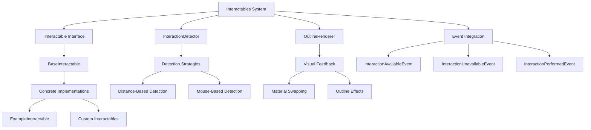

## Detection Strategy Architecture

The system uses different detection methods based on the active controller type:

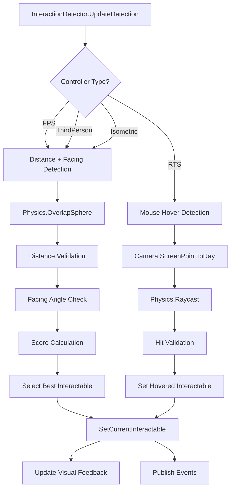

## Interaction Lifecycle

Each interactable object follows a complete lifecycle with visual and event feedback:

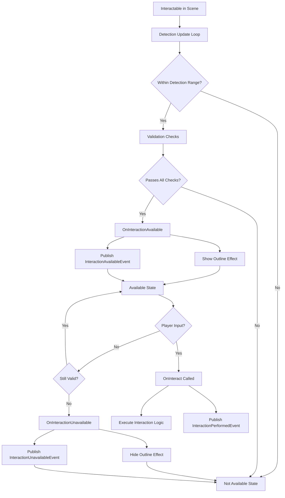

## Distance-Based Detection System

For character-based controllers (FPS, Third-Person, Isometric):

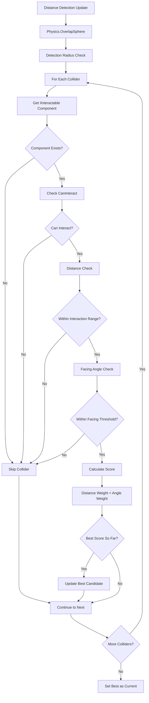

## Mouse-Based Detection System

For RTS controllers with mouse interaction:

```mermaid
graph TD
    A[Mouse Detection Update] --> B[Get Mouse Position]
    B --> C[Camera.ScreenPointToRay]
    C --> D[Physics.Raycast]
    D --> E{Hit Detected?}
    
    E -->|No| F[Clear Current Interactable]
    E -->|Yes| G[Get Hit Collider]
    
    G --> H[Get IInteractable Component]
    H --> I{Component Exists?}
    I -->|No| F
    I -->|Yes| J{Can Interact?}
    
    J -->|No| F
    J -->|Yes| K[Set as Current Interactable]
    
    F --> L[SetCurrentInteractable(null)]
    K --> M[SetCurrentInteractable(found)]
    
    L --> N[Update Visual Feedback]
    M --> N
```

## Visual Feedback System

The OutlineRenderer provides flexible visual feedback for interaction availability:

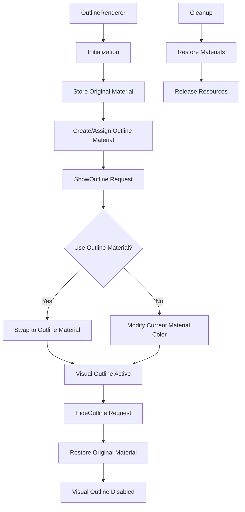

## IInteractable Interface Contract

The interface defines the complete interaction contract:

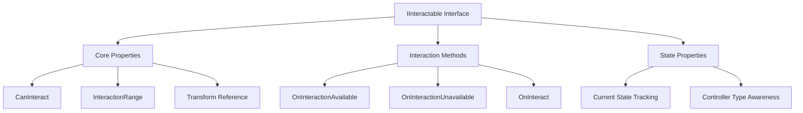

## Event Integration Pattern

The system publishes events for external system coordination:

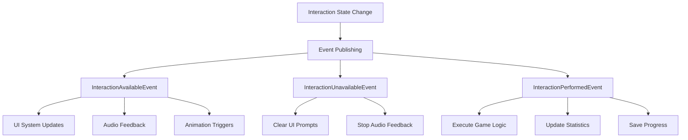

## BaseInteractable Implementation

The base implementation provides common functionality and extension points:

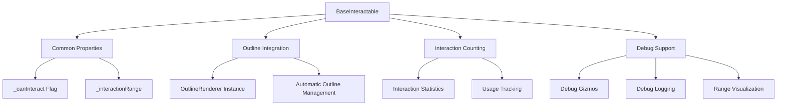

## Interaction Scoring System

For distance-based detection, the system uses a scoring algorithm to select the best interactable:

```mermaid
graph TD
    A[Interaction Scoring] --> B[Distance Component]
    A --> C[Angle Component]
    A --> D[Combined Score]
    
    B --> E[Closer = Better Score]
    C --> F[More Centered = Better Score]
    D --> G[Lowest Total Score Wins]
    
    E --> H[score += distance]
    F --> I[score += (angle / threshold)]
    H --> J[Final Score Calculation]
    I --> J
    J --> K[Compare Against Best]
```

## Debug and Visualization Features

The system provides comprehensive debug visualization:

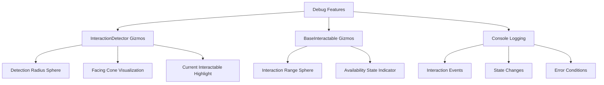

## Performance Considerations

The system includes several performance optimizations:

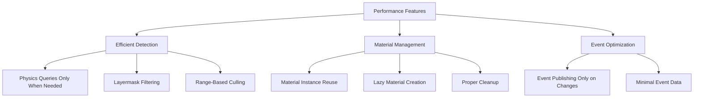

## Integration with Controllers

The system adapts its behavior based on the active controller type:

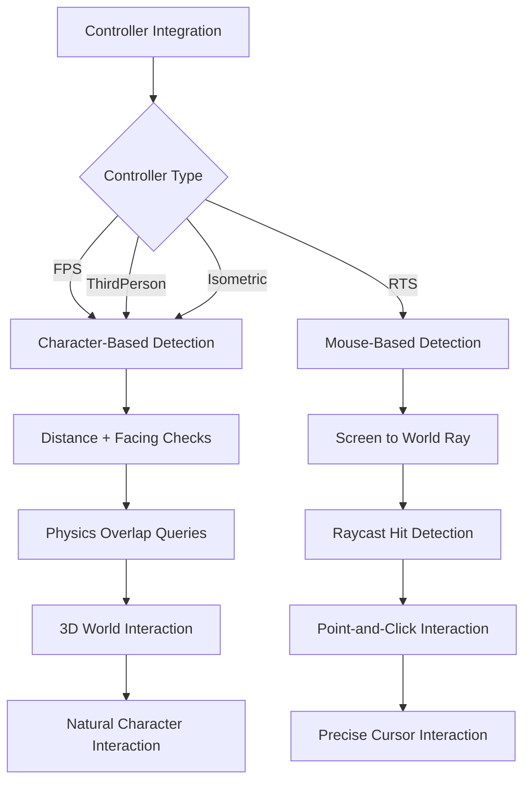

## Best Practices

### Interactable Design Guidelines
1. **Inherit from BaseInteractable** for standard functionality and consistent behavior
2. **Set Appropriate Ranges** for interaction distance based on object size and context
3. **Implement Visual Feedback** using OutlineRenderer or custom visualization methods
4. **Handle Controller Types** appropriately in interaction logic
5. **Use LayerMasks** to optimize detection performance

### Performance Optimization
1. **Layer Organization** - Use specific layers for interactable objects
2. **Range Tuning** - Set conservative interaction ranges to reduce overlap queries
3. **Material Management** - Reuse outline materials across similar objects
4. **Update Frequency** - Consider detection update frequency for performance
5. **Event Efficiency** - Only publish events when interaction state actually changes

### Integration Patterns
1. **Event-Driven Logic** - Use interaction events to trigger game logic
2. **UI Coordination** - Subscribe to interaction events for UI prompt updates
3. **Audio Integration** - Provide audio feedback for interaction availability
4. **Animation Triggers** - Use interaction events to trigger object animations
5. **Statistics Tracking** - Track interaction data for analytics and achievements

## Common Usage Patterns

### Basic Interactable Object
Inherit from BaseInteractable and override interaction methods for custom behavior.

### Complex Interaction Logic
Implement IInteractable directly for complete control over interaction behavior.

### Visual Feedback Customization
Configure OutlineRenderer settings or implement custom visual feedback systems.

### Controller-Specific Behavior
Use the controller type parameter to provide different interaction behaviors per controller.

The Interactables system provides a robust, flexible foundation for object interaction in Unity games while automatically adapting to different control schemes and maintaining high performance through intelligent detection strategies.
