# Controllers Documentation

## Overview

The Controllers system provides a flexible, component-based player control architecture supporting multiple gameplay perspectives (First-Person, Third-Person, Isometric, RTS). It uses composition over inheritance for maximum flexibility and integrates seamlessly with Unity's physics, input, and Cinemachine systems.

## Core Architecture

The Controllers system operates through a hierarchical composition pattern with clear separation of concerns:

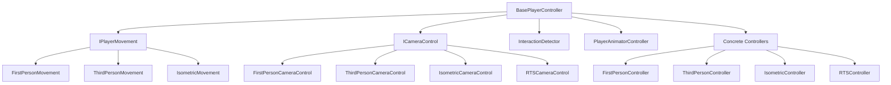

## Controller Types and Characteristics

### Controller Comparison Matrix

| Controller Type | Movement Style | Camera Type | Cursor Lock | Interaction Method | Use Cases |
|----------------|---------------|-------------|-------------|-------------------|-----------|
| **FirstPerson** | Direct character control | Attached to character | Always locked | Distance + Facing | FPS games, immersive exploration |
| **ThirdPerson** | Character movement + rotation | Orbital around character | Gameplay only | Distance + Facing | Action RPGs, adventure games |
| **Isometric** | Top-down movement | Fixed angle overhead | Never locked | Distance + Facing | RPGs, puzzle games, strategy |
| **RTS** | Camera movement | Free camera control | Never locked | Mouse hover | Strategy games, city builders |

## BasePlayerController Architecture

The base controller provides a unified framework for all player control types:

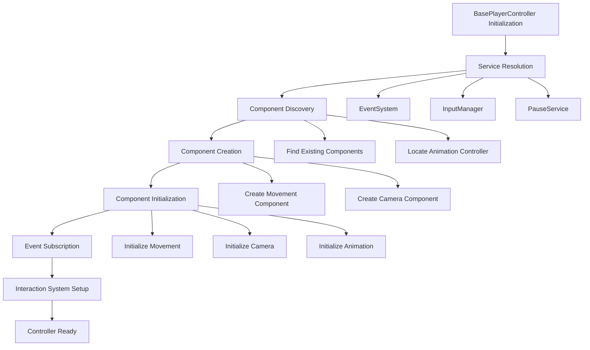

## Component Lifecycle Management

Each controller manages a complex lifecycle with multiple coordinated components:

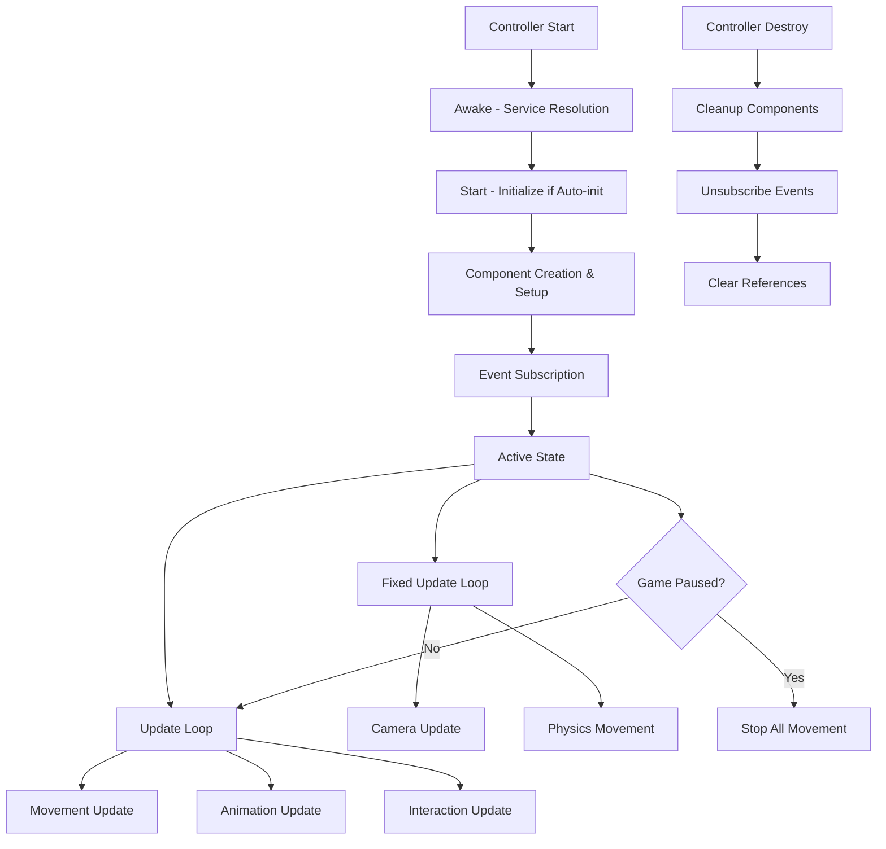

## Input Flow Architecture

The system uses event-driven input processing with context-aware routing:

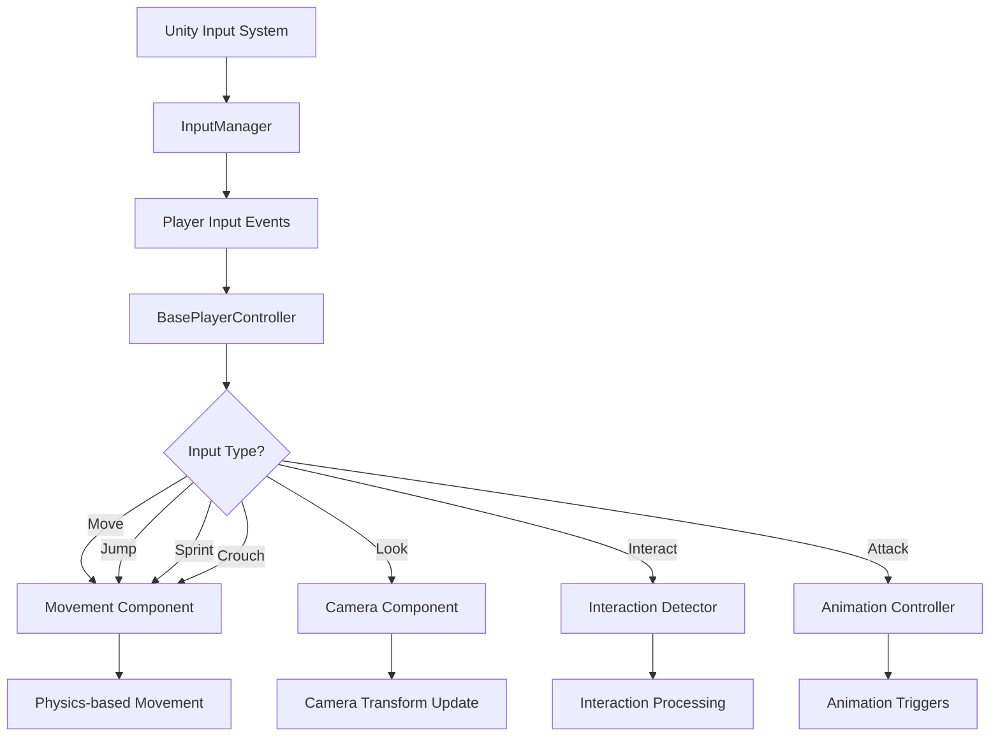

## Movement System Architecture

The movement system provides specialized movement behaviors through composition:

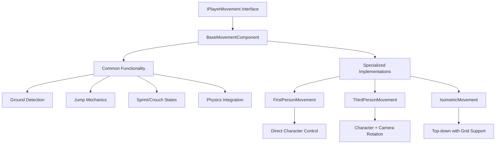

## Camera System Architecture

The camera system provides perspective-appropriate camera behaviors:

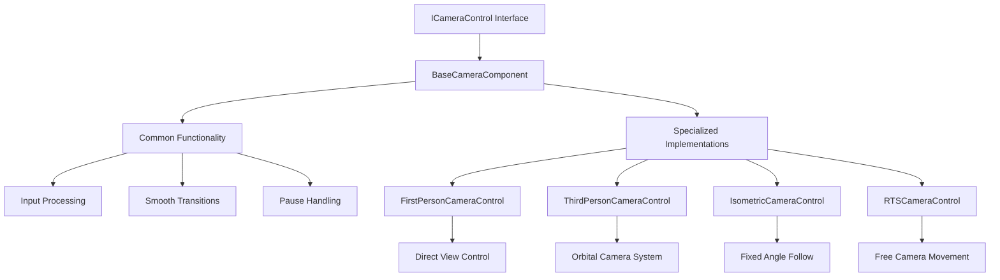

## Interaction System Integration

The interaction system provides context-sensitive object interaction:

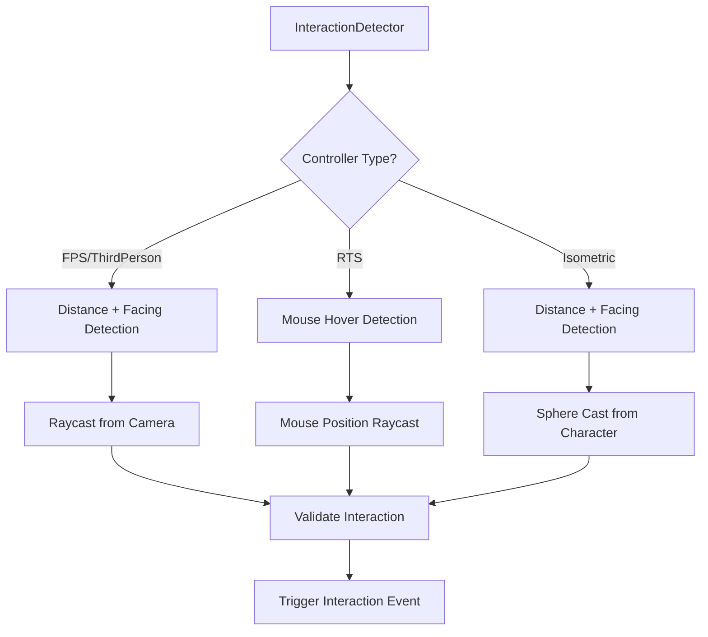

## Animation System Integration

The animation system coordinates with movement and input for responsive character animation:

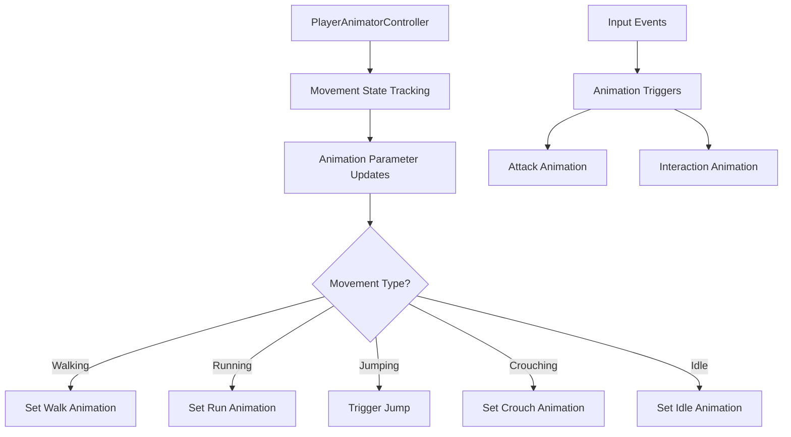

## Prefab Management System

The PlayerPrefabSelector manages multiple controller prefabs with automatic loading:

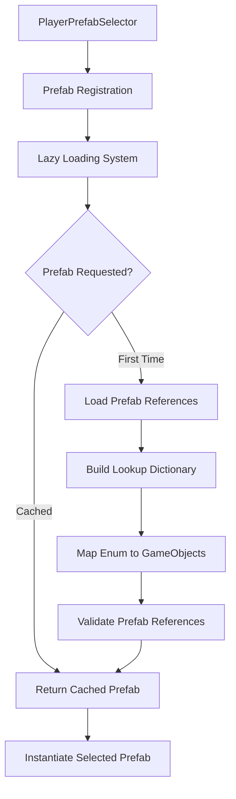

## Service Integration Pattern

Controllers integrate with multiple game services through dependency injection:

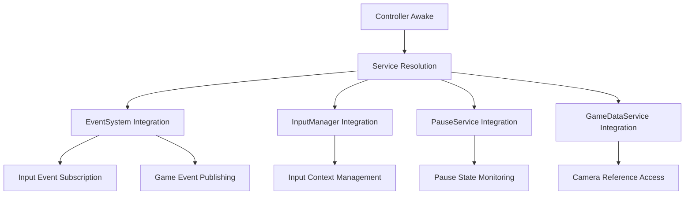

## Cursor Management System

Different controllers have different cursor requirements managed automatically:

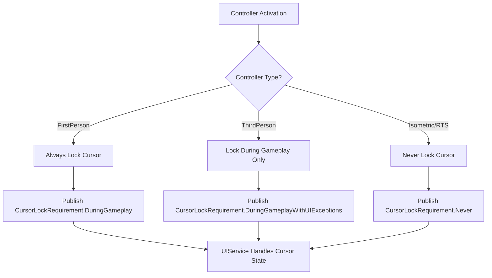

## Performance Optimization Features

The controller system includes several performance optimizations:

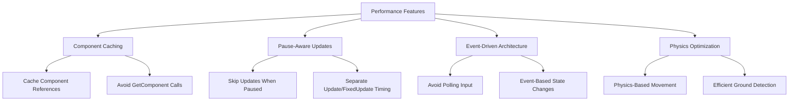

## Error Handling and Recovery

The system implements robust error handling for component failures:

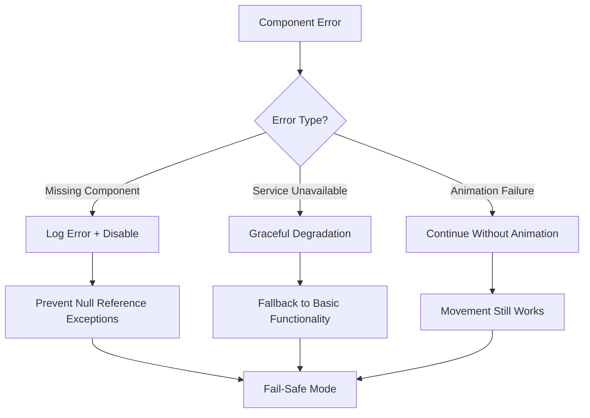

## Best Practices

### Controller Design Guidelines
1. **Composition Over Inheritance**: Use interfaces for movement and camera components
2. **Event-Driven Communication**: All input and state changes through events
3. **Service Dependencies**: Resolve services in Awake, handle missing services gracefully
4. **Component Lifecycle**: Proper initialization, cleanup, and pause handling
5. **Performance Awareness**: Cache references, avoid expensive operations in Update

### Integration Patterns
1. **Service Integration**: Use GameManager.GetService for dependency resolution
2. **Event Publishing**: Publish controller activation events for cursor management
3. **Animation Coordination**: Coordinate movement state with animation parameters
4. **Interaction Setup**: Configure interaction detection based on controller type
5. **Physics Integration**: Use Rigidbody for movement, handle physics interactions properly

### Performance Optimization
1. **Component Caching**: Cache all component references during initialization
2. **Update Optimization**: Use pause-aware updates, separate Update/FixedUpdate concerns
3. **Memory Management**: Proper cleanup in OnDestroy, unsubscribe from events
4. **Physics Efficiency**: Use appropriate physics settings, optimize collision detection
5. **Input Efficiency**: Event-driven input handling instead of polling

## Common Usage Patterns

### Controller Instantiation
Controllers are typically instantiated through the InstantiationService using prefab selection:

### Input Handling
All input flows through the event system with automatic routing to appropriate components:

### Component Composition
Controllers combine movement, camera, animation, and interaction components for complete player control:

### Service Coordination
Controllers coordinate with multiple services for complete game integration:

The Controllers system provides a robust, flexible foundation for player control in Unity games while maintaining clean separation of concerns, high performance, and easy extensibility.
