# DIContainer Documentation

## Overview

The DIContainer is an enhanced dependency injection container that provides automatic constructor injection support for Unity projects. It implements the Service Locator pattern with singleton instance management and supports multiple registration strategies for flexible dependency management.

## Core Architecture

The DIContainer operates as a singleton instance that manages three types of service registrations:

- **Singleton Services**: Single instance shared across the application
- **Transient Services**: New instance created for each request
- **Factory Services**: Custom factory functions for specialized creation logic

## Registration Patterns

### Singleton Pattern Flow

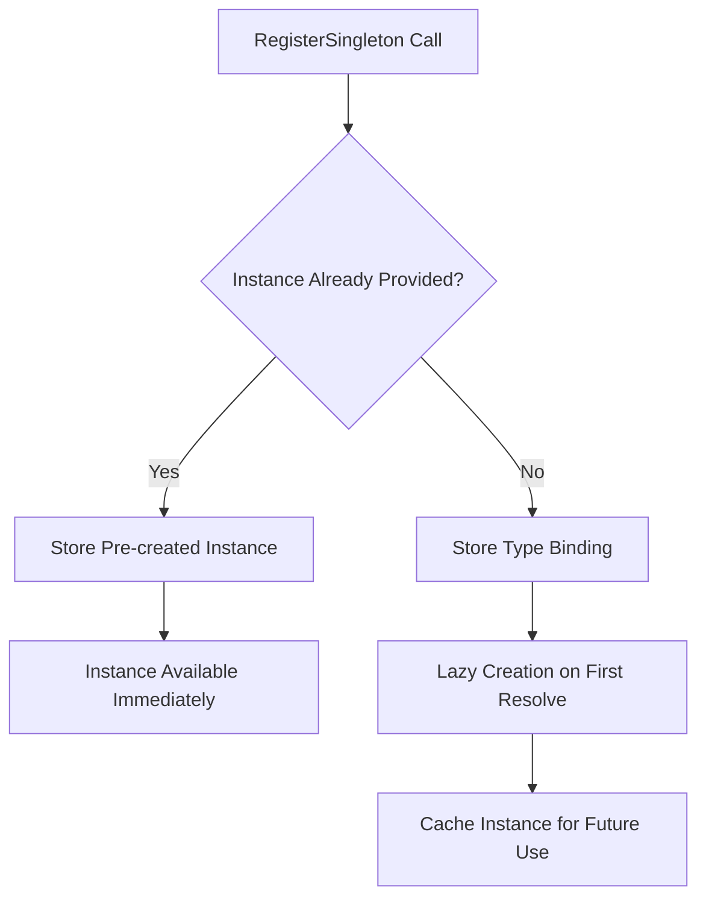

### Transient Pattern Flow

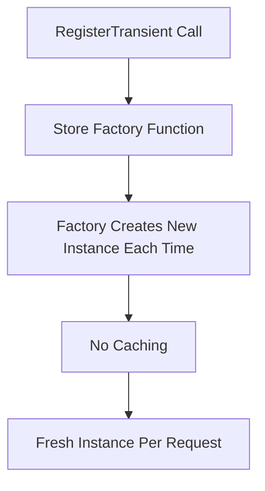

### Factory Pattern Flow

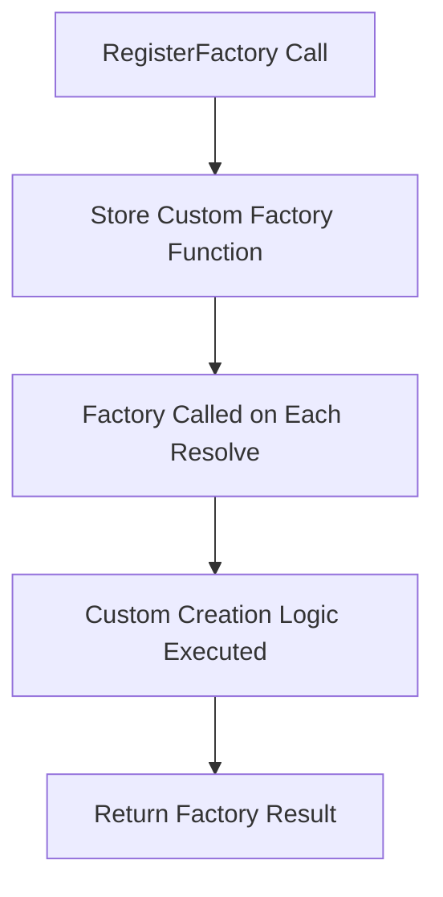

## Service Resolution Process

The container follows a priority-based resolution strategy:

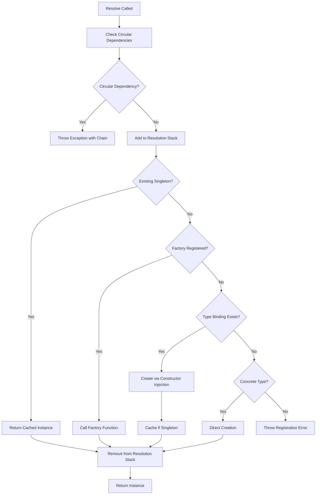

## Constructor Injection Process

The DIContainer uses reflection-based constructor injection to automatically resolve dependencies:

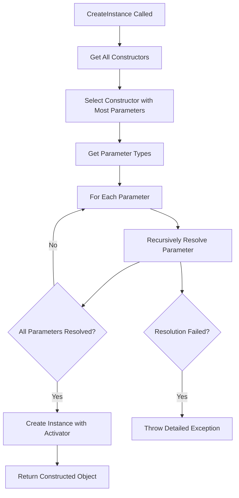

## Circular Dependency Detection

The container maintains a resolution stack to prevent infinite dependency loops:

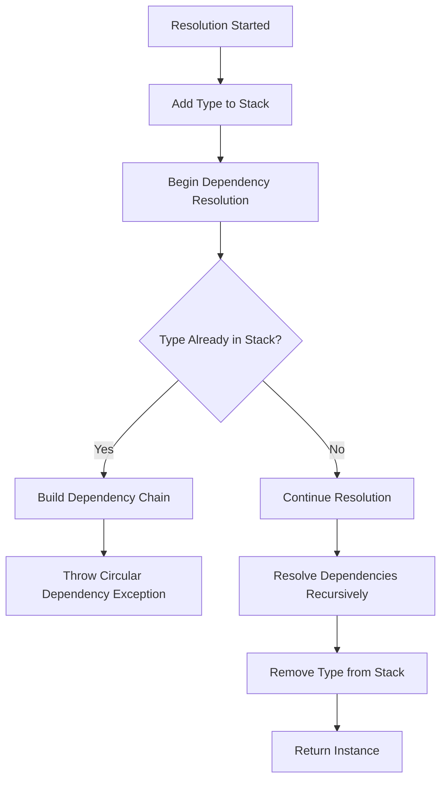

## Internal Data Management

The container manages four key data structures:

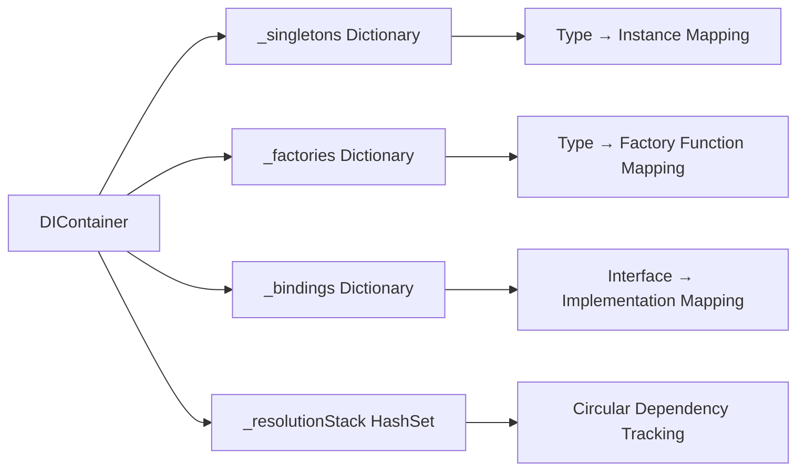

## Service Lifecycle Management

Different registration types have distinct lifecycle behaviors:

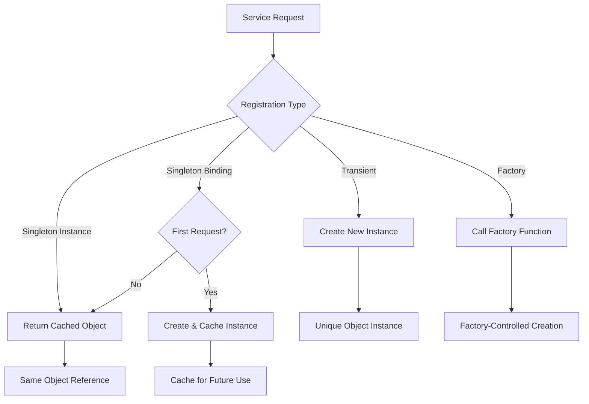

## Error Handling Strategy

The container implements comprehensive error handling:

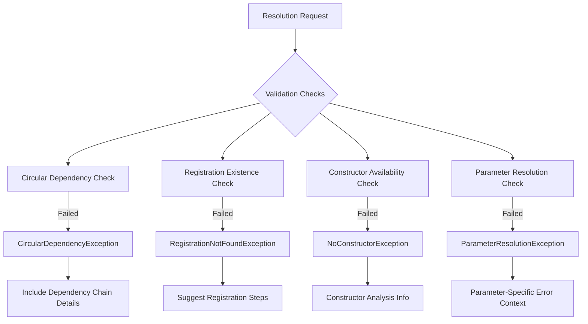

## Container Query Capabilities

The container provides introspection methods for runtime service discovery:

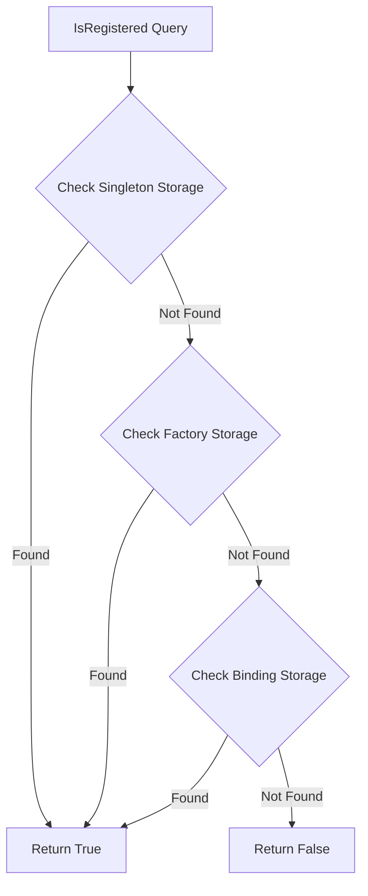

## Performance Considerations

### Memory Management
- Singleton instances are cached indefinitely until container cleanup
- Transient instances are not cached, relying on garbage collection
- Factory functions maintain closure references

### Reflection Overhead
- Constructor analysis happens once per type
- Parameter type resolution uses cached reflection data
- Performance cost is front-loaded during registration/first resolution

### Thread Safety
- The current implementation is **not thread-safe**
- Singleton pattern implementation uses lazy initialization
- Concurrent access requires external synchronization

## Best Practices

### Registration Strategy
1. **Use Singletons** for stateful services that maintain application-wide state
2. **Use Transient** for stateless services that can be safely recreated
3. **Use Factory** for services requiring custom initialization or external dependencies

### Dependency Design
1. Depend on abstractions (interfaces) rather than concrete types
2. Avoid circular dependencies through careful interface design
3. Keep constructor parameter lists focused and minimal

### Error Handling
1. Register all required services before attempting resolution
2. Use `IsRegistered<T>()` for conditional service access
3. Handle resolution exceptions gracefully in application code

## Integration Patterns

### Service Registration Flow
Services should be registered during application bootstrap:

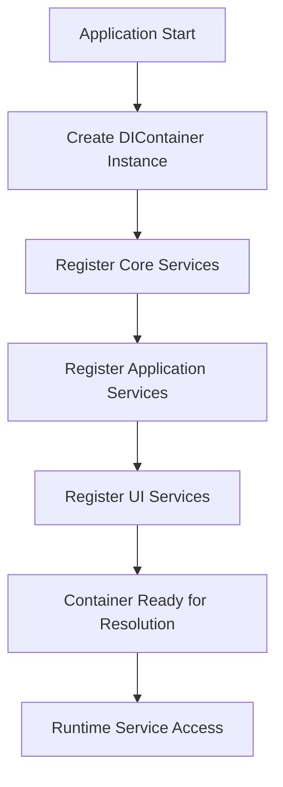

### Unity Integration
The container integrates with Unity's component system through service locator patterns, allowing MonoBehaviour components to access registered services without tight coupling.

## Troubleshooting

### Common Issues
1. **Circular Dependencies**: Redesign interfaces to break dependency cycles
2. **Missing Registrations**: Ensure all services are registered before first use
3. **Constructor Ambiguity**: Use explicit registration with factory functions
4. **Performance Issues**: Consider singleton vs transient trade-offs

### Debugging Tools
- Use `IsRegistered<T>()` to verify service availability
- Examine exception messages for dependency chain details
- Enable logging in factory functions for creation tracking
