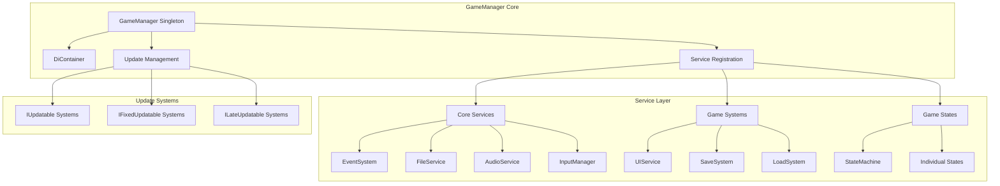
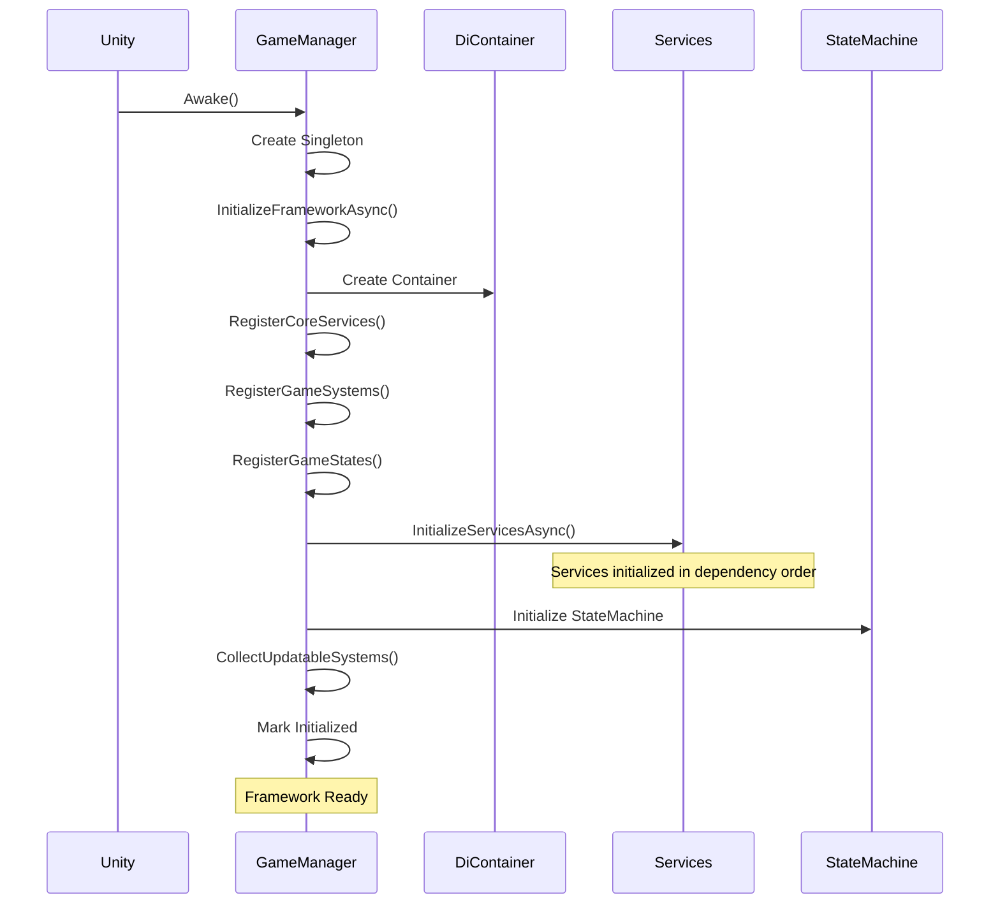
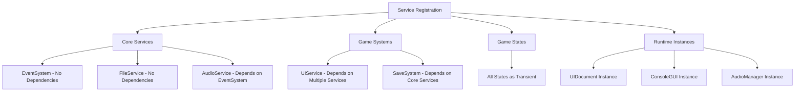
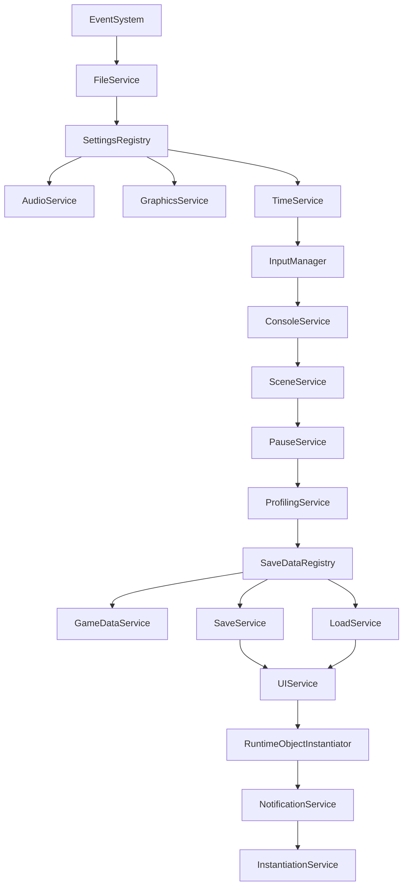
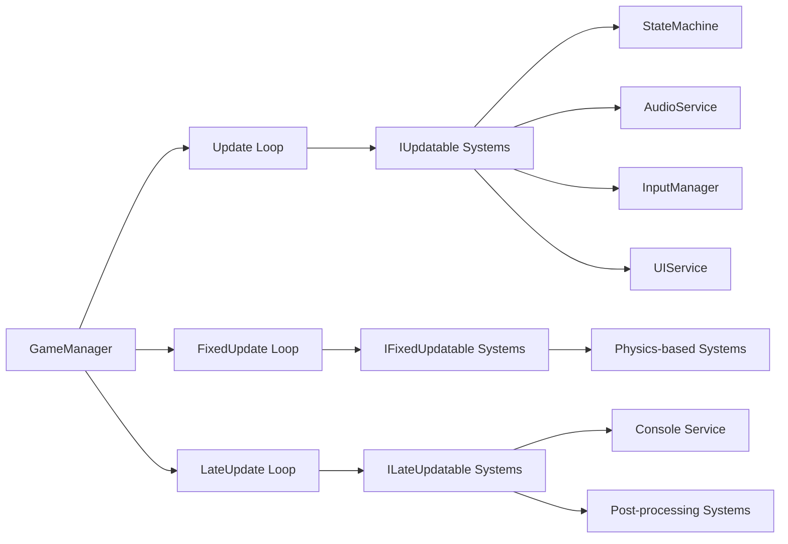
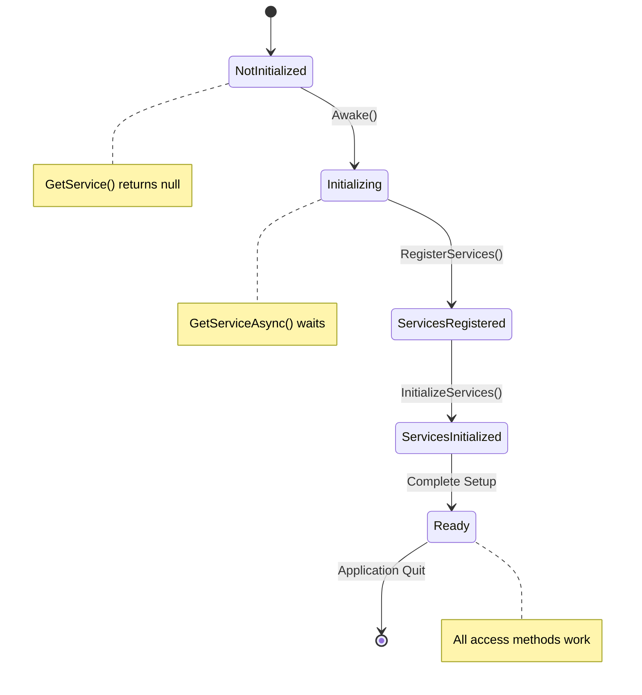
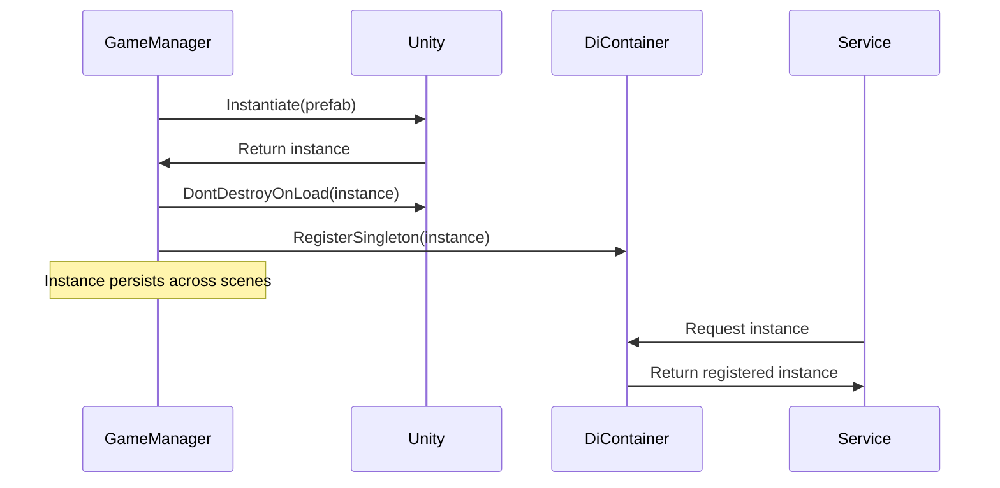
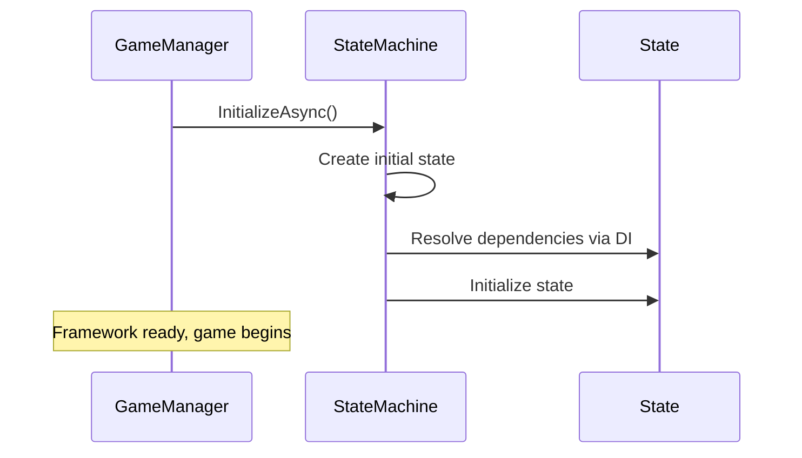
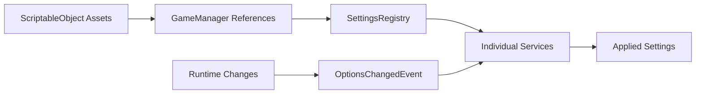
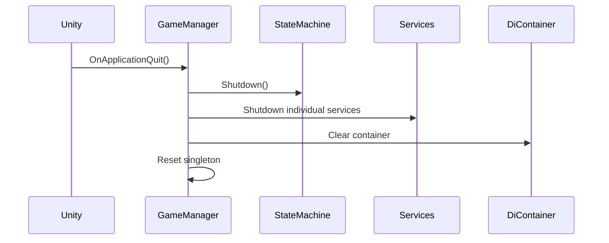

# GameManager Documentation

## Overview

The GameManager is the central coordinator of the entire game framework, implementing a singleton pattern with dependency injection to bootstrap and manage all core systems. It orchestrates service initialization, manages frame updates, and provides global access to framework services.

## Architecture



### Key Responsibilities

1. **Framework Initialization**: Bootstraps the entire game framework in correct dependency order
2. **Dependency Injection**: Manages service registration and resolution through DiContainer
3. **Service Lifecycle**: Coordinates initialization, updates, and shutdown of all services
4. **Global Service Access**: Provides static methods for accessing services throughout the application
5. **Update Coordination**: Manages Unity update loops for all registered systems
6. **State Machine Integration**: Initializes and coordinates the game state machine

## Initialization Sequence

The GameManager follows a carefully orchestrated initialization sequence to ensure all dependencies are satisfied:



### Initialization Phases

1. **Container Setup**: Creates DiContainer instance
2. **Service Registration**: Registers all services in dependency order
3. **Service Initialization**: Initializes services respecting dependencies
4. **State Machine Setup**: Creates and initializes the game state machine
5. **Update Collection**: Gathers all systems requiring frame updates
6. **Framework Ready**: Marks initialization complete

## Dependency Injection System

The GameManager uses a custom DiContainer to manage all service dependencies:

### Service Registration Patterns

```csharp
// Singleton Registration (most services)
_container.RegisterSingleton<IEventSystem, EventSystem.EventSystem>();

// Transient Registration (game states)
_container.RegisterTransient<MainMenuState, MainMenuState>();

// Instance Registration (prefab instances)
_container.RegisterSingleton(uiDocumentInstance);
```

### Registration Categories



## Service Initialization Order

Services are initialized in dependency order to ensure all required services are available:

### Core Service Dependencies



### Critical Dependencies

- **EventSystem**: Required by almost all other services
- **FileService**: Needed for configuration and save file operations
- **SettingsRegistry**: Must be loaded before services that depend on settings
- **SaveDataRegistry**: Required before GameDataService and Save/Load services
- **UIService**: Initialized last as it depends on many other services

## Update System Management

The GameManager coordinates frame updates for all registered systems:

### Update Types



### Update Collection Process

```csharp
private void CollectUpdatableSystems()
{
    // Collect systems implementing IUpdatable
    var audioService = _container.Resolve<IAudioService>();
    if (audioService is IUpdatable updatable)
        _updatables.Add(updatable);
    
    // Systems are called in registration order each frame
}
```

## Service Access Patterns

The GameManager provides multiple ways to access services:

### Synchronous Access

```csharp
// Direct access (requires GameManager to be initialized)
var audioService = GameManager.GetService<IAudioService>();
if (audioService != null)
{
    audioService.PlaySound("buttonClick");
}
```

### Asynchronous Access

```csharp
// Waits for initialization to complete
var audioService = await GameManager.GetServiceAsync<IAudioService>();
audioService.PlaySound("gameStart"); // Safe to use immediately
```

### Service Availability



## Runtime Instance Management

The GameManager handles instantiation and registration of Unity prefabs:

### Prefab Instance Creation



### Managed Instances

- **UIDocument**: Main UI system interface
- **ConsoleGUI**: Debug console interface (if enabled)
- **AudioManager**: Audio system controller
- **Unity EventSystem**: UGUI input handling

## Game State Machine Integration

The GameManager initializes and coordinates with the game state machine:

### State Registration

```csharp
private void RegisterGameStates()
{
    // All states registered as transient for fresh DI each time
    _container.RegisterTransient<MainMenuState, MainMenuState>();
    _container.RegisterTransient<PlayingState, PlayingState>();
    // ... other states
}
```

### State Machine Lifecycle



## Configuration Management

The GameManager integrates with the settings system through ScriptableObject references:

### Settings Integration

```csharp
public Dictionary<Type, ConfigCategoryBase> GetConfigurationSettings()
{
    return new Dictionary<Type, ConfigCategoryBase> 
    {
        { typeof(AudioSettings_SO), _audioSettingsSo },
        { typeof(GraphicsSettings_SO), _graphicsSettingsSo },
        { typeof(GameplaySettings_SO), _gameplaySettingsSo },
        { typeof(InputSettings_SO), _inputSettingsSo },
        { typeof(DebugSettings_SO), _debugSettingsSo }
    };
}
```

### Settings Flow



## Error Handling and Resilience

The GameManager implements comprehensive error handling:

### Initialization Error Handling

```csharp
private async Task InitializeFrameworkAsync()
{
    try
    {
        // ... initialization steps
        _initializationComplete.SetResult(true);
    }
    catch (System.Exception e)
    {
        Debug.LogError($"Framework initialization failed: {e}");
        _initializationComplete.SetException(e);
    }
}
```

### Graceful Degradation

- **Missing Prefabs**: Creates fallback instances or disables features
- **Service Registration Failures**: Continues with available services
- **Initialization Errors**: Provides detailed logging and maintains partial functionality

## Shutdown and Cleanup

The GameManager ensures clean shutdown of all systems:

### Shutdown Sequence



## Best Practices

### Service Design

1. **Dependency Declaration**: Services should declare dependencies through constructor injection
2. **Interface Usage**: Always register services by interface to maintain loose coupling
3. **Initialization Order**: Design services to have minimal dependencies for easier ordering
4. **Stateless Design**: Prefer stateless services where possible for better testability

### GameManager Usage

1. **Singleton Access**: Use `GetServiceAsync<T>()` during initialization phases
2. **Direct Access**: Use `GetService<T>()` only when GameManager is guaranteed to be ready
3. **Null Checking**: Always check for null when using direct access
4. **Service Lifecycle**: Don't cache service references across scene loads

### Integration Patterns

```csharp
// Proper service access in MonoBehaviour
public class GameSystem : MonoBehaviour
{
    private IAudioService _audioService;
    
    private async void Start()
    {
        // Wait for GameManager to be ready
        _audioService = await GameManager.GetServiceAsync<IAudioService>();
    }
    
    private void PlaySound()
    {
        // Service guaranteed to be available
        _audioService?.PlaySound("effect");
    }
}
```

## Debugging and Diagnostics

The GameManager provides extensive logging for troubleshooting:

### Debug Information

- Service registration order and success
- Initialization progress and timing
- Update system collection results
- Error details with stack traces
- Service resolution failures

### Diagnostic Methods

```csharp
// Check if specific service is registered
bool isRegistered = _container.IsRegistered<IMyService>();

// Get service count for diagnostics
int updateCount = _updatables.Count;
Debug.Log($"Collected {updateCount} updatable systems");
```

## Performance Considerations

### Optimization Features

- **Lazy Initialization**: Services initialize only when needed
- **Update Batching**: All system updates handled in single frame loop
- **Singleton Pattern**: Prevents duplicate service instances
- **DontDestroyOnLoad**: Minimizes scene transition overhead

### Memory Management

- **Service Reuse**: Single instances shared across entire application
- **Proper Cleanup**: All services shut down cleanly on application quit
- **Container Management**: DiContainer cleared on shutdown to prevent leaks

## Integration Examples

### Custom Service Registration

```csharp
// In RegisterGameSystems()
private void RegisterGameSystems()
{
    // Register custom game-specific services
    _container.RegisterSingleton<ICustomGameService, CustomGameService>();
    _container.RegisterSingleton<IScoreManager, ScoreManager>();
}
```

### Service Implementation

```csharp
public class CustomGameService : ICustomGameService
{
    private readonly IEventSystem _eventSystem;
    private readonly IAudioService _audioService;
    
    // Dependencies injected via constructor
    public CustomGameService(IEventSystem eventSystem, IAudioService audioService)
    {
        _eventSystem = eventSystem;
        _audioService = audioService;
    }
    
    public async Task InitializeAsync()
    {
        // Service initialization logic
        _eventSystem.Subscribe<GameEvent>(HandleGameEvent);
    }
}
```

### State with Service Dependencies

```csharp
public class CustomGameState : BaseGameState
{
    private readonly ICustomGameService _customService;
    
    public CustomGameState(ICustomGameService customService)
    {
        _customService = customService; // Injected by GameManager
    }
    
    public override void OnEnter()
    {
        _customService.StartCustomBehavior();
    }
}
```

## Troubleshooting

### Common Issues

#### "Service not found" Errors
- **Cause**: Service not registered or accessed before initialization
- **Solution**: Check registration order and use `GetServiceAsync<T>()`

#### "Circular Dependency" Errors
- **Cause**: Services depend on each other cyclically
- **Solution**: Redesign dependencies or use event system for communication

#### "Initialization Failed" Errors
- **Cause**: Exception during service initialization
- **Solution**: Check logs for specific service errors and dependencies

### Diagnostic Checklist

1. Verify all required prefabs are assigned in inspector
2. Check service registration order matches dependencies
3. Ensure all ScriptableObject settings are assigned
4. Verify no circular dependencies exist
5. Check console for detailed error messages

## Conclusion

The GameManager provides a robust foundation for Unity game development through its comprehensive dependency injection system, careful initialization ordering, and centralized service management. It ensures proper system coordination while maintaining flexibility for custom game implementations.

**Key Benefits:**
- **Centralized Coordination**: Single point of control for entire framework
- **Dependency Management**: Automatic resolution of service dependencies
- **Proper Initialization**: Services start in correct order with dependencies satisfied
- **Global Access**: Services available throughout the application
- **Clean Shutdown**: Graceful cleanup of all systems
- **Extensible Design**: Easy to add new services and systems

The GameManager scales from simple games to complex applications while maintaining clean architecture and excellent performance characteristics.
