# EventSystem Documentation

## Overview

The EventSystem provides a type-safe, decoupled communication mechanism for Unity game systems. It implements a publish-subscribe pattern that allows components to communicate without direct dependencies, promoting loose coupling and maintainable architecture.

## Core Architecture

The EventSystem operates as a centralized message broker that manages event subscriptions and publications. It supports both parameterized events (with data) and parameterless events (simple notifications).

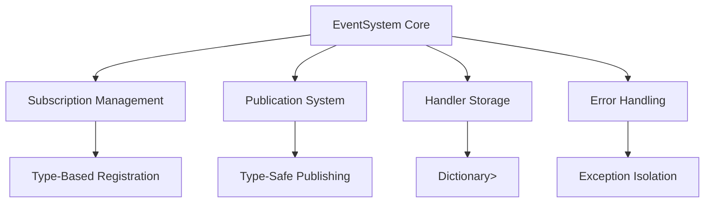

## Event Registration Flow

The subscription system maintains handlers in type-indexed collections:

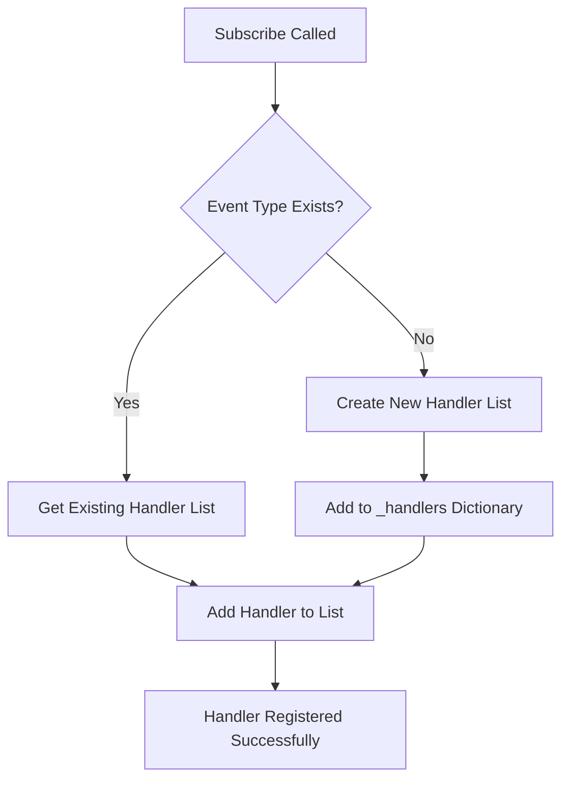

## Event Publication Process

Event publishing follows a safe iteration pattern with error isolation:

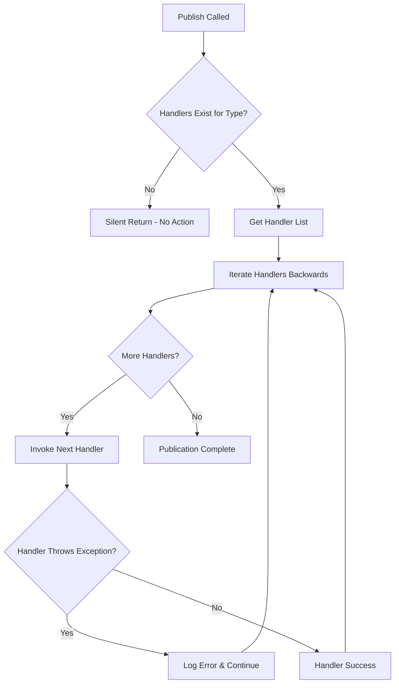

## Event Lifecycle Management

The system provides complete lifecycle control for event handlers:

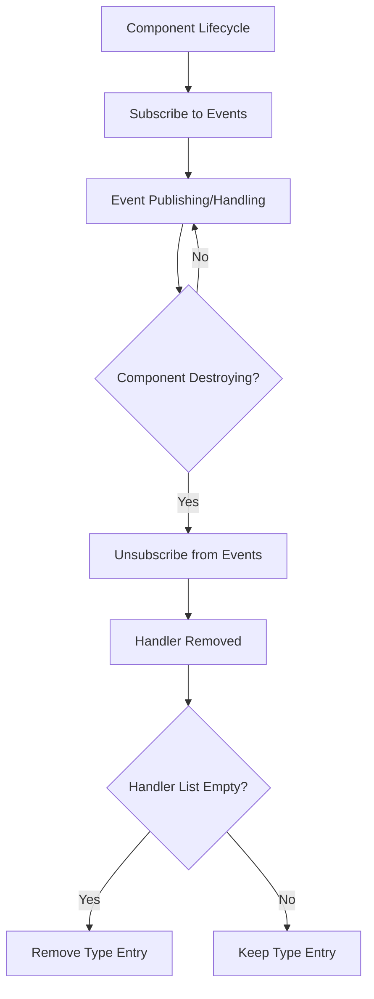

## Event Type System

The EventSystem supports multiple event patterns organized by domain:

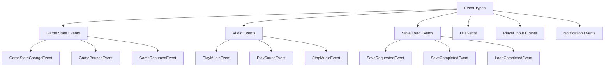

## Handler Invocation Strategy

The system uses backwards iteration to handle dynamic handler modification:

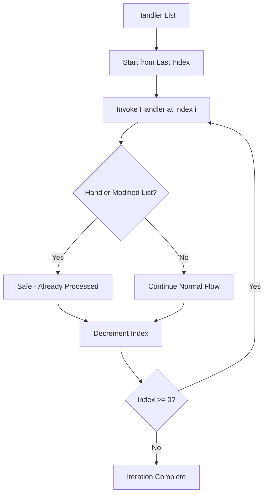

## Event Pattern Types

### Parameterized Events
Events that carry data payloads for rich communication:

```mermaid
graph LR
    A[Publisher] --> B[Create Event Data]
    B --> C[Publish<EventType>(data)]
    C --> D[EventSystem Routes]
    D --> E[Handler Receives Data]
    E --> F[Process Event Data]
```

### Parameterless Events
Simple notification events without data:

```mermaid
graph LR
    A[Publisher] --> B[Publish<EventType>()]
    B --> C[EventSystem Routes]
    C --> D[Handler Receives Notification]
    D --> E[Perform Action]
```

## Error Handling and Resilience

The EventSystem implements robust error handling to prevent cascading failures:

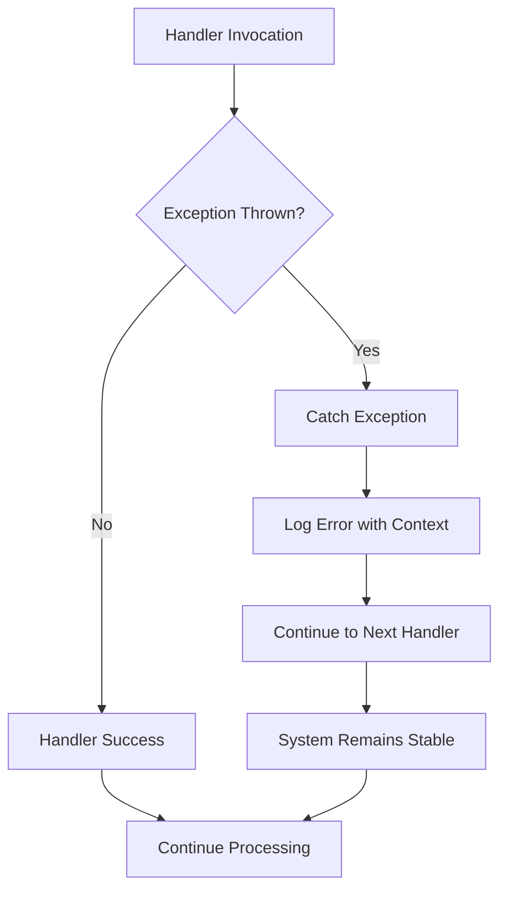

## Event Categories and Domains

### Game State Management
Handles core game flow and state transitions:

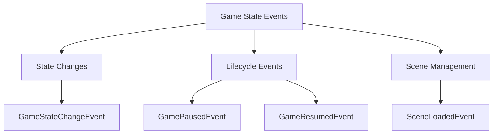

### Audio System Integration
Manages audio playback requests and control:

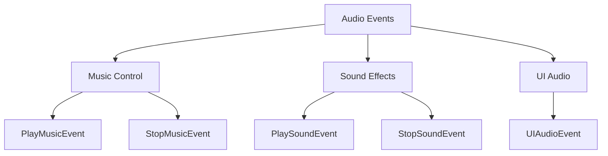

### Save/Load Operations
Coordinates game persistence operations:

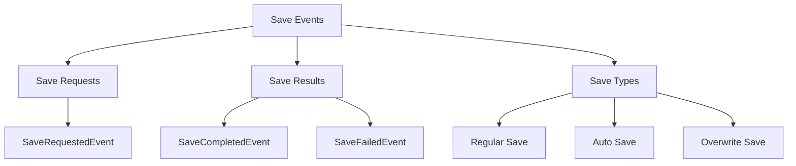

## Memory Management Strategy

The EventSystem uses efficient memory management for handler storage:

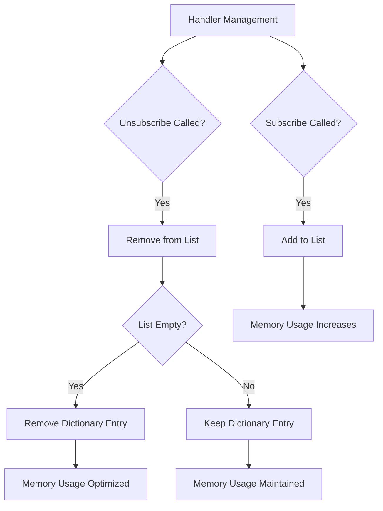

## Thread Safety Considerations

The current EventSystem implementation is **not thread-safe**:

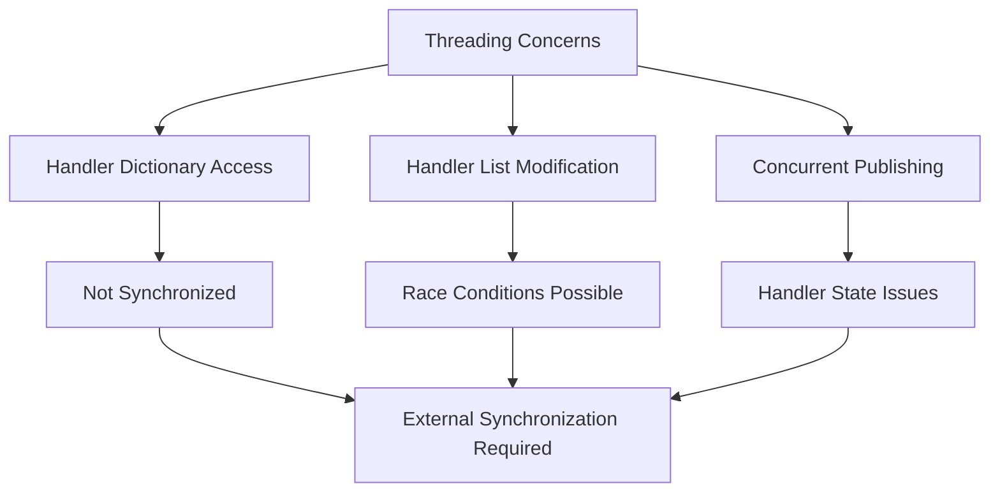

## Service Integration Pattern

The EventSystem integrates with the game's service architecture:

```mermaid
graph TD
    A[IGameService Interface] --> B[EventSystem Implementation]
    B --> C[InitializeAsync()]
    B --> D[Shutdown()]
    B --> E[IsInitialized Property]
    
    C --> F[Setup Complete]
    D --> G[Clear All Handlers]
    G --> H[Reset State]
```

## Best Practices and Usage Patterns

### Subscription Management
Components should manage their event subscriptions carefully:

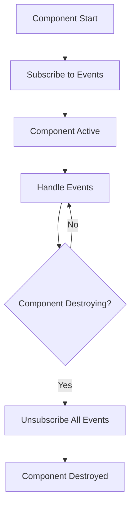

### Event Design Guidelines
Events should be designed for clarity and maintainability:

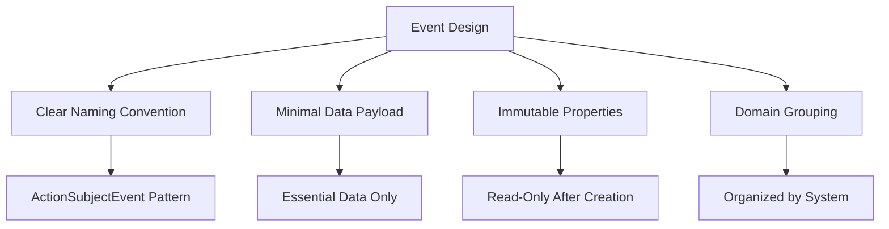

## Performance Considerations

### Handler Invocation Overhead
- **Dictionary Lookup**: O(1) for type-based handler retrieval
- **Handler Iteration**: O(n) where n is the number of handlers
- **Exception Handling**: Minimal overhead for success cases
- **Memory Allocation**: No allocations during normal operation

### Optimization Strategies
- Use parameterless events when no data is needed
- Unsubscribe handlers when components are destroyed
- Group related events to minimize subscription overhead
- Consider batching frequent events if performance becomes critical

## Integration Examples

### Service Registration
The EventSystem registers as a singleton service:

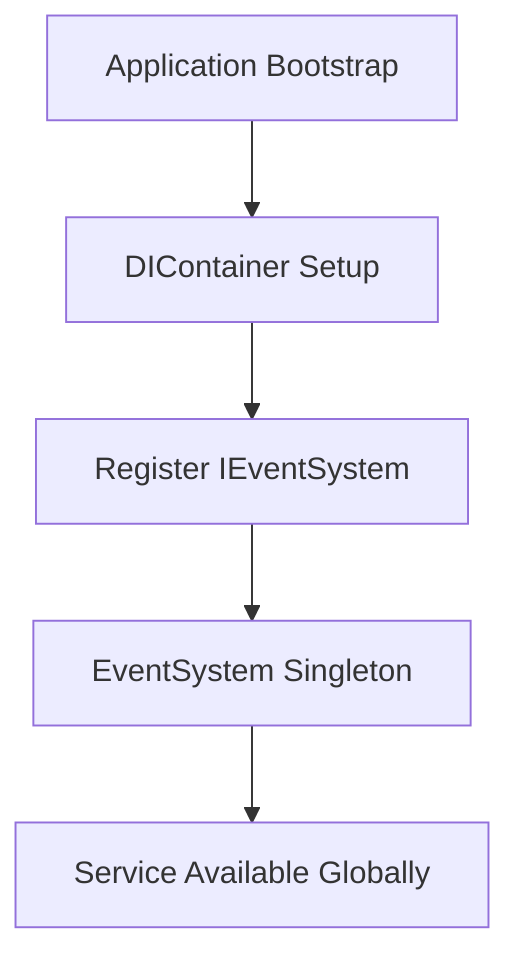

### Component Communication
Loose coupling between game systems:

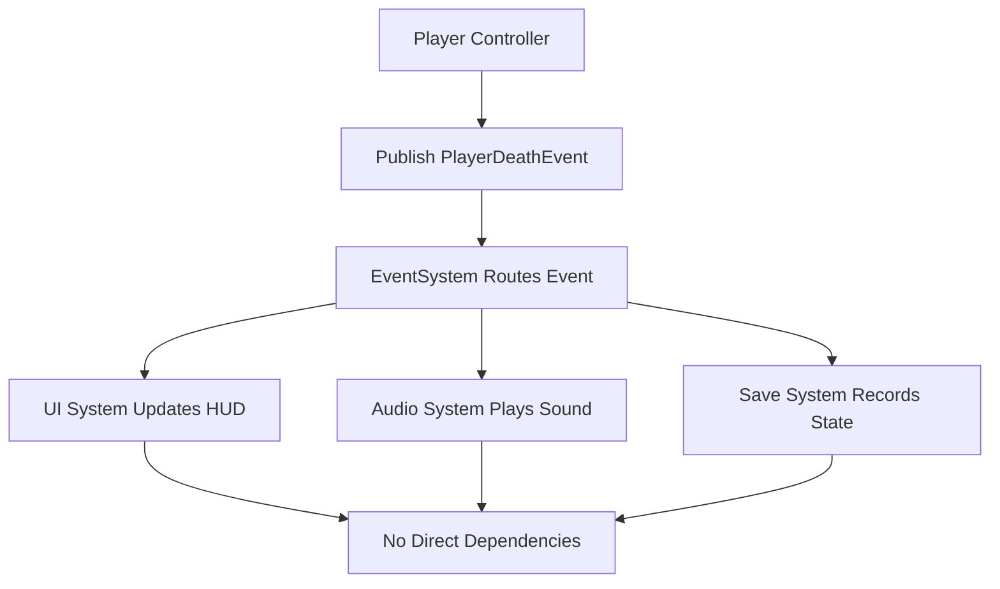

## Troubleshooting

### Common Issues
1. **Memory Leaks**: Forgetting to unsubscribe handlers
2. **Handler Exceptions**: Unhandled exceptions in event handlers
3. **Event Ordering**: Expecting specific handler execution order
4. **Thread Safety**: Using events across threads

### Debugging Strategies
- Use Unity's Debug.Log in handlers to trace event flow
- Implement event logging for subscription/unsubscription
- Monitor handler count growth for memory leak detection
- Use try-catch blocks in critical event handlers

### Error Patterns
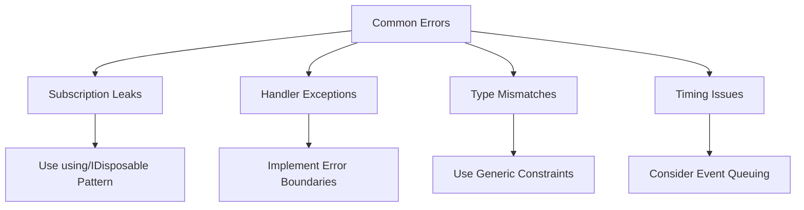

The EventSystem provides a robust foundation for decoupled communication in Unity games, enabling clean separation of concerns and maintainable system architecture.
