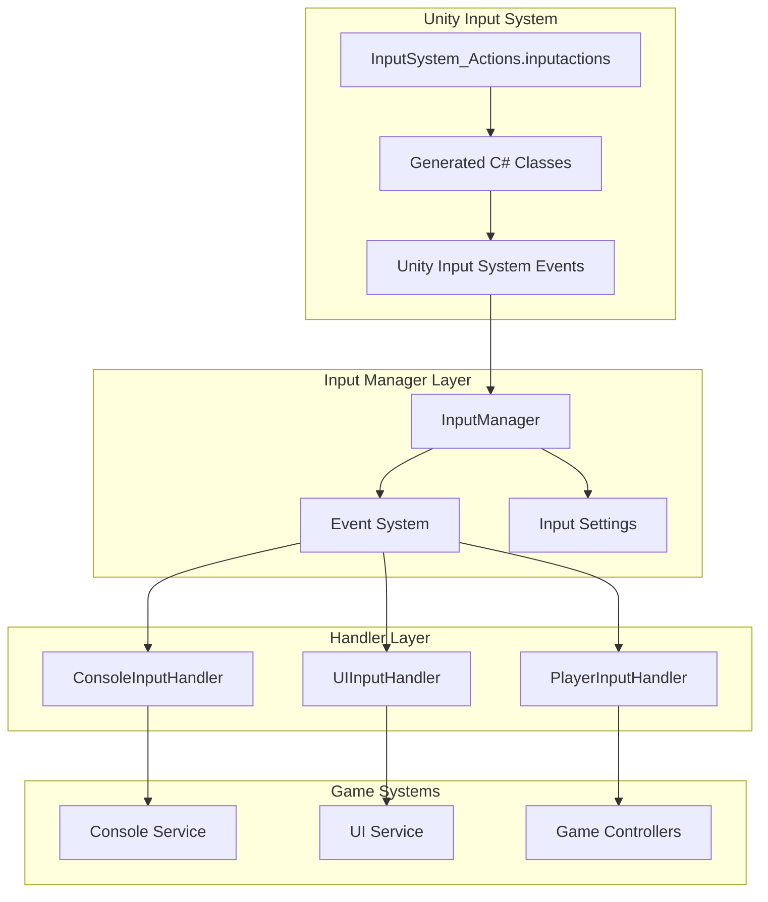
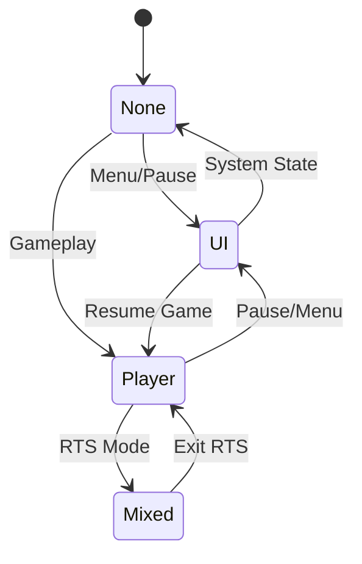
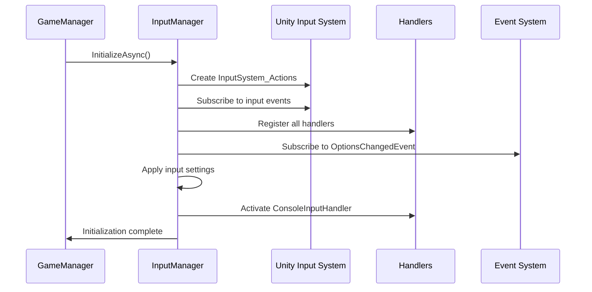
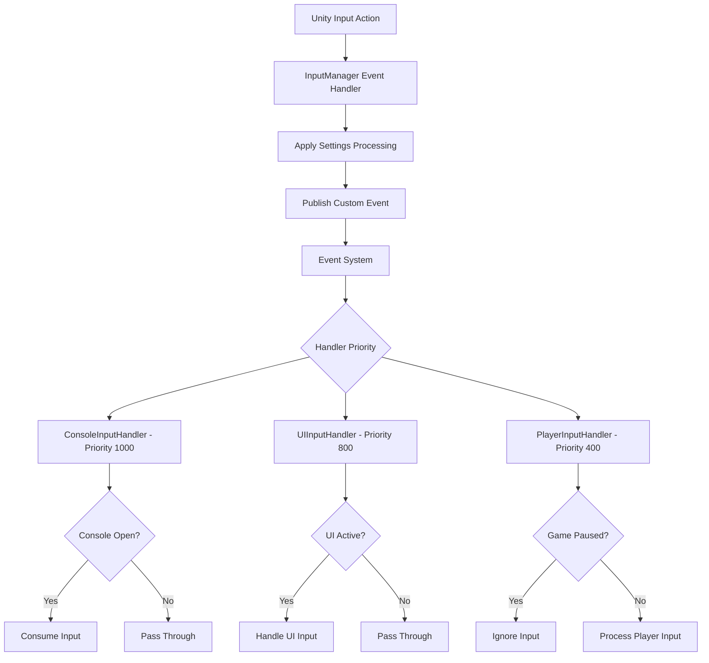
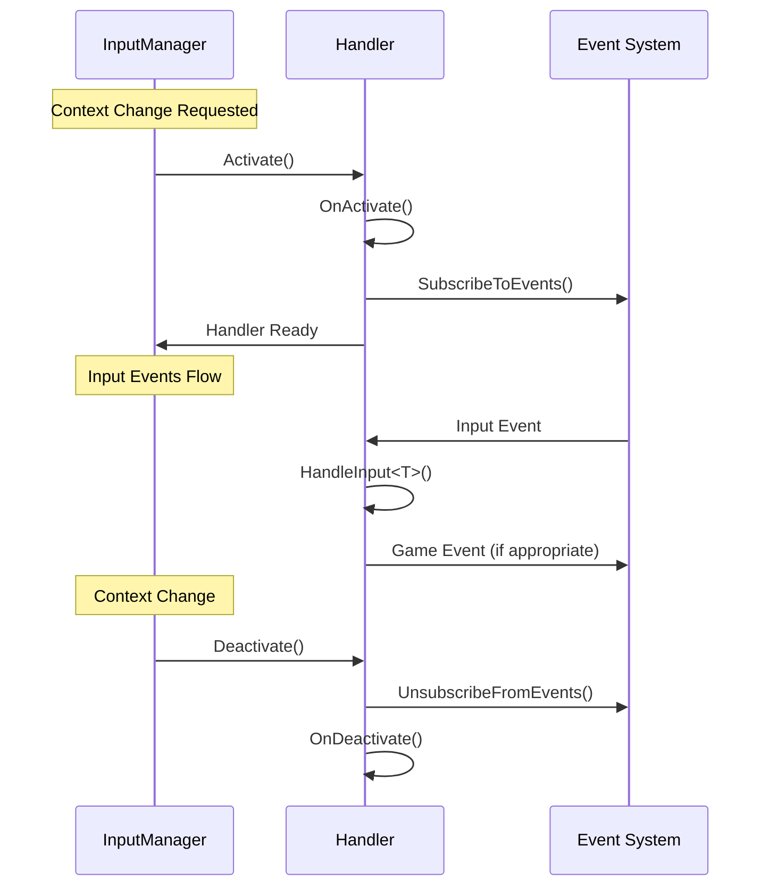
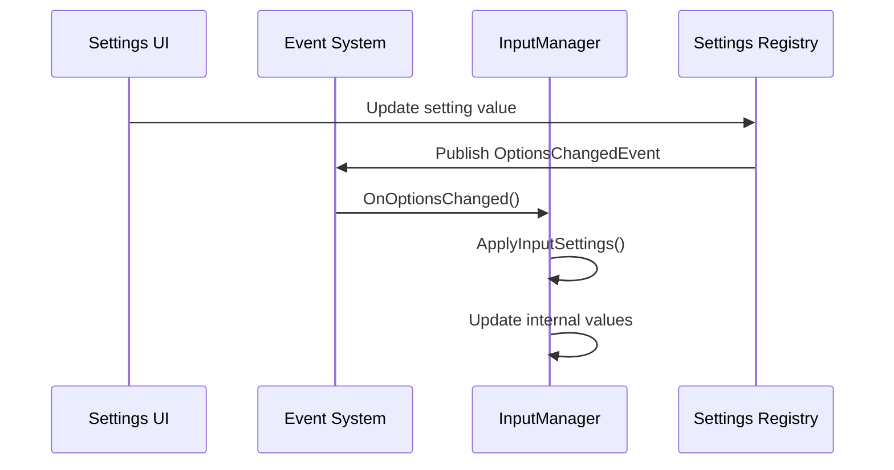
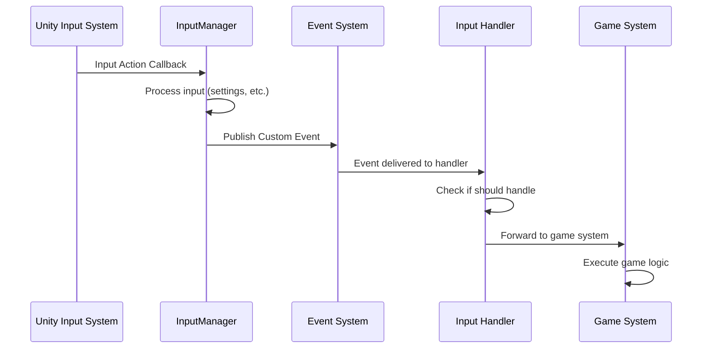
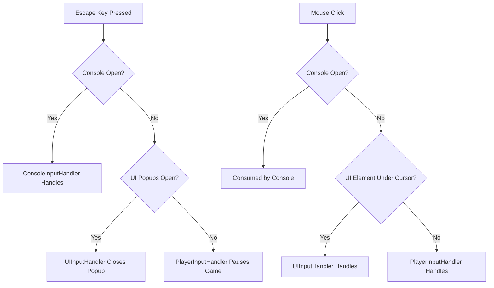

# Input System Documentation

## Overview

The Input System provides a unified, context-aware input management framework that combines Unity's Input System with custom event-driven handlers. It manages different input contexts (UI, Player, Console) with priority-based processing and automatic conflict resolution.

## Architecture



### Core Components

- **InputManager**: Central coordinator that manages Unity Input System integration and handler lifecycle
- **InputHandlerBase**: Abstract base class for all input handlers with priority and activation systems
- **Input Contexts**: System for switching between different input modes (None, UI, Player, Mixed)
- **Event System Integration**: Converts Unity input events to custom game events
- **Settings Integration**: Mouse sensitivity, Y-axis inversion, and other input preferences

## Input Contexts

The system uses contexts to manage which inputs are active:



### Context Types

- **None**: No input handlers active (system states)
- **UI**: Only UI input active (menus, popups)
- **Player**: Only player input active (gameplay)
- **Mixed**: Both UI and player input active (RTS, complex interfaces)

## InputManager

The InputManager serves as the central coordinator for all input operations:

### Key Responsibilities

1. **Unity Input System Integration**: Converts Unity input callbacks to custom events
2. **Handler Management**: Activates/deactivates handlers based on context
3. **Settings Integration**: Applies mouse sensitivity and Y-axis inversion
4. **Context Switching**: Manages transitions between input modes
5. **Priority Management**: Ensures higher priority handlers process input first

### Initialization Flow



### Input Processing Pipeline



## Input Handlers

### Handler Hierarchy

Each handler has a specific purpose and priority level:

#### ConsoleInputHandler (Priority: 1000)
- **Always Active**: Console can be toggled from any state
- **Highest Priority**: Prevents conflicts when console is open
- **Input Consumption**: Consumes most input when console is active
- **Key Bindings**: Tilde (~) to toggle, Enter to submit commands

```csharp
// Console toggle is always available
private void OnConsoleToggle(ConsoleToggleInputEvent evt)
{
    if (evt.Phase == InputActionPhase.Performed && debugSettings.ConsoleEnabled.Value)
    {
        bool currentState = _consoleService.IsConsoleOpen();
        _consoleService.SetConsoleOpen(!currentState);
    }
}
```

#### UIInputHandler (Priority: 800)
- **Context Dependent**: Active during UI and Mixed contexts
- **Navigation Support**: Handles menu navigation, clicks, cancellation
- **Popup Management**: Manages UI popup stack and cancellation
- **Key Bindings**: Arrow keys/WASD for navigation, Enter for submit, Escape for cancel

```csharp
// Handles UI cancellation contextually
private void OnUICancel(UICancelInputEvent evt)
{
    if (_uiService.HasOpenPopups())
    {
        // Close topmost popup
        var currentPopup = _uiService.GetCurrentPopup();
        // Handle popup closure
    }
    else
    {
        // No popups - pause game instead
        _eventSystem.Publish(new PauseRequestedEvent());
    }
}
```

#### PlayerInputHandler (Priority: 400)
- **Gameplay Only**: Active during Player and Mixed contexts
- **Pause Respect**: Automatically ignores input when game is paused
- **Movement & Actions**: Handles all player gameplay input
- **Key Bindings**: WASD for movement, Mouse for look, Space for jump, etc.

```csharp
// Respects pause state automatically
private void OnPlayerMove(PlayerMoveInputEvent evt)
{
    if (_pauseService.IsPaused) return;
    
    // Forward movement data to movement systems
}
```

### Handler Lifecycle



## Input Settings Integration

The system integrates with the game's settings system for input preferences:

### Supported Settings

- **Mouse Sensitivity**: Multiplier applied to look input
- **Y-Axis Inversion**: Inverts vertical mouse movement
- **Future Settings**: Key bindings, controller support, etc.

### Settings Processing

```csharp
private Vector2 ProcessLookInput(Vector2 rawInput)
{
    // Apply mouse sensitivity
    Vector2 processedInput = rawInput * _mouseSensitivity;
    
    // Apply Y-axis inversion
    if (_invertYAxis)
    {
        processedInput.y = -processedInput.y;
    }
    
    return processedInput;
}
```

### Settings Updates



## Unity Input System Integration

### Action Maps

The system uses three action maps defined in `InputSystem_Actions.inputactions`:

#### Player Action Map
- **Move**: WASD/Arrow keys, Left stick (Vector2)
- **Look**: Mouse delta, Right stick (Delta with scaling)
- **Attack**: Mouse buttons, Triggers (Button)
- **Jump**: Space, A button (Button)
- **Crouch**: Left Control, B button (Button, hold/toggle)
- **Sprint**: Left Shift, Left stick click (Button, hold)
- **Interact**: E, X button (Button)
- **Pause**: Escape, Menu button (Button)

#### UI Action Map
- **Navigate**: Arrow keys, WASD, D-pad (Vector2)
- **Submit**: Enter, Space, A button (Button)
- **Cancel**: Escape, Backspace, B button (Button)
- **Click**: Mouse left click, A button (Button)
- **Point**: Mouse position (Vector2)
- **RightClick**: Mouse right click (Button)
- **ScrollWheel**: Mouse scroll wheel (Scroll)

#### Console Action Map
- **ToggleConsole**: Tilde (~), Backtick (`) (Button)
- **Submit**: Enter, Return (Button)
- **TabComplete**: Tab (Button)
- **HistoryUp**: Up arrow (Button)
- **HistoryDown**: Down arrow (Button)

### Event Conversion

The InputManager converts Unity input callbacks to custom events:

```csharp
// Unity callback -> Custom event
_onMoveInput = ctx => _eventSystem.Publish(new PlayerMoveInputEvent(ctx.ReadValue<Vector2>(), ctx.phase));
_onLookInput = ctx => {
    Vector2 rawInput = ctx.ReadValue<Vector2>();
    Vector2 processedInput = ProcessLookInput(rawInput); // Apply settings
    _eventSystem.Publish(new PlayerLookInputEvent(processedInput, ctx.phase));
};
```

## Context Management

### Context Switching

Input contexts determine which handlers are active:

```csharp
public void SetInputContext(InputContext context)
{
    if (_currentContext == context) return;
    
    _currentContext = context;
    
    // Deactivate non-console handlers
    DeactivateHandler<UIInputHandler>();
    DeactivateHandler<PlayerInputHandler>();
    
    // Activate based on context
    switch (context)
    {
        case InputContext.UI:
            ActivateHandler<UIInputHandler>();
            break;
        case InputContext.Player:
            ActivateHandler<PlayerInputHandler>();
            break;
        case InputContext.Mixed:
            ActivateHandler<UIInputHandler>();
            ActivateHandler<PlayerInputHandler>();
            break;
    }
}
```

### Context Usage Examples

```csharp
// Game state transitions
public class MainMenuState : BaseGameState
{
    public override void OnEnter()
    {
        InputManager.SetInputContext(InputContext.UI); // Menu navigation only
    }
}

public class PlayingState : BaseGameState
{
    public override void OnEnter()
    {
        InputManager.SetInputContext(InputContext.Player); // Gameplay input
    }
    
    private void OnPauseMenuOpened()
    {
        InputManager.SetInputContext(InputContext.UI); // Switch to menu input
    }
}

// Specialized controllers
public class RTSController : BasePlayerController
{
    protected override void Start()
    {
        _requiredInputContext = InputContext.Mixed; // Needs both camera and UI
        base.Start();
    }
}
```

## Event System Integration

### Custom Input Events

The system defines custom events for each input type:

```csharp
// Player Events
public class PlayerMoveInputEvent
{
    public Vector2 MoveVector { get; }
    public InputActionPhase Phase { get; }
}

public class PlayerLookInputEvent
{
    public Vector2 LookDelta { get; }
    public InputActionPhase Phase { get; }
}

// UI Events
public class UINavigateInputEvent
{
    public Vector2 NavigateVector { get; }
}

// Console Events
public class ConsoleToggleInputEvent
{
    public InputActionPhase Phase { get; }
}
```

### Event Flow



## Priority and Conflict Resolution

### Handler Priority System

Handlers are processed in priority order (higher numbers first):

1. **ConsoleInputHandler (1000)**: Always wins conflicts
2. **UIInputHandler (800)**: Takes precedence during UI interactions
3. **PlayerInputHandler (400)**: Only processes when no higher priority handlers consume input

### Input Consumption

Handlers can consume input to prevent lower priority handlers from processing it:

```csharp
public override bool HandleInput<T>(T inputEvent)
{
    // Console open? Consume most input except console-specific
    if (!_consoleService.IsConsoleOpen()) return false;
    
    return inputEvent is not ConsoleSubmitInputEvent && 
           inputEvent is not ConsoleTabCompleteInputEvent;
}
```

### Conflict Resolution Examples



## Integration Examples

### Game State Integration

```csharp
public class GameStateManager
{
    public void TransitionToGameplay()
    {
        // Set appropriate input context for gameplay
        _inputManager.SetInputContext(InputContext.Player);
    }
    
    public void OpenPauseMenu()
    {
        // Switch to UI input for menu navigation
        _inputManager.SetInputContext(InputContext.UI);
    }
}
```

### Controller Integration

```csharp
public class PlayerController : MonoBehaviour
{
    private void OnEnable()
    {
        // Subscribe to processed input events
        _eventSystem.Subscribe<PlayerMoveInputEvent>(OnMoveInput);
        _eventSystem.Subscribe<PlayerLookInputEvent>(OnLookInput);
    }
    
    private void OnMoveInput(PlayerMoveInputEvent evt)
    {
        // Input is already processed (sensitivity, etc.)
        Vector2 movement = evt.MoveVector;
        ApplyMovement(movement);
    }
}
```

### Settings Integration

```csharp
public class InputSettings : MonoBehaviour
{
    public void UpdateMouseSensitivity(float newSensitivity)
    {
        // Settings system automatically notifies InputManager
        var settings = SettingsRegistry.Get<InputSettings_SO>();
        settings.MouseSensitivity.Value = newSensitivity;
        
        // InputManager receives OptionsChangedEvent and updates
    }
}
```

## Best Practices

### Handler Implementation

1. **Specific Responsibility**: Each handler should manage one input domain
2. **Priority Assignment**: Higher priority for more critical/exclusive input
3. **Input Consumption**: Only consume input when necessary to prevent conflicts
4. **State Awareness**: Check relevant service states before processing

### Context Management

1. **Clear Contexts**: Use appropriate contexts for each game state
2. **Smooth Transitions**: Always set context when entering new game states
3. **Mixed Context**: Use sparingly, only for complex interfaces that need both input types

### Performance Considerations

1. **Event Subscription**: Subscribe/unsubscribe properly in handler lifecycle
2. **Input Processing**: Keep processing lightweight, defer heavy work
3. **Settings Application**: Cache processed settings, don't recalculate every frame

### Debugging

1. **Handler Logging**: Each handler logs activation/deactivation
2. **Context Tracking**: Monitor context changes for unexpected behavior
3. **Event Flow**: Use event system debugging to trace input flow

## Troubleshooting

### Common Issues

#### Input Not Responding
- Check if appropriate context is set for current game state
- Verify handler is registered and activated
- Confirm input isn't being consumed by higher priority handler

#### Settings Not Applied
- Verify OptionsChangedEvent is being published when settings change
- Check InputManager is subscribed to settings events
- Ensure settings are being loaded correctly from SettingsRegistry

#### Context Conflicts
- Review context switching logic in game states
- Check for competing context changes from different systems
- Verify handler priorities are set appropriately

### Debugging Tools

```csharp
// Log current input state
Debug.Log($"Current Context: {inputManager.GetCurrentContext()}");
Debug.Log($"Mouse Sensitivity: {inputManager.GetMouseSensitivity()}");
Debug.Log($"Y-Axis Inverted: {inputManager.GetInvertYAxis()}");

// Monitor handler activation
// (Built into handlers - check console for activation logs)
```

## Conclusion

The Input System provides a robust, context-aware foundation for managing all game input. Its priority-based handler system, Unity Input System integration, and settings management ensure reliable input processing across all game states while maintaining excellent performance and flexibility.

**Key Benefits:**
- **Context Awareness**: Automatic input mode switching based on game state
- **Priority Management**: Conflict-free input handling with clear precedence
- **Settings Integration**: Seamless user preference application
- **Event-Driven**: Clean separation between input detection and game logic
- **Extensible**: Easy to add new handlers and input types
- **Performance**: Efficient event-based processing with minimal overhead

The system scales from simple single-context games to complex applications requiring multiple simultaneous input modes, making it suitable for any game genre or interface complexity.
