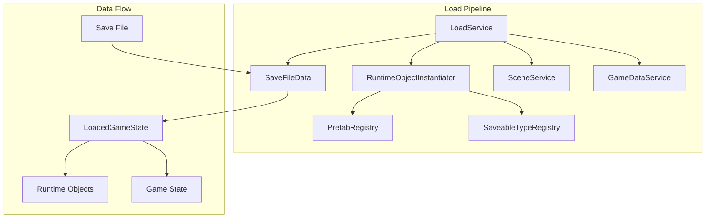
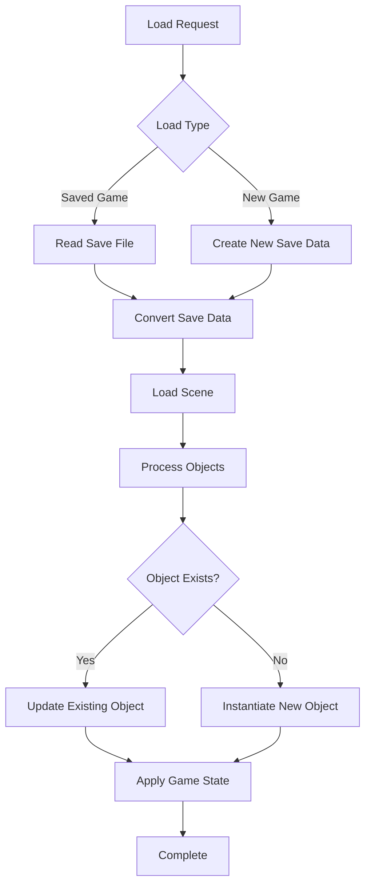
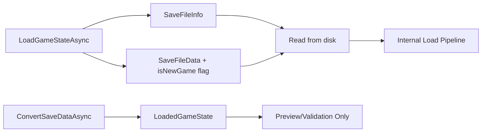
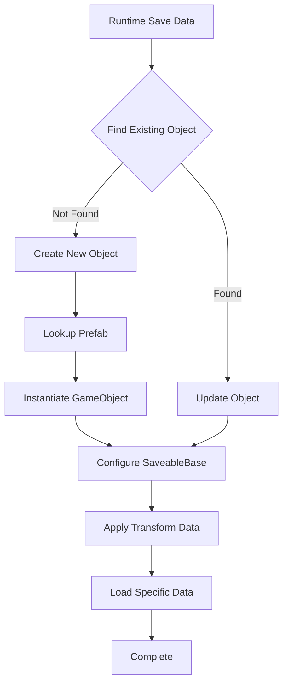
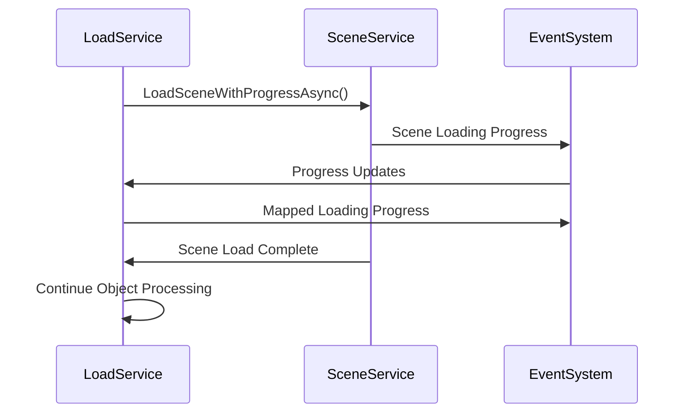
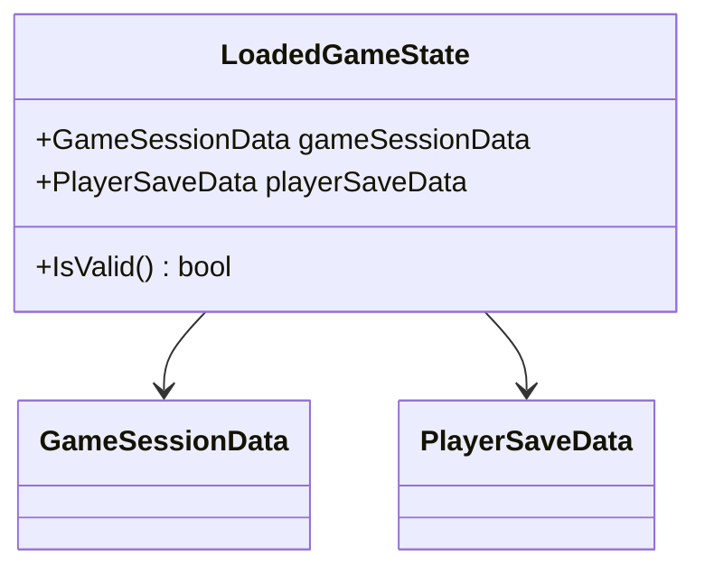
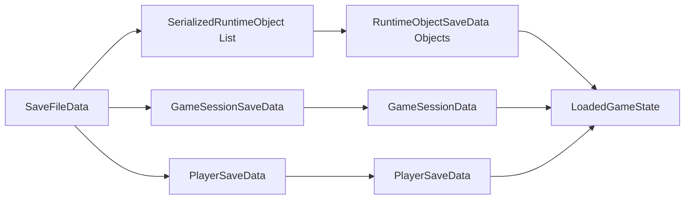
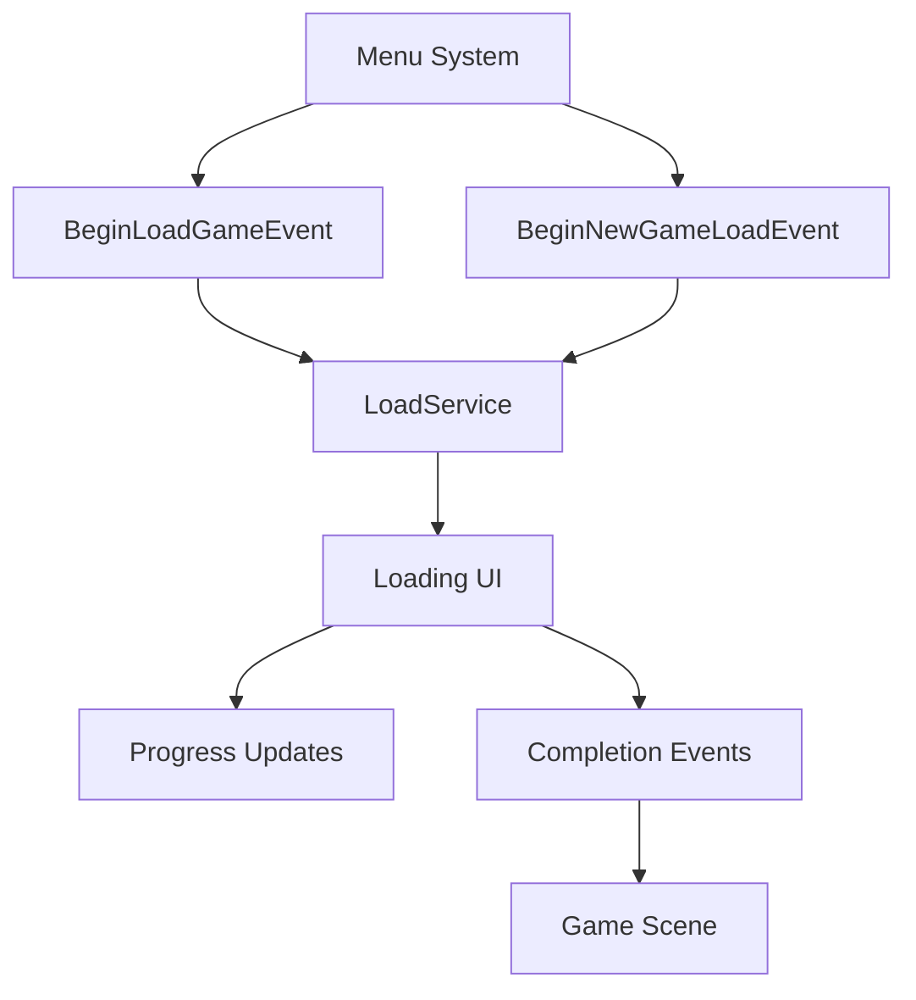

# LoadSystem Documentation

## Overview

The LoadSystem is responsible for transforming saved game data back into live game objects and state. It handles both loading existing save files and creating new game sessions through a unified pipeline that ensures consistency across all load operations.

## Architecture

The LoadSystem consists of two main components that work together to reconstruct game state:

### Core Components

- **LoadService**: Orchestrates the entire loading process
- **RuntimeObjectInstantiator**: Creates and configures game objects from save data
- **PrefabRegistry**: Maps prefab GUIDs to actual prefab assets
- **SaveableTypeRegistry**: Resolves save data types automatically
- **LoadedGameState**: Container for converted runtime data

## Loading Process

The LoadSystem follows a standardized pipeline regardless of whether loading a saved game or starting a new game:

### Load Stages

1. **Initialization** (0-10%): Setup and validation
2. **Data Processing** (10-20%): Convert save data to runtime format
3. **Scene Loading** (40-60%): Switch to appropriate scene
4. **Object Creation** (60-85%): Instantiate/update game objects
5. **State Application** (85-100%): Apply final game state

## LoadService

The LoadService acts as the main orchestrator for all load operations. It provides a unified interface for both saved games and new games.

### Key Responsibilities

- **Event Handling**: Responds to load requests from UI systems
- **Progress Reporting**: Publishes detailed progress information
- **Error Recovery**: Gracefully handles failures and corrupted data
- **Resource Coordination**: Manages interaction between multiple services

### Load Methods

### Event Integration

The LoadService publishes events throughout the loading process:

- `LoadingProgressEvent`: Real-time progress updates with descriptive messages
- `LoadingCompletedEvent`: Successful completion notification
- `LoadingFailedEvent`: Error information and recovery guidance

## RuntimeObjectInstantiator

The RuntimeObjectInstantiator handles the creation and configuration of game objects from save data. It has been designed to eliminate complex factory patterns in favor of direct SaveableBase integration.

### Object Processing Strategy

### Smart Object Detection

The system intelligently detects existing objects in the scene to avoid duplication:

- Searches for objects with matching `UniqueID` and `TypeName`
- Updates existing objects instead of creating duplicates
- Maintains object references and scene hierarchy
- Improves loading performance by reducing instantiation overhead

### Configuration Process

1. **Prefab Lookup**: Uses PrefabRegistry to find prefab by GUID
2. **Instantiation**: Creates GameObject with correct transform data
3. **SaveableBase Configuration**: Applies save data through SaveableBase.LoadRuntimeSaveData()
4. **Validation**: Ensures object is properly configured

## Scene Management Integration

The LoadSystem coordinates with SceneService to handle scene transitions during loading:

### Progress Mapping

Scene loading progress (0.0-1.0) is mapped to overall loading progress (0.4-0.6), providing seamless progress reporting to UI systems.

## Data Structures

### LoadedGameState

Container for converted runtime game data that separates core game information from runtime objects:

### Integration with SaveFileData

## Error Handling

The LoadSystem implements comprehensive error handling and recovery strategies:

### Common Error Scenarios

1. **Missing Prefab**: Gracefully skips objects with missing prefab references
2. **Corrupted Save Data**: Continues loading valid objects, reports failures
3. **Scene Loading Failure**: Falls back to default scene when possible
4. **Component Mismatch**: Logs errors for objects without SaveableBase components

### Recovery Strategies

- **Partial Loading**: Continues with successful objects when some fail
- **Fallback Scenes**: Uses default scenes when saved scenes are unavailable
- **Data Validation**: Validates save data integrity before processing
- **Graceful Degradation**: Provides meaningful error messages for debugging

## Performance Considerations

### Optimization Features

- **Parallel Processing**: Some operations can be performed concurrently
- **Smart Detection**: Avoids unnecessary object instantiation
- **Progressive Loading**: Processes objects in manageable batches
- **Memory Management**: Properly disposes temporary objects

### Progress Reporting

The system provides detailed progress information:

- **Granular Updates**: Frequent progress updates for responsive UI
- **Descriptive Messages**: Clear indication of current loading stage
- **Error Aggregation**: Groups similar errors to avoid spam

## Integration Points

### Service Dependencies

The LoadSystem integrates with several core services:

- **FileService**: Reading save files from disk
- **SceneService**: Scene loading and management
- **GameDataService**: Core game state application
- **EventSystem**: Progress reporting and event handling
- **PrefabRegistry**: Prefab asset resolution
- **SaveableTypeRegistry**: Automatic type discovery

### Usage Patterns

## Best Practices

### Error Recovery
- Always validate save data before processing
- Implement fallback mechanisms for critical failures
- Log detailed error information for debugging
- Continue loading when partial failures occur

### Performance
- Use progress reporting for long-running operations
- Implement object pooling for frequently instantiated objects
- Consider memory usage with large save files
- Profile loading times in development

### Integration
- Subscribe to loading events for UI updates
- Handle both success and failure scenarios
- Provide meaningful feedback to users
- Ensure proper service initialization order

The LoadSystem provides a robust foundation for game state restoration with comprehensive error handling, detailed progress reporting, and efficient object management. Its unified pipeline ensures consistent behavior across all loading scenarios while maintaining excellent performance and reliability.