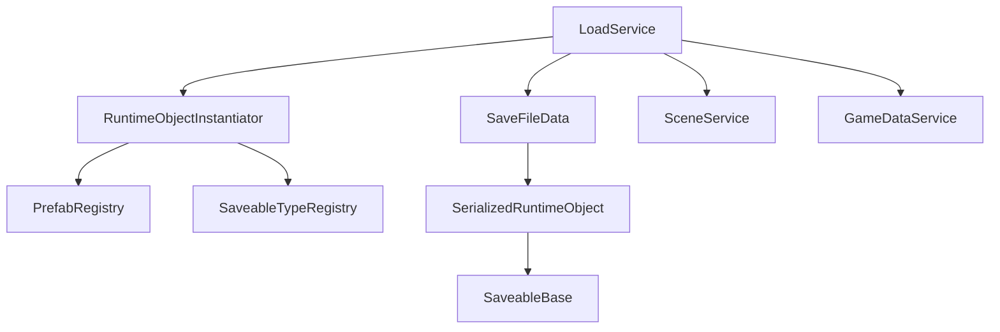

# Load System Documentation

## Overview

The Load System is a comprehensive framework for restoring game state from persistent storage in Unity. It features automatic object instantiation, intelligent scene management, and seamless integration with the Save System.

## Key Features

- **Automatic Object Instantiation**: Creates runtime objects from save data
- **Scene Management**: Handles scene loading and object placement
- **Smart Object Detection**: Updates existing objects instead of duplicating
- **Progress Reporting**: Real-time loading progress with detailed steps
- **Type-Safe Loading**: Automatic type resolution using SaveableTypeRegistry
- **Error Recovery**: Graceful handling of corrupted or missing data
- **Unified Pipeline**: Same process for both saved games and new games

---

## Architecture Overview

### Core Components



### Service Integration

The Load System integrates with multiple game services:

- **LoadService**: Main load orchestration service
- **RuntimeObjectInstantiator**: Handles object instantiation and configuration
- **SceneService**: Manages scene transitions during loading
- **GameDataService**: Applies core game data (player, session)
- **EventSystem**: Progress reporting and completion notifications

---

## Quick Start Guide

### 1. Basic Load Operation

```csharp
// Get the load service
var loadService = await GameManager.GetServiceAsync<ILoadService>();

// Load a specific save file
var saveFileInfo = new SaveFileInfo("MySaveFile.json", saveData);
bool success = await loadService.LoadGameStateAsync(saveFileInfo);

if (success)
{
    Debug.Log("Game loaded successfully!");
}
else
{
    Debug.LogError("Failed to load game!");
}
```

### 2. New Game Loading

```csharp
// Publish new game event (handled automatically by LoadService)
var newGameEvent = new BeginNewGameLoadEvent
{
    PlayerName = "Player1",
    Difficulty = "Normal", 
    StartingScene = "GameLevel1"
};

eventSystem.Publish(newGameEvent);
```

### 3. Progress Monitoring

```csharp
// Subscribe to progress events
eventSystem.Subscribe<LoadingProgressEvent>(OnLoadingProgress);

private void OnLoadingProgress(LoadingProgressEvent evt)
{
    Debug.Log($"Loading: {evt.Message} ({evt.Progress:P0})");
    // Update progress bar UI
    progressBar.value = evt.Progress;
}
```

---

## LoadService Class Reference

### Overview

`LoadService` is the main orchestration service for load operations. It handles both saved games and new game creation through a unified pipeline.

### Key Methods

#### Load from Save File
```csharp
public async Task<bool> LoadGameStateAsync(SaveFileInfo saveFileInfo)
```

Loads a game from an existing save file with full progress reporting.

#### Load from Save Data
```csharp
public async Task<bool> LoadGameStateAsync(SaveFileData saveFileData, bool isNewGame = false)
```

Loads game state from SaveFileData structure. Used for both saved games and new games.

#### Convert Save Data
```csharp
public async Task<LoadedGameState> ConvertSaveDataAsync(SaveFileData saveFileData)
```

Converts save data to runtime objects without applying to game state. Useful for validation or preview.

### Load Process Flow

#### For Saved Games:
1. **Initialize** (0.0): Set up load operation
2. **Read Save File** (0.1): Load SaveFileData from disk
3. **Validate Data** (0.1): Ensure save file integrity
4. **Convert Data** (0.2): Transform to runtime objects
5. **Load Scene** (0.4-0.6): Switch to saved scene
6. **Instantiate Objects** (0.6): Create/update runtime objects
7. **Apply Game State** (0.85): Update core game data
8. **Complete** (1.0): Finalize and notify

#### For New Games:
1. **Initialize** (0.0): Set up new game
2. **Setup Game Data** (0.1): Create fresh SaveFileData
3. **Create Objects** (0.2): Generate initial game objects
4. **Load Scene** (0.4-0.6): Switch to starting scene
5. **Apply Game State** (0.85): Set initial game data
6. **Complete** (1.0): Finalize and notify

### Event Integration

The load service publishes events during the loading process:

- `LoadingProgressEvent`: Progress updates with descriptive messages
- `LoadingCompletedEvent`: Load operation completed successfully  
- `LoadingFailedEvent`: Load operation failed with error details

---

## RuntimeObjectInstantiator Class Reference

### Overview

`RuntimeObjectInstantiator` handles the instantiation and configuration of runtime objects from save data. It has been completely redesigned to eliminate ObjectFactories and use SaveableBase directly.

### Key Features

- **No More ObjectFactories**: Direct SaveableBase integration
- **Automatic Type Handling**: Uses SaveableTypeRegistry for type resolution
- **Smart Object Detection**: Updates existing objects instead of duplicating
- **Prefab Registry Integration**: Efficient prefab lookup by GUID

### Key Methods

#### Object Instantiation
```csharp
public async Task<GameObject> InstantiateObjectAsync(RuntimeObjectSaveData saveData, Transform parent = null)
```

Creates a new GameObject from save data:
1. Looks up prefab using PrefabGUID
2. Instantiates prefab at specified transform values
3. Configures using SaveableBase.LoadRuntimeSaveData()

#### Object Configuration  
```csharp
public async Task<bool> ConfigureObjectAsync(GameObject gameObject, RuntimeObjectSaveData saveData)
```

Configures an existing GameObject with save data:
1. Finds SaveableBase component on GameObject
2. Sets UniqueID from save data
3. Calls LoadRuntimeSaveData() to restore state

#### Debug Methods
```csharp
public void LogRegisteredTypes()
public bool ValidateRegisteredTypes()
```

### Instantiation Process

#### New Object Creation:
1. **Validate Input**: Check save data and prefab GUID
2. **Lookup Prefab**: Find prefab in PrefabRegistry
3. **Instantiate**: Create GameObject with correct transform
4. **Configure**: Use SaveableBase to restore state
5. **Return**: Provide configured GameObject

#### Existing Object Update:
1. **Find Component**: Locate SaveableBase on GameObject
2. **Set Identity**: Update UniqueID from save data
3. **Load State**: Call LoadRuntimeSaveData() method
4. **Return**: Indicate success/failure

### Integration with SaveableBase

```
// NEW SYSTEM (Simple, automatic):
var saveableBase = gameObject.GetComponent<SaveableBase>();
if (saveableBase != null)
{
    saveableBase.SetUniqueID(saveData.uniqueID);
    saveableBase.LoadRuntimeSaveData(saveData);
    return true;
}
```

---

## PrefabRegistry Integration

### Overview

`RuntimeObjectInstantiator` uses `PrefabRegistry` to efficiently map prefab GUIDs to actual prefab assets, eliminating the need for Resources folder loading.

### Prefab Lookup Process

1. **GUID Extraction**: Get prefabGUID from RuntimeObjectSaveData
2. **Registry Lookup**: Find prefab asset using PrefabRegistry.GetPrefab()
3. **Validation**: Ensure prefab exists and is valid
4. **Instantiation**: Create GameObject from prefab asset

### Error Handling

```csharp
GameObject prefab = _prefabRegistry.GetPrefab(saveData.prefabGUID);
if (prefab == null)
{
    Debug.LogError($"Prefab not found for GUID: {saveData.prefabGUID}");
    return null;
}
```

---

## Smart Object Detection

### Overview

The Load System intelligently detects existing objects in the scene and updates them instead of creating duplicates. This is especially useful for scene-based objects that should persist.

### Detection Process

```csharp
private GameObject FindExistingSceneObject(string uniqueID, string typeName)
{
    var allSaveables = UnityEngine.Object.FindObjectsOfType<SaveableBase>();
    
    foreach (var saveable in allSaveables)
    {
        if (saveable.UniqueID == uniqueID && saveable.TypeName == typeName)
        {
            return saveable.gameObject;
        }
    }
    
    return null; // No existing object found
}
```

### Usage in Load Process

```csharp
foreach (var runtimeData in allRuntimeObjects)
{
    var existingObject = FindExistingSceneObject(runtimeData.uniqueID, runtimeData.typeName);
    
    if (existingObject != null)
    {
        // Update existing object
        await _runtimeInstantiator.ConfigureObjectAsync(existingObject, runtimeData);
    }
    else
    {
        // Create new object
        await _runtimeInstantiator.InstantiateObjectAsync(runtimeData);
    }
}
```

### Benefits

- **No Duplicates**: Prevents creating multiple objects with same UniqueID
- **Faster Loading**: Updates are faster than instantiation
- **Scene Integration**: Works seamlessly with pre-placed scene objects
- **State Preservation**: Maintains object references and connections

---

## Scene Management Integration

### Overview

The Load System integrates with `SceneService` to handle scene transitions during loading. It supports both saved games (load specific scene) and new games (load starting scene).

### Scene Loading Process

#### For Saved Games:
```csharp
var sceneToLoad = loadedGameState.GameSessionData?.CurrentScene;
if (!string.IsNullOrEmpty(sceneToLoad))
{
    bool sceneLoaded = await _sceneService.LoadSceneWithProgressAsync(sceneToLoad, (progress) =>
    {
        // Map scene progress to overall loading progress
        float mappedProgress = 0.4f + (progress * 0.2f);
        _eventSystem?.Publish(new LoadingProgressEvent("Loading scene...", mappedProgress));
    });
}
```

#### For New Games:
```csharp
var newGameEvent = new BeginNewGameLoadEvent
{
    StartingScene = "GameLevel1" // Scene specified in new game event
};
```

### Progress Mapping

Scene loading progress (0.0-1.0) is mapped to the overall loading progress range (0.4-0.6), providing seamless progress reporting to the UI.

---

## Data Structures

### LoadedGameState

Container for converted runtime game data:

```csharp
public class LoadedGameState
{
    public GameSessionData GameSessionData { get; set; }
    public PlayerSaveData PlayerSaveData { get; set; }
    
    public bool IsValid()
    {
        return GameSessionData != null && PlayerSaveData != null;
    }
}
```

### Event Classes

#### LoadingProgressEvent
```csharp
public class LoadingProgressEvent
{
    public string Message { get; } // Descriptive progress message
    public float Progress { get; }  // Progress value (0.0 to 1.0)
}
```

#### LoadingCompletedEvent
```csharp
public class LoadingCompletedEvent
{
    // Signals successful completion of load operation
}
```

#### LoadingFailedEvent
```csharp
public class LoadingFailedEvent
{
    public Exception Exception { get; } // Error details
}
```

---

## Best Practices

### 1. Progress Event Handling

```csharp
public class LoadingUI : MonoBehaviour
{
    [SerializeField] private Slider _progressBar;
    [SerializeField] private Text _progressText;
    
    private void OnEnable()
    {
        EventSystem.Subscribe<LoadingProgressEvent>(OnLoadingProgress);
        EventSystem.Subscribe<LoadingCompletedEvent>(OnLoadingComplete);
        EventSystem.Subscribe<LoadingFailedEvent>(OnLoadingFailed);
    }
    
    private void OnLoadingProgress(LoadingProgressEvent evt)
    {
        _progressBar.value = evt.Progress;
        _progressText.text = evt.Message;
    }
    
    private void OnLoadingComplete(LoadingCompletedEvent evt)
    {
        // Hide loading UI, show game UI
        gameObject.SetActive(false);
    }
    
    private void OnLoadingFailed(LoadingFailedEvent evt)
    {
        // Show error message, return to menu
        ShowErrorDialog(evt.Exception.Message);
    }
}
```

### 2. Save File Validation

```csharp
public async Task<bool> ValidateAndLoadSaveFile(string fileName)
{
    try
    {
        var saveFileInfo = SaveFileInfo.CreateFromFile(fileName);
        if (saveFileInfo == null || !saveFileInfo.IsValid())
        {
            Debug.LogError($"Invalid save file: {fileName}");
            return false;
        }
        
        return await loadService.LoadGameStateAsync(saveFileInfo);
    }
    catch (Exception ex)
    {
        Debug.LogError($"Error loading save file {fileName}: {ex.Message}");
        return false;
    }
}
```

### 3. New Game Setup

```csharp
public class NewGameSetup : MonoBehaviour
{
    public void StartNewGame(string playerName, string difficulty)
    {
        var newGameEvent = new BeginNewGameLoadEvent
        {
            PlayerName = playerName,
            Difficulty = difficulty,
            StartingScene = GetStartingSceneForDifficulty(difficulty)
        };
        
        EventSystem.Publish(newGameEvent);
    }
    
    private string GetStartingSceneForDifficulty(string difficulty)
    {
        return difficulty switch
        {
            "Easy" => "TutorialLevel",
            "Normal" => "GameLevel1", 
            "Hard" => "GameLevel1_Hard",
            _ => "GameLevel1"
        };
    }
}
```

---

## Error Handling and Recovery

### Common Issues and Solutions

#### 1. Missing Prefab
**Issue**: RuntimeObjectSaveData references a prefab that doesn't exist.
```csharp
// Solution: Graceful handling with logging
if (prefab == null)
{
    Debug.LogError($"Prefab not found for GUID: {saveData.prefabGUID}. " +
                  $"Object {saveData.uniqueID} ({saveData.typeName}) will be skipped.");
    return null;
}
```

#### 2. Corrupted Save Data
**Issue**: SerializedRuntimeObject can't be deserialized.
```csharp
// Solution: Skip invalid objects, continue loading
var deserializedObj = serializedObj.Deserialize();
if (deserializedObj == null)
{
    Debug.LogWarning($"Failed to deserialize runtime object: {serializedObj.uniqueID}. Skipping...");
    continue;
}
```

#### 3. Missing Scene
**Issue**: Save file references a scene that doesn't exist.
```csharp
// Solution: Fall back to default scene
private string ValidateScene(string sceneName)
{
    if (string.IsNullOrEmpty(sceneName) || !SceneExists(sceneName))
    {
        Debug.LogWarning($"Scene '{sceneName}' not found. Using default scene.");
        return "DefaultGameScene";
    }
    return sceneName;
}
```

#### 4. Component Mismatch
**Issue**: Prefab doesn't have expected SaveableBase component.
```csharp
// Solution: Log error and skip object
var saveableBase = gameObject.GetComponent<SaveableBase>();
if (saveableBase == null)
{
    Debug.LogError($"GameObject '{gameObject.name}' does not have a SaveableBase component. " +
                  $"Cannot configure object {saveData.uniqueID}.");
    return false;
}
```

### Recovery Strategies

#### Partial Loading
When some objects fail to load, continue with successful objects:

```csharp
int successCount = 0;
int failureCount = 0;

foreach (var runtimeData in allRuntimeObjects)
{
    try
    {
        bool success = await ProcessRuntimeObject(runtimeData);
        if (success) successCount++;
        else failureCount++;
    }
    catch (Exception ex)
    {
        Debug.LogError($"Error processing {runtimeData.uniqueID}: {ex.Message}");
        failureCount++;
    }
}

Debug.Log($"Loading completed: {successCount} succeeded, {failureCount} failed");
return successCount > 0; // Consider successful if at least some objects loaded
```

#### Fallback Scene Loading
If the saved scene fails to load, fall back to a default scene:

```csharp
try
{
    await _sceneService.LoadSceneWithProgressAsync(targetScene, progressCallback);
}
catch (Exception ex)
{
    Debug.LogError($"Failed to load scene '{targetScene}': {ex.Message}");
    Debug.Log("Loading default scene instead...");
    await _sceneService.LoadSceneWithProgressAsync("DefaultGameScene", progressCallback);
}
```

---

## Performance Considerations

### Memory Management
- **Object Pooling**: Consider pooling frequently instantiated objects
- **Progressive Loading**: Load objects in batches for large save files
- **Memory Cleanup**: Properly dispose of temporary objects during loading

### Loading Speed Optimization
- **Parallel Operations**: Some operations can be parallelized
- **Caching**: Cache frequently accessed prefabs
- **Scene Preloading**: Consider preloading common scenes

### Progress Reporting
- **Granular Updates**: More frequent updates provide better user feedback
- **Meaningful Messages**: Use descriptive progress messages
- **Error Aggregation**: Batch similar errors to avoid spam

---

## Integration Examples

### Menu Integration
```csharp
public class SaveLoadMenu : MonoBehaviour
{
    public async void OnLoadButtonClick(SaveFileInfo saveFile)
    {
        ShowLoadingScreen();
        
        var loadService = await GameManager.GetServiceAsync<ILoadService>();
        bool success = await loadService.LoadGameStateAsync(saveFile);
        
        if (success)
        {
            // Loading screen will be hidden by LoadingCompletedEvent
        }
        else
        {
            HideLoadingScreen();
            ShowErrorDialog("Failed to load save file");
        }
    }
}
```

### Checkpoint System
```csharp
public class CheckpointManager : MonoBehaviour
{
    public async void SaveCheckpoint()
    {
        var saveService = await GameManager.GetServiceAsync<ISaveService>();
        await saveService.SaveGameStateAsync("checkpoint.json", isAutoSave: true);
    }
    
    public async void LoadCheckpoint()
    {
        var saveFileInfo = SaveFileInfo.CreateFromFile("checkpoint.json");
        if (saveFileInfo?.IsValid() == true)
        {
            var loadService = await GameManager.GetServiceAsync<ILoadService>();
            await loadService.LoadGameStateAsync(saveFileInfo);
        }
    }
}
```

---

## Testing and Debugging

### Debug Methods

#### Validate System State
```csharp
var instantiator = await GameManager.GetServiceAsync<IRuntimeObjectInstantiator>();
bool isValid = instantiator.ValidateRegisteredTypes();
if (!isValid)
{
    Debug.LogError("RuntimeObjectInstantiator validation failed!");
}
```

#### Log Type Information
```csharp
instantiator.LogRegisteredTypes();
// Output:
// [SaveableTypeRegistry] === Registered Types (2) ===
// [SaveableTypeRegistry] 'ClickableCube' -> ClickableCube -> ClickableCubeRuntimeSaveData
// [SaveableTypeRegistry] 'TestGenericSaveable' -> TestGenericSaveable -> TestGenericRuntimeSaveData
```

#### Test Save File Integrity
```csharp
public static bool ValidateSaveFile(string fileName)
{
    var saveFileInfo = SaveFileInfo.CreateFromFile(fileName);
    if (saveFileInfo == null) return false;
    
    // Try to load the save data
    try
    {
        string json = System.IO.File.ReadAllText(fileName);
        var saveData = JsonUtility.FromJson<SaveFileData>(json);
        return saveData?.ValidateData() == true;
    }
    catch (Exception ex)
    {
        Debug.LogError($"Save file validation failed: {ex.Message}");
        return false;
    }
}

---

## Conclusion

The Load System provides a robust, efficient framework for restoring game state with minimal configuration. The elimination of ObjectFactories and integration with SaveableTypeRegistry makes the system both simpler and more powerful.

Key benefits:
- **90% less boilerplate code** compared to previous factory-based systems
- **Automatic type discovery** eliminates manual registration
- **Smart object detection** prevents duplicates and improves performance
- **Comprehensive error handling** ensures graceful recovery from issues
- **Detailed progress reporting** provides excellent user feedback

For questions or issues, refer to the debugging section or examine the example implementations in the codebase.
