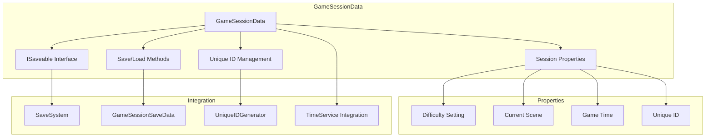
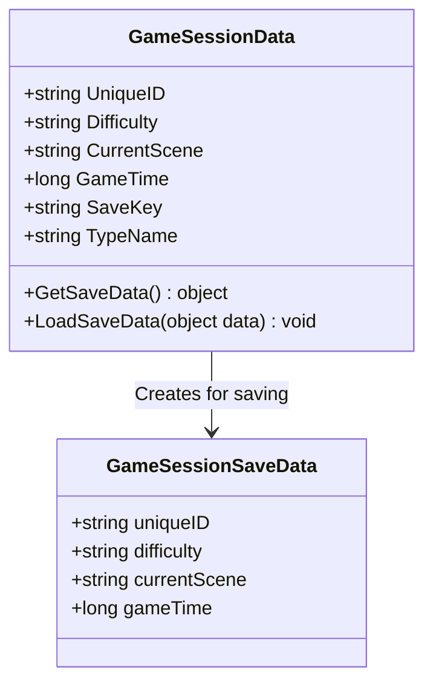
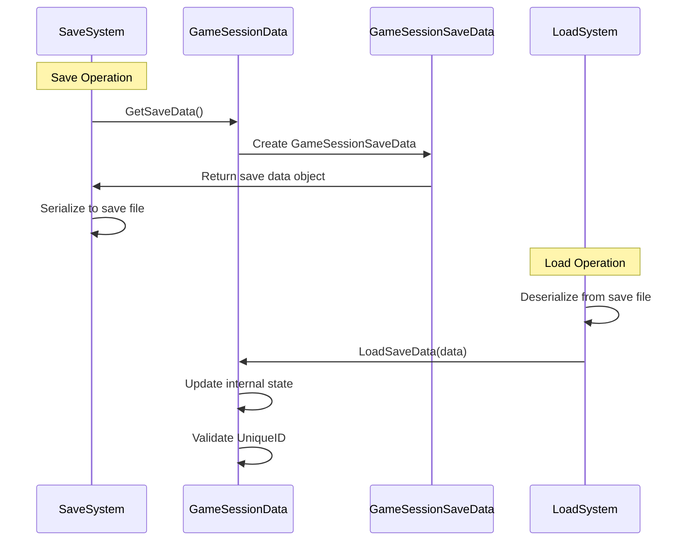
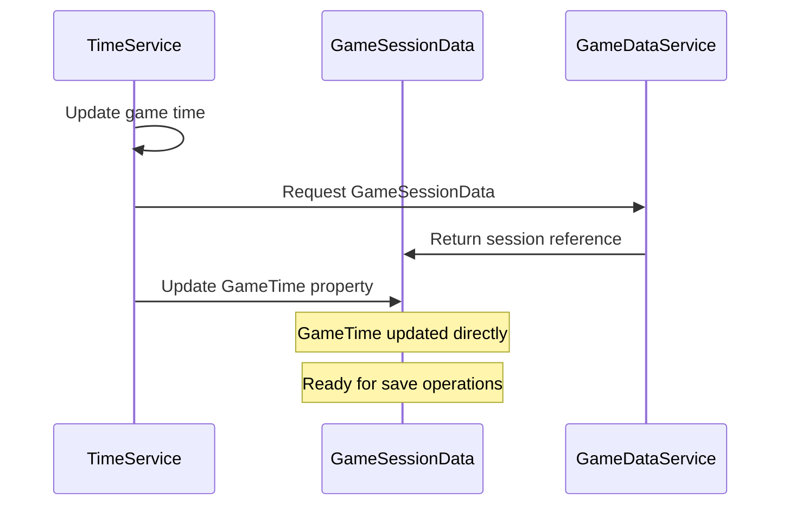
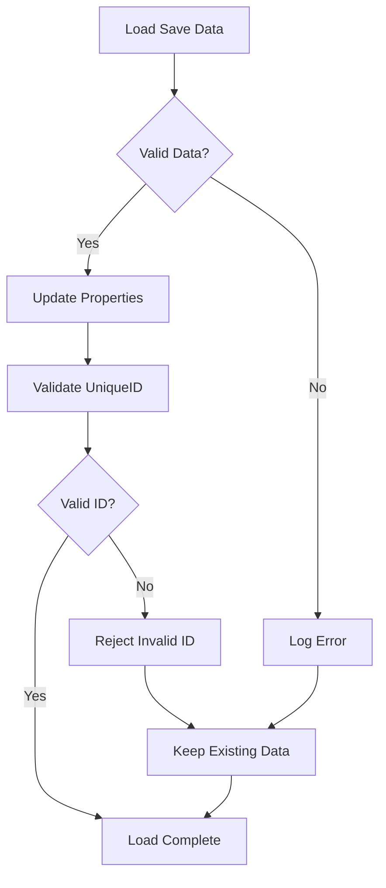
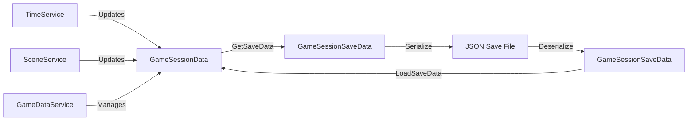

# GameSessionData Documentation

## Overview

GameSessionData is a core data structure that represents the current game session state, implementing the ISaveable interface to integrate seamlessly with the Save/Load system. It manages essential session information including difficulty settings, current scene, and elapsed game time while providing unique identification for save operations.

## Architecture



### Key Responsibilities

1. **Session State Management**: Tracks core game session information
2. **Save System Integration**: Provides standardized save/load operations
3. **Unique Identification**: Maintains persistent session identity across saves
4. **Time Tracking**: Integrates with TimeService for accurate game time tracking
5. **Scene Management**: Tracks current scene for proper game state restoration

## Core Properties

### Session Identification

```csharp
public string UniqueID { get; private set; }
public string SaveKey => "GameSessionData";
public string TypeName => typeof(GameSessionData).Name;
```

The GameSessionData uses a fixed SaveKey of "GameSessionData", ensuring there's always exactly one game session entry in save files.

### Game State Properties



#### Property Details

- **UniqueID**: Persistent identifier for this specific game session
- **Difficulty**: Game difficulty setting (e.g., "Easy", "Normal", "Hard")
- **CurrentScene**: Name of the currently active scene
- **GameTime**: Elapsed game time in ticks (managed by TimeService)

## ISaveable Implementation

GameSessionData implements ISaveable to integrate with the Save/Load system:

### Save Operation

```csharp
public object GetSaveData()
{
    return new GameSessionSaveData
    {
        uniqueID = _uniqueID,
        difficulty = _difficulty,
        currentScene = _currentScene,
        gameTime = _gameTime
    };
}
```

### Load Operation

```csharp
public void LoadSaveData(object data)
{
    if (data is GameSessionData directData)
    {
        _uniqueID = directData._uniqueID;
        _difficulty = directData._difficulty;
        _currentScene = directData._currentScene;
        _gameTime = directData._gameTime;
    }
    
    // Update public property to trigger validation
    UniqueID = _uniqueID;
}
```

### Save/Load Flow



## Unique ID Management

### ID Generation and Validation

```csharp
private string GenerateUniqueId()
{
    return UniqueIDGenerator.GenerateUniqueID("session");
}

public string UniqueID
{
    get => _uniqueID;
    private set
    {
        if (string.IsNullOrEmpty(value) || !UniqueIDGenerator.IsValidUniqueID(value))
        {
            Debug.LogError($"[GameSessionData] Invalid UniqueID assigned: {value}");
            return;
        }
        _uniqueID = value;
    }
}
```

### ID Format and Structure

GameSession IDs follow the pattern: `session_{timestamp}_{random}`

**Example**: `session_1734567890123_4567`

This ensures each game session has a unique, persistent identifier across all save operations.

## Constructor Patterns

GameSessionData provides multiple constructor patterns for different use cases:

### New Session Creation

```csharp
public GameSessionData(string difficulty, string currentScene, long gameTime)
{
    this.UniqueID = GenerateUniqueId();  // Generate new ID
    this.Difficulty = difficulty;
    this.CurrentScene = currentScene;
    this.GameTime = gameTime;
}
```

### Existing Session Loading

```csharp
public GameSessionData(string gameSessionID, string difficulty, string currentScene, long gameTime)
{
    this.UniqueID = gameSessionID;  // Use existing ID
    this.Difficulty = difficulty;
    this.CurrentScene = currentScene;
    this.GameTime = gameTime;
}
```

### Usage Examples

```csharp
// Creating a new game session
var newSession = new GameSessionData("Normal", "GameLevel1", 0);

// Loading an existing session
var loadedSession = new GameSessionData(
    "session_1734567890123_4567", 
    "Hard", 
    "GameLevel3", 
    3600000  // 1 hour in milliseconds
);
```

## Integration with Game Systems

### TimeService Integration



The TimeService updates the GameTime property directly, ensuring accurate time tracking without additional overhead.

### Save System Integration

```csharp
// GameSessionData is automatically registered with SaveSystem
public class GameDataService
{
    private void RegisterWithSaveSystem()
    {
        var saveRegistry = await GameManager.GetServiceAsync<ISaveDataRegistry>();
        saveRegistry.RegisterSaveable(_gameSessionData);
    }
}
```

### Scene Management Integration

```csharp
// Scene transitions update CurrentScene automatically
public class SceneService
{
    private void OnSceneLoaded(string sceneName)
    {
        var gameData = GameManager.GetService<IGameDataService>();
        var sessionData = gameData.GetGameSessionData();
        sessionData.CurrentScene = sceneName;
    }
}
```

## Data Validation and Error Handling

### UniqueID Validation

```csharp
public string UniqueID
{
    private set
    {
        // Validates format: prefix_timestamp_random
        if (!UniqueIDGenerator.IsValidUniqueID(value))
        {
            Debug.LogError($"Invalid UniqueID assigned: {value}");
            return; // Reject invalid IDs
        }
        _uniqueID = value;
    }
}
```

### Load Data Validation

```csharp
public void LoadSaveData(object data)
{
    try
    {
        // Validate data type and content
        if (data is GameSessionData directData)
        {
            // Load and validate each field
            _difficulty = directData._difficulty;
            // ... other fields
        }
    }
    catch (System.Exception ex)
    {
        Debug.LogError($"Failed to load save data: {ex.Message}");
        // Continue with existing data on failure
    }
}
```

### Error Recovery



## Usage Patterns

### Creating New Game Sessions

```csharp
public class NewGameManager
{
    public GameSessionData CreateNewSession(string difficulty)
    {
        return new GameSessionData(
            difficulty: difficulty,
            currentScene: "GameLevel1",
            gameTime: 0
        );
    }
}
```

### Loading Existing Sessions

```csharp
public class LoadGameManager
{
    public GameSessionData LoadSession(GameSessionSaveData saveData)
    {
        return new GameSessionData(
            gameSessionID: saveData.uniqueID,
            difficulty: saveData.difficulty,
            currentScene: saveData.currentScene,
            gameTime: saveData.gameTime
        );
    }
}
```

### Session Management

```csharp
public class GameDataService
{
    private GameSessionData _currentSession;
    
    public void StartNewGame(string difficulty)
    {
        _currentSession = new GameSessionData(difficulty, "GameLevel1", 0);
        RegisterWithSaveSystem(_currentSession);
    }
    
    public void LoadGame(GameSessionSaveData saveData)
    {
        _currentSession = new GameSessionData(
            saveData.uniqueID,
            saveData.difficulty, 
            saveData.currentScene,
            saveData.gameTime
        );
        RegisterWithSaveSystem(_currentSession);
    }
}
```

## Integration with Save Data Types

### GameSessionSaveData Structure

```csharp
[System.Serializable]
public class GameSessionSaveData
{
    public string uniqueID;
    public string difficulty;
    public string currentScene;
    public long gameTime;
}
```

### Data Type Relationship



## Best Practices

### Session Creation

1. **Use Appropriate Constructor**: Choose constructor based on whether creating new or loading existing session
2. **Validate Inputs**: Always validate difficulty and scene name inputs
3. **Initialize Properly**: Ensure all properties are set during construction

### Property Management

1. **Direct Updates**: Let TimeService update GameTime directly for performance
2. **Scene Synchronization**: Update CurrentScene during scene transitions
3. **Difficulty Consistency**: Maintain difficulty setting throughout session

### Save/Load Operations

1. **Error Handling**: Always wrap save/load operations in try-catch blocks
2. **Data Validation**: Validate loaded data before applying to session
3. **ID Preservation**: Never modify UniqueID after initial assignment

### Integration

```csharp
// Proper integration example
public class SessionManager
{
    private GameSessionData _session;
    
    public async void InitializeSession()
    {
        // Create or load session
        _session = new GameSessionData("Normal", "GameLevel1", 0);
        
        // Register with save system
        var saveRegistry = await GameManager.GetServiceAsync<ISaveDataRegistry>();
        saveRegistry.RegisterSaveable(_session);
        
        // Session ready for use
    }
    
    public void UpdateSessionDifficulty(string newDifficulty)
    {
        _session.Difficulty = newDifficulty;
        // Auto-saved through save system
    }
}
```

## Debugging and Diagnostics

### Debug Information

```csharp
public void LogSessionState()
{
    Debug.Log($"[GameSessionData] Session ID: {UniqueID}");
    Debug.Log($"[GameSessionData] Difficulty: {Difficulty}");
    Debug.Log($"[GameSessionData] Current Scene: {CurrentScene}");
    Debug.Log($"[GameSessionData] Game Time: {GameTime} ticks");
}
```

### Common Issues and Solutions

#### "Invalid UniqueID" Errors
- **Cause**: Attempting to assign malformed or empty UniqueID
- **Solution**: Use GenerateUniqueId() for new sessions, preserve existing IDs for loaded sessions

#### "Failed to load save data" Errors
- **Cause**: Corrupted or incompatible save data format
- **Solution**: Implement robust error handling and fallback to default values

#### "Session not registered" Warnings
- **Cause**: GameSessionData not registered with SaveDataRegistry
- **Solution**: Ensure proper registration during initialization

### Validation Methods

```csharp
public bool ValidateSession()
{
    bool isValid = true;
    
    if (string.IsNullOrEmpty(UniqueID))
    {
        Debug.LogError("GameSessionData has no UniqueID");
        isValid = false;
    }
    
    if (string.IsNullOrEmpty(Difficulty))
    {
        Debug.LogWarning("GameSessionData has no difficulty set");
    }
    
    if (GameTime < 0)
    {
        Debug.LogWarning("GameSessionData has negative game time");
    }
    
    return isValid;
}
```

## Conclusion

GameSessionData provides a robust, well-integrated solution for managing core game session information. Its ISaveable implementation ensures seamless integration with the Save/Load system, while its validation and error handling mechanisms maintain data integrity across all operations.

**Key Benefits:**
- **Seamless Save/Load Integration**: Implements ISaveable for automatic save system compatibility
- **Unique Session Identity**: Persistent identification across all save operations
- **Robust Data Validation**: Comprehensive error handling and data validation
- **Service Integration**: Works seamlessly with TimeService, SceneService, and other systems
- **Flexible Construction**: Multiple constructor patterns for different use cases
- **Performance Optimized**: Direct property updates minimize overhead

The GameSessionData class serves as the foundation for game session management, providing reliable state tracking and persistence capabilities essential for any game requiring save/load functionality.
