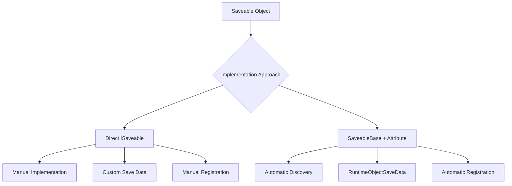
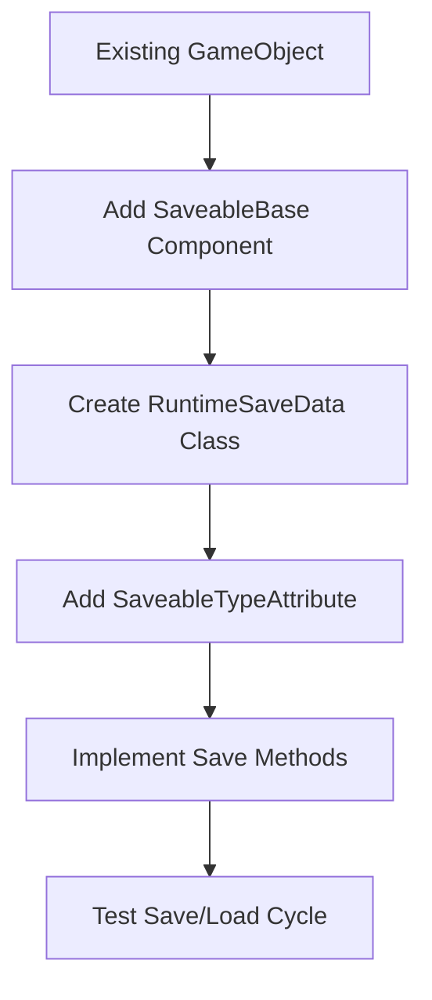
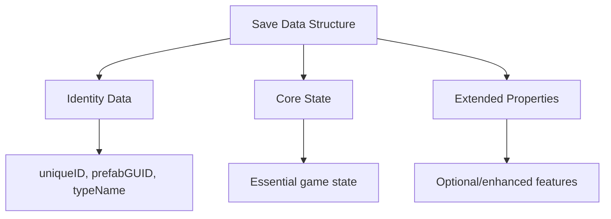

# ISaveable Implementation Guide

## Overview

This guide covers how to implement saveable objects in the Save System, including both direct ISaveable implementation and the modern SaveableBase approach. You'll learn how to add custom data, extend existing objects, and implement best practices for reliable save/load functionality.

## Two Approaches to Saving Objects

The Save System supports two main approaches for creating saveable objects:



### Direct ISaveable Implementation
- **Use when**: You need full control over save/load logic
- **Complexity**: Higher - more boilerplate code required
- **Benefits**: Maximum flexibility, no inheritance requirements
- **Best for**: Complex objects, non-MonoBehaviour saveables

### SaveableBase Approach
- **Use when**: You want automatic type discovery and minimal setup
- **Complexity**: Lower - mostly automatic
- **Benefits**: Automatic registration, type safety, less code
- **Best for**: Standard game objects, prefab instances

## Direct ISaveable Implementation

### Step 1: Implement ISaveable Interface

```csharp
using UnityEngine;
using GameFramework.SaveSystem.Interfaces;

public class CustomISaveableObject : MonoBehaviour, ISaveable
{
    [SerializeField] private string _uniqueID;
    [SerializeField] private int _health = 100;
    [SerializeField] private Vector3 _spawnPoint;
    [SerializeField] private string _itemName = "Default Item";
    
    public string UniqueID => _uniqueID;
    public string SaveKey => $"CustomObject_{_uniqueID}";
    public string TypeName => "CustomISaveableObject";
    
    private void Awake()
    {
        if (string.IsNullOrEmpty(_uniqueID))
        {
            _uniqueID = System.Guid.NewGuid().ToString();
        }
    }
    
    public object GetSaveData()
    {
        return new CustomObjectSaveData
        {
            uniqueID = _uniqueID,
            health = _health,
            spawnPoint = _spawnPoint,
            itemName = _itemName,
            position = transform.position,
            rotation = transform.eulerAngles,
            scale = transform.localScale
        };
    }
    
    public void LoadSaveData(object data)
    {
        if (data is CustomObjectSaveData saveData)
        {
            _uniqueID = saveData.uniqueID;
            _health = saveData.health;
            _spawnPoint = saveData.spawnPoint;
            _itemName = saveData.itemName;
            
            // Apply transform data
            transform.position = saveData.position;
            transform.rotation = Quaternion.Euler(saveData.rotation);
            transform.localScale = saveData.scale;
        }
    }
}
```

### Step 2: Create Save Data Class

```csharp
[System.Serializable]
public class CustomObjectSaveData
{
    public string uniqueID;
    public int health;
    public Vector3 spawnPoint;
    public string itemName;
    public Vector3 position;
    public Vector3 rotation;
    public Vector3 scale;
}
```

### Step 3: Manual Registration

```csharp
using GameFramework.SaveSystem.Interfaces;
using GameFramework.Core;

public class CustomISaveableObject : MonoBehaviour, ISaveable
{
    private ISaveDataRegistry _saveRegistry;
    
    private async void Start()
    {
        // Get the save registry and register this object
        _saveRegistry = await GameManager.GetServiceAsync<ISaveDataRegistry>();
        if (_saveRegistry != null)
        {
            bool registered = _saveRegistry.RegisterSaveable(this);
            if (registered)
            {
                Debug.Log($"Registered saveable object: {SaveKey}");
            }
        }
    }
    
    private void OnDestroy()
    {
        // Clean up registration
        _saveRegistry?.DeregisterSaveable(this);
    }
}
```

## SaveableBase Approach (Recommended)

### Step 1: Create Save Data Structure

```csharp
using GameFramework.SaveSystem.Data;
using UnityEngine;

[System.Serializable]
public class WeaponRuntimeSaveData : RuntimeObjectSaveData
{
    [Header("Weapon Data")]
    public int damage = 10;
    public float durability = 100f;
    public string weaponType = "Sword";
    public bool isEquipped = false;
    public Color weaponColor = Color.white;
    
    [Header("Enhancement Data")]  
    public int enhancementLevel = 0;
    public string[] enchantments = new string[0];
    public float criticalChance = 0.05f;
    
    public WeaponRuntimeSaveData() : base() { }
    
    public WeaponRuntimeSaveData(string uniqueID, string prefabGUID) 
        : base(uniqueID, prefabGUID, "Weapon")
    {
    }
}
```

### Step 2: Create Saveable Component

```csharp
using UnityEngine;
using GameFramework.SaveSystem;
using GameFramework.SaveSystem.Data;
using GameFramework.SaveSystem.Attributes;

[SaveableType(typeof(WeaponRuntimeSaveData))]
public class WeaponSaveable : SaveableBase
{
    [Header("Weapon Settings")]
    [SerializeField] private int _damage = 10;
    [SerializeField] private float _durability = 100f;
    [SerializeField] private string _weaponType = "Sword";
    [SerializeField] private bool _isEquipped = false;
    [SerializeField] private Color _weaponColor = Color.white;
    
    [Header("Enhancement Settings")]
    [SerializeField] private int _enhancementLevel = 0;
    [SerializeField] private string[] _enchantments = new string[0];
    [SerializeField] private float _criticalChance = 0.05f;
    
    protected override RuntimeObjectSaveData CreateSpecificRuntimeSaveData()
    {
        return new WeaponRuntimeSaveData(UniqueID, PrefabGUID)
        {
            damage = _damage,
            durability = _durability,
            weaponType = _weaponType,
            isEquipped = _isEquipped,
            weaponColor = _weaponColor,
            enhancementLevel = _enhancementLevel,
            enchantments = _enchantments,
            criticalChance = _criticalChance
        };
    }
    
    protected override void LoadSpecificRuntimeSaveData(RuntimeObjectSaveData saveData)
    {
        if (saveData is WeaponRuntimeSaveData weaponData)
        {
            _damage = weaponData.damage;
            _durability = weaponData.durability;
            _weaponType = weaponData.weaponType;
            _isEquipped = weaponData.isEquipped;
            _weaponColor = weaponData.weaponColor;
            _enhancementLevel = weaponData.enhancementLevel;
            _enchantments = weaponData.enchantments ?? new string[0];
            _criticalChance = weaponData.criticalChance;
            
            // Apply visual changes after loading
            UpdateWeaponAppearance();
        }
    }
    
    protected override string GetUniqueIdPrefix() => "weapon";
    
    private void UpdateWeaponAppearance()
    {
        // Update weapon visuals based on loaded data
        var renderer = GetComponent<Renderer>();
        if (renderer != null)
        {
            renderer.material.color = _weaponColor;
        }
    }
}
```

## Adding Complex Data Types

### Handling Collections and Complex Objects

```csharp
[System.Serializable]
public class InventoryRuntimeSaveData : RuntimeObjectSaveData
{
    [Header("Inventory Data")]
    public InventoryItem[] items = new InventoryItem[0];
    public int maxCapacity = 20;
    public float totalWeight = 0f;
    
    [Header("Currency")]
    public CurrencyData currencies = new CurrencyData();
    
    public InventoryRuntimeSaveData() : base() { }
    
    public InventoryRuntimeSaveData(string uniqueID, string prefabGUID) 
        : base(uniqueID, prefabGUID, "Inventory")
    {
    }
}

[System.Serializable]
public class InventoryItem
{
    public string itemID;
    public int quantity;
    public float condition;
    public string[] modifiers;
}

[System.Serializable]
public class CurrencyData
{
    public int gold = 0;
    public int silver = 0;
    public int gems = 0;
}
```

### SaveableBase Implementation for Complex Data

```csharp
[SaveableType(typeof(InventoryRuntimeSaveData))]
public class InventorySaveable : SaveableBase
{
    [SerializeField] private List<InventoryItemData> _items = new List<InventoryItemData>();
    [SerializeField] private int _maxCapacity = 20;
    [SerializeField] private CurrencyManager _currencies;
    
    protected override RuntimeObjectSaveData CreateSpecificRuntimeSaveData()
    {
        return new InventoryRuntimeSaveData(UniqueID, PrefabGUID)
        {
            items = _items.Select(item => new InventoryItem
            {
                itemID = item.ID,
                quantity = item.Quantity,
                condition = item.Condition,
                modifiers = item.Modifiers.ToArray()
            }).ToArray(),
            maxCapacity = _maxCapacity,
            totalWeight = CalculateTotalWeight(),
            currencies = new CurrencyData
            {
                gold = _currencies.Gold,
                silver = _currencies.Silver,
                gems = _currencies.Gems
            }
        };
    }
    
    protected override void LoadSpecificRuntimeSaveData(RuntimeObjectSaveData saveData)
    {
        if (saveData is InventoryRuntimeSaveData inventoryData)
        {
            // Load items
            _items.Clear();
            foreach (var item in inventoryData.items)
            {
                _items.Add(new InventoryItemData
                {
                    ID = item.itemID,
                    Quantity = item.quantity,
                    Condition = item.condition,
                    Modifiers = item.modifiers.ToList()
                });
            }
            
            // Load capacity and currencies
            _maxCapacity = inventoryData.maxCapacity;
            _currencies.SetCurrencies(
                inventoryData.currencies.gold,
                inventoryData.currencies.silver,
                inventoryData.currencies.gems
            );
            
            // Refresh UI after loading
            RefreshInventoryUI();
        }
    }
}
```

## Advanced Usage Patterns

### Custom Extension Points

```csharp
[SaveableType(typeof(NPCRuntimeSaveData))]
public class NPCSaveable : SaveableBase
{
    [SerializeField] private NPCDialogueState _dialogueState;
    [SerializeField] private QuestManager _questManager;
    
    protected override void OnBeforeSave()
    {
        // Capture dynamic state before saving
        UpdateDialogueFlags();
        CacheQuestProgress();
    }
    
    protected override void OnAfterLoad()
    {
        // Restore dynamic state after loading
        RestoreDialogueFlags();
        RestoreQuestProgress();
        UpdateNPCBehavior();
    }
    
    protected override void OnSaveError(System.Exception exception)
    {
        Debug.LogError($"Failed to save NPC {gameObject.name}: {exception.Message}");
        // Log to analytics or crash reporting system
    }
    
    protected override void OnLoadError(System.Exception exception)
    {
        Debug.LogError($"Failed to load NPC {gameObject.name}: {exception.Message}");
        // Reset to default state
        ResetToDefaultState();
    }
}
```

### Dynamic Data with Validation

```csharp
protected override RuntimeObjectSaveData CreateSpecificRuntimeSaveData()
{
    var saveData = new PlayerRuntimeSaveData(UniqueID, PrefabGUID)
    {
        level = _level,
        experience = _experience,
        health = _health,
        skills = SerializeSkills(),
        equipment = SerializeEquipment()
    };
    
    // Validate data before saving
    if (!ValidateSaveData(saveData))
    {
        Debug.LogWarning("Save data validation failed, using safe defaults");
        ApplySafeDefaults(saveData);
    }
    
    return saveData;
}

private bool ValidateSaveData(PlayerRuntimeSaveData data)
{
    return data.level > 0 && 
           data.health >= 0 && 
           data.experience >= 0 &&
           data.skills != null &&
           data.equipment != null;
}
```

## Integration with Existing Objects

### Adding Save Functionality to Existing Components



### Example: Converting Existing Health System

```csharp
// Original Health component (existing)
public class HealthComponent : MonoBehaviour
{
    [SerializeField] private float _currentHealth = 100f;
    [SerializeField] private float _maxHealth = 100f;
    [SerializeField] private bool _isInvulnerable = false;
    
    // Existing health logic...
}

// New saveable wrapper
[System.Serializable]
public class HealthRuntimeSaveData : RuntimeObjectSaveData
{
    public float currentHealth;
    public float maxHealth;
    public bool isInvulnerable;
    public float lastDamageTime;
    
    public HealthRuntimeSaveData() : base() { }
    public HealthRuntimeSaveData(string uniqueID, string prefabGUID) 
        : base(uniqueID, prefabGUID, "Health") { }
}

// SaveableBase component (add to same GameObject)
[SaveableType(typeof(HealthRuntimeSaveData))]
public class HealthSaveable : SaveableBase
{
    private HealthComponent _healthComponent;
    
    protected override void OnAwakeCustom()
    {
        _healthComponent = GetComponent<HealthComponent>();
        if (_healthComponent == null)
        {
            Debug.LogError("HealthSaveable requires HealthComponent on same GameObject");
        }
    }
    
    protected override RuntimeObjectSaveData CreateSpecificRuntimeSaveData()
    {
        return new HealthRuntimeSaveData(UniqueID, PrefabGUID)
        {
            currentHealth = _healthComponent.CurrentHealth,
            maxHealth = _healthComponent.MaxHealth,
            isInvulnerable = _healthComponent.IsInvulnerable,
            lastDamageTime = _healthComponent.LastDamageTime
        };
    }
    
    protected override void LoadSpecificRuntimeSaveData(RuntimeObjectSaveData saveData)
    {
        if (saveData is HealthRuntimeSaveData healthData)
        {
            _healthComponent.SetHealth(healthData.currentHealth, healthData.maxHealth);
            _healthComponent.SetInvulnerability(healthData.isInvulnerable);
            _healthComponent.SetLastDamageTime(healthData.lastDamageTime);
        }
    }
}
```

## Best Practices

### Data Organization



### Performance Considerations

1. **Minimal Data**: Only save what changes from defaults
2. **Efficient Serialization**: Use appropriate data types
3. **Batch Operations**: Group related save operations
4. **Validation**: Validate data to prevent corruption

### Error Handling Patterns

```csharp
protected override void LoadSpecificRuntimeSaveData(RuntimeObjectSaveData saveData)
{
    if (!(saveData is MyRuntimeSaveData myData))
    {
        Debug.LogWarning($"Expected MyRuntimeSaveData, got {saveData?.GetType().Name}");
        return;
    }
    
    try
    {
        // Load with validation
        _value = Mathf.Clamp(myData.value, MinValue, MaxValue);
        _name = string.IsNullOrEmpty(myData.name) ? DefaultName : myData.name;
        
        // Apply loaded state
        ApplyLoadedState();
    }
    catch (System.Exception ex)
    {
        Debug.LogError($"Error loading save data: {ex.Message}");
        ResetToDefaults();
    }
}
```

### Testing Save/Load Functionality

```csharp
[System.Serializable]
public class TestRuntimeSaveData : RuntimeObjectSaveData
{
    public int testValue = 42;
    public string debugInfo = "";
    
    public TestRuntimeSaveData() : base() { }
    public TestRuntimeSaveData(string uniqueID, string prefabGUID) 
        : base(uniqueID, prefabGUID, "Test") { }
}

[SaveableType(typeof(TestRuntimeSaveData))]
public class TestSaveable : SaveableBase
{
    [SerializeField] private int _testValue = 42;
    
    // Debug methods for testing
    [ContextMenu("Test Save Data Creation")]
    private void TestSaveDataCreation()
    {
        var saveData = CreateRuntimeSaveData();
        Debug.Log($"Created save data: {JsonUtility.ToJson(saveData, true)}");
    }
    
    [ContextMenu("Simulate Load")]
    private void SimulateLoad()
    {
        var testData = new TestRuntimeSaveData(UniqueID, PrefabGUID)
        {
            testValue = Random.Range(1, 100),
            debugInfo = $"Loaded at {System.DateTime.Now}"
        };
        
        LoadRuntimeSaveData(testData);
        Debug.Log($"Simulated load complete. New value: {_testValue}");
    }
}
```

