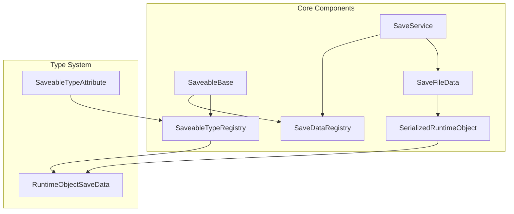
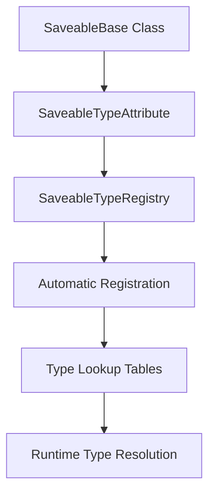
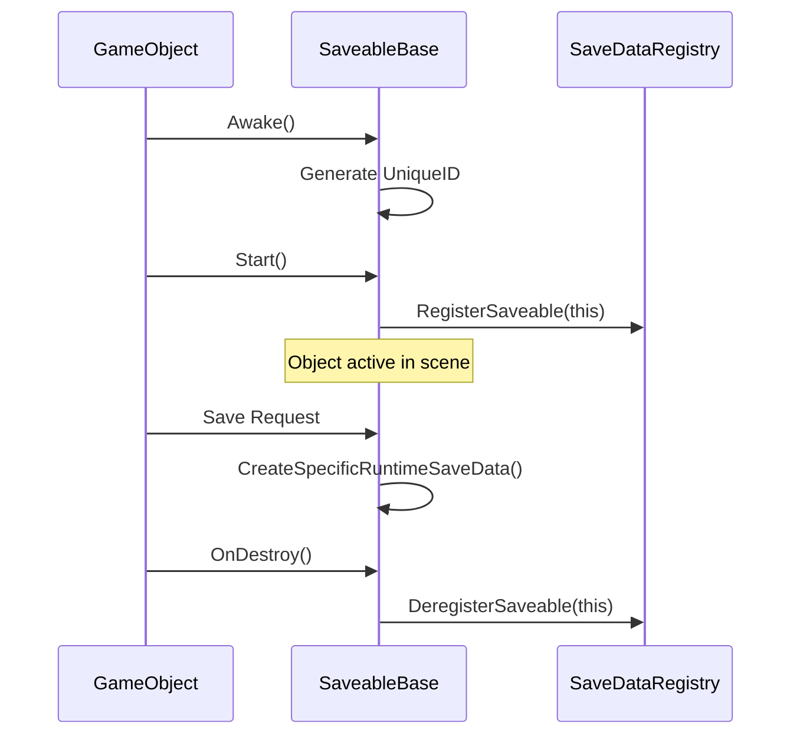
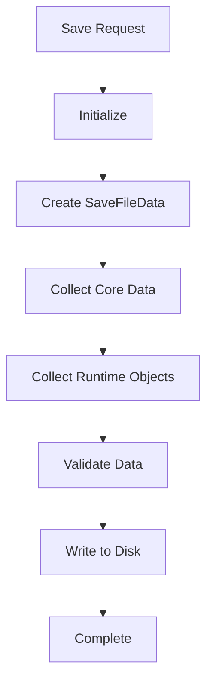
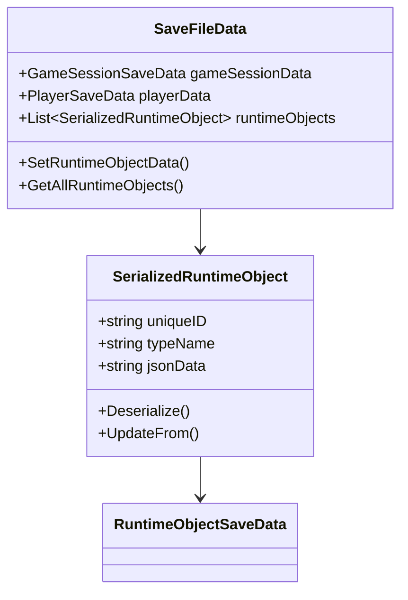
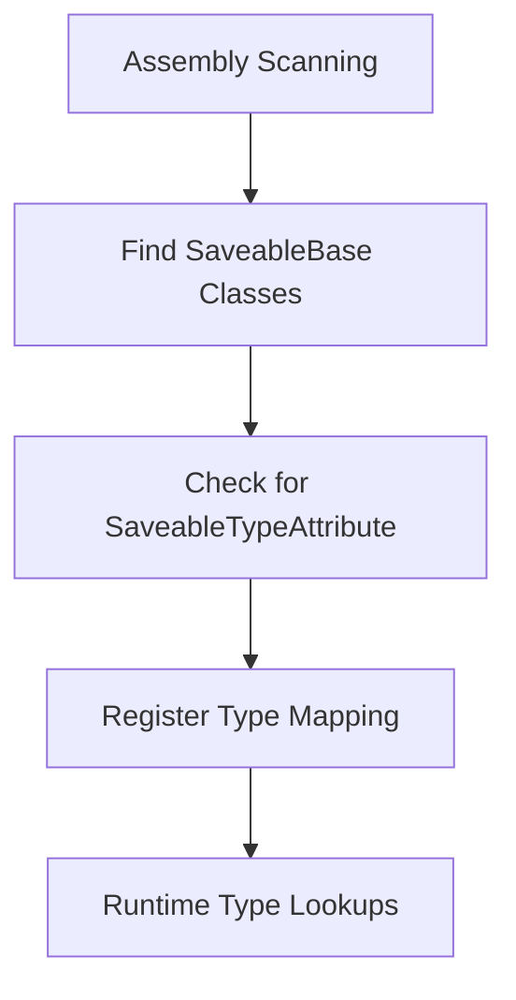
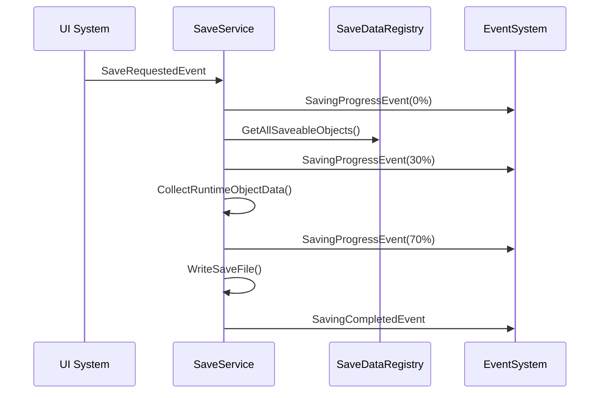
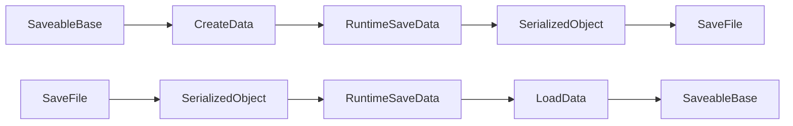
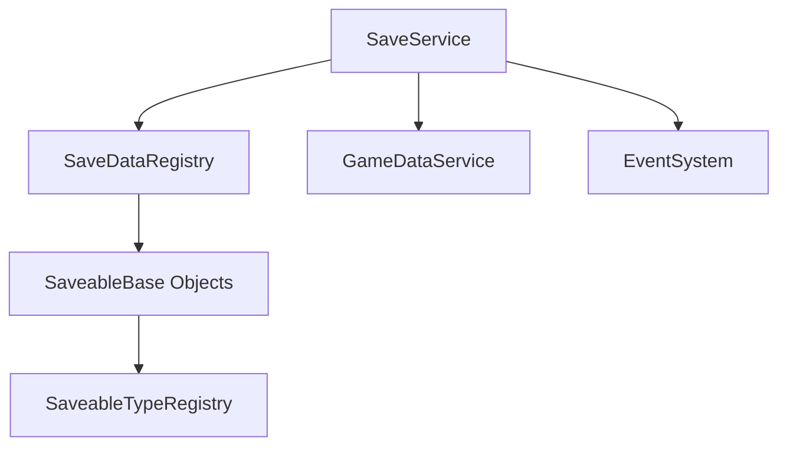
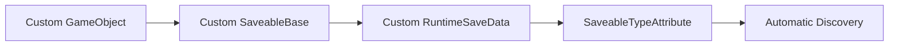

# SaveSystem Documentation

## Overview

The SaveSystem provides a comprehensive framework for persisting game state in Unity through automatic type discovery, unified data storage, and minimal configuration requirements.

## Architecture

### Core Components

- **SaveableBase**: Base class for all objects that can be saved
- **SaveService**: Orchestrates the save process and progress reporting
- **SaveDataRegistry**: Manages registered saveable objects
- **SaveableTypeRegistry**: Automatic type discovery through reflection
- **SaveFileData**: Unified container for all save data
- **SerializedRuntimeObject**: Type-safe wrapper for storing save data

## Automatic Type Discovery

The system uses attributes and reflection to automatically discover saveable types:

### How It Works

1. **Compile Time**: Developer adds `[SaveableType(typeof(DataClass))]` attribute
2. **Runtime Initialization**: SaveableTypeRegistry scans assemblies for attributes
3. **Automatic Registration**: Creates lookup tables for type resolution
4. **Save Operations**: Uses lookup tables for efficient type handling

## SaveableBase Lifecycle

SaveableBase objects follow a predictable lifecycle:

### Key Lifecycle Events

- **Awake**: UniqueID generation and PrefabGUID determination
- **Start**: Registration with SaveDataRegistry
- **Save Operations**: Automatic data creation and collection
- **OnDestroy**: Automatic deregistration from save system

## Save Process

The save process follows a structured pipeline:

### Save Stages

1. **Initialization** (0%): Setup save operation
2. **Core Data Collection** (10%): Gather GameSession and Player data
3. **Runtime Object Collection** (30-70%): Process all registered saveables
4. **Data Validation** (70%): Ensure save data integrity
5. **File Writing** (80-100%): Persist to disk storage

## Data Storage System

The SaveSystem uses unified storage that handles any save data type:

### Unified Storage Benefits

- **Automatic Extensibility**: New types work without code changes
- **Type Safety**: Maintains type information through serialization
- **Performance**: Efficient lookup and storage operations
- **Debugging**: Clear type and object tracking

## SaveableTypeRegistry

Provides automatic type discovery through reflection:

### Type Resolution Flow

1. **Discovery Phase**: Scans assemblies for SaveableBase classes with attributes
2. **Registration Phase**: Creates lookup tables for efficient access
3. **Runtime Phase**: Provides O(1) type lookups for save operations
4. **Validation Phase**: Ensures all registered types are properly configured

## SaveService Orchestration

The SaveService coordinates the save process with progress updates:

## SaveableBase Implementation

Creating a new saveable type requires minimal code:

### Required Components

1. **Class Declaration**: Inherit from SaveableBase
2. **Type Attribute**: Add `[SaveableType(typeof(YourSaveData))]`
3. **Data Creation**: Implement `CreateSpecificRuntimeSaveData()`
4. **Data Loading**: Implement `LoadSpecificRuntimeSaveData()`

### Data Flow Pattern

## Runtime Object Save Data

All save data inherits from RuntimeObjectSaveData:

### Base Properties

- **Identity**: `uniqueID`, `prefabGUID`, `typeName`
- **Transform**: `position`, `rotation`, `scale`
- **State**: `isActive`
- **Custom Data**: Provided by derived classes

## Error Handling

The SaveSystem implements comprehensive error handling:

### Error Types and Responses

1. **Missing SaveableType Attribute**: Warning logged, fallback to class name
2. **Save Data Creation Failure**: Object skipped, error logged
3. **Serialization Failure**: Object skipped, detailed error reporting
4. **File System Errors**: Operation retry with error reporting

### Recovery Strategies

- **Partial Saves**: Continue saving valid objects when some fail
- **Data Validation**: Pre-save validation to catch issues early
- **Fallback Behavior**: Graceful degradation for missing components
- **Debug Information**: Detailed logging for troubleshooting

## Performance Considerations

### Optimization Features

- **Lazy Initialization**: Registry initializes on first use
- **Efficient Lookups**: O(1) dictionary operations for type resolution
- **Batched Processing**: Collects all save data before writing
- **Memory Management**: Proper cleanup of temporary objects

## Integration Patterns

### Service Dependencies

### Usage Patterns

- **Automatic Registration**: SaveableBase objects self-register
- **Event-Driven Saves**: UI triggers saves through events
- **Progress Monitoring**: UI subscribes to progress events
- **Error Handling**: Graceful failure recovery

## Extensibility

The SaveSystem supports easy extension without code changes:

### Adding New Types

1. Create new SaveableBase-derived class
2. Create corresponding RuntimeObjectSaveData class
3. Add SaveableTypeAttribute to link them
4. System automatically discovers and handles the new type

### Custom Save Data Structure

## Best Practices

### Implementation Guidelines

- **Unique ID Management**: Let SaveableBase handle ID generation
- **Data Validation**: Implement proper validation in save data classes
- **Error Handling**: Use virtual error handling methods for custom behavior
- **Testing**: Validate save/load cycles during development

### Performance Optimization

- **Minimal Save Data**: Only save essential state information
- **Efficient Serialization**: Use appropriate data types for JSON
- **Registry Usage**: Leverage type registry for consistent behavior
- **Progress Reporting**: Implement callbacks for long operations

The SaveSystem provides a robust, extensible foundation for game state persistence with minimal configuration overhead. Its automatic type discovery and unified storage system enable rapid development while maintaining type safety and performance.
