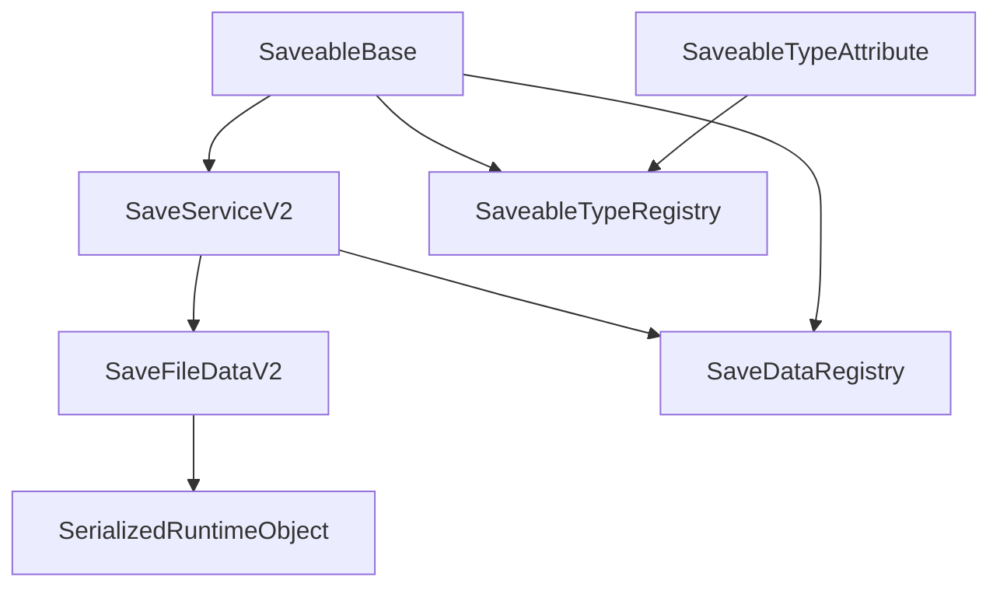

# Save System Documentation

## Overview

The Save System is a powerful, extensible framework for persisting game state in Unity. It features automatic type discovery, unified data storage, and seamless integration with the game's service architecture.

## Key Features

- **Automatic Type Discovery**: Uses attributes instead of manual registration
- **Unified Storage**: Single collection handles all saveable types
- **Zero Boilerplate**: New saveable types require only adding an attribute
- **Type Safety**: Compile-time validation of save data types
- **Performance Optimized**: Efficient serialization and service integration
- **Extensible**: Easy to add new saveable types without code changes

---

## Architecture Overview

### Core Components



### Service Integration

The Save System integrates with the game's dependency injection container:

- **SaveServiceV2**: Main save orchestration service
- **SaveDataRegistry**: Manages registered saveable objects
- **Event System**: Progress reporting and completion notifications
- **File System**: Persistent storage operations

---

## Quick Start Guide

### 1. Create a Saveable Component

```csharp
using UnityEngine;
using GameFramework.SaveSystem;
using GameFramework.SaveSystem.Data;
using GameFramework.SaveSystem.Attributes;

[SaveableType(typeof(MyObjectRuntimeSaveData))]
public class MyObject : SaveableBase
{
    [SerializeField] private int _value = 0;
    [SerializeField] private string _name = "Default";
    
    protected override RuntimeObjectSaveData CreateSpecificRuntimeSaveData()
    {
        return new MyObjectRuntimeSaveData(UniqueID, PrefabGUID)
        {
            value = _value,
            name = _name
        };
    }
    
    protected override void LoadSpecificRuntimeSaveData(RuntimeObjectSaveData saveData)
    {
        if (saveData is MyObjectRuntimeSaveData myData)
        {
            _value = myData.value;
            _name = myData.name;
        }
    }
    
    protected override string GetUniqueIdPrefix() => "myobject";
}
```

### 2. Create Save Data Structure

```csharp
using GameFramework.SaveSystem.Data;
using UnityEngine;

[System.Serializable]
public class MyObjectRuntimeSaveData : RuntimeObjectSaveData
{
    [Header("MyObject Data")]
    public int value = 0;
    public string name = "Default";
    
    public MyObjectRuntimeSaveData() : base() { }
    
    public MyObjectRuntimeSaveData(string uniqueID, string prefabGUID) 
        : base(uniqueID, prefabGUID, "MyObject")
    {
    }
}
```

### 3. That's It! 🎉

Your object will automatically:
- Register with the save system
- Be included in save operations
- Load correctly from save files
- Work with all existing save/load UI

---

## SaveableBase Class Reference

### Overview

`SaveableBase` is the foundation class for all saveable objects in the system. It handles:

- Automatic registration with the save system
- Unique ID generation and management
- Prefab GUID tracking for instantiation
- Type-safe save data creation and loading

### Key Methods

#### Abstract Methods (Must Implement)

```csharp
protected abstract RuntimeObjectSaveData CreateSpecificRuntimeSaveData();
protected abstract void LoadSpecificRuntimeSaveData(RuntimeObjectSaveData saveData);
```

#### Virtual Methods (Optional Override)

```csharp
protected virtual string GetUniqueIdPrefix() => GetType().Name.ToLower();
protected virtual void OnAwakeCustom() { }
protected virtual void OnStartCustom() { }
protected virtual void OnDestroyCustom() { }
protected virtual void OnBeforeSave() { }
protected virtual void OnAfterLoad() { }
```

### Lifecycle

1. **Awake**: Unique ID generation, prefab GUID determination
2. **Start**: Save system registration
3. **During Game**: Automatic save/load handling
4. **OnDestroy**: Automatic save system deregistration

### Properties

- `UniqueID`: Persistent identifier for this specific object instance
- `PrefabGUID`: GUID of the prefab this object was instantiated from
- `SaveKey`: Unique key used in save system registration
- `TypeName`: Friendly type name for this saveable type

---

## SaveServiceV2 Class Reference

### Overview

`SaveServiceV2` is the main orchestration service for save operations. It:

- Coordinates with the save data registry
- Collects data from all saveable objects
- Handles progress reporting
- Manages file writing operations

### Key Methods

```csharp
public async Task<bool> SaveGameStateAsync(string fileName, bool isAutoSave = false)
```

Saves the current game state to the specified file with progress reporting.

### Event Integration

The save service publishes events during the save process:

- `SavingProgressEvent`: Progress updates (0.0 to 1.0)
- `SavingCompletedEvent`: Save operation completed successfully
- `SavingFailedEvent`: Save operation failed

### Save Process Flow

1. **Initialize** (0.0): Set up save operation
2. **Gather Data** (0.1): Create base save file structure
3. **Collect Objects** (0.3): Gather data from all saveable objects
4. **Validate** (0.7): Ensure save data integrity
5. **Write to Disk** (0.8): Persist to storage
6. **Complete** (1.0): Finalize and notify

---

## SaveFileDataV2 Class Reference

### Overview

`SaveFileDataV2` is the unified container for all save data. It features:

- Dynamic runtime object storage
- Automatic type handling
- Built-in validation
- Debug information tracking

### Key Features

#### Unified Storage
```csharp
[SerializeField] public List<SerializedRuntimeObject> RuntimeObjects;
```

Single collection that can store ANY type of `RuntimeObjectSaveData`.

#### Core Game Data
```csharp
[SerializeField] public GameSessionSaveData GameSessionData;
[SerializeField] public PlayerSaveData PlayerData;
```

Fixed fields for essential game data.

### Key Methods

```csharp
public bool SetRuntimeObjectData(RuntimeObjectSaveData saveData)
public List<RuntimeObjectSaveData> GetAllRuntimeObjects()
public RuntimeObjectSaveData GetRuntimeObjectByID(string uniqueID)
public List<T> GetAllRuntimeObjectsOfType<T>() where T : RuntimeObjectSaveData
public bool RemoveRuntimeObject(string uniqueID)
public bool ValidateData()
```

---

## SaveableTypeAttribute Reference

### Overview

The `SaveableTypeAttribute` enables automatic type discovery and eliminates manual registration boilerplate.

### Usage

```csharp
[SaveableType(typeof(MyObjectRuntimeSaveData))]
public class MyObject : SaveableBase
{
    // Implementation...
}
```

### Properties

- `SaveDataType`: The Type of RuntimeObjectSaveData associated with this SaveableBase
- `DisplayName`: Optional display name override

### Validation

The attribute automatically validates that:
- SaveDataType inherits from RuntimeObjectSaveData
- SaveDataType is not null
- Type relationships are consistent

---

## SaveableTypeRegistry Reference

### Overview

Static registry that uses reflection to automatically discover and manage saveable types.

### Key Features

- **Automatic Discovery**: Scans assemblies for SaveableType attributes
- **Efficient Lookups**: Multiple lookup tables for fast type resolution
- **Factory Methods**: Creates save data instances by type
- **Validation**: Ensures all registered types are properly configured

### Key Methods

```csharp
public static void Initialize()
public static Type GetSaveDataType(string typeName)
public static Type GetSaveDataType(Type saveableType)
public static string GetTypeName(Type saveDataType)
public static bool IsTypeRegistered(string typeName)
public static RuntimeObjectSaveData CreateSaveDataInstance(string typeName)
```

### Debug Methods

```csharp
public static void LogRegisteredTypes()
public static bool ValidateRegisteredTypes()
```

---

## SerializedRuntimeObject Reference

### Overview

Wrapper class that enables dynamic storage of any RuntimeObjectSaveData type in a single collection.

### Key Features

- **Type Preservation**: Stores full type information
- **JSON Serialization**: Efficient data storage
- **Validation**: Built-in data integrity checks
- **Debug Information**: Size and type tracking

### Methods

```csharp
public SerializedRuntimeObject(RuntimeObjectSaveData saveData)
public RuntimeObjectSaveData Deserialize()
public bool UpdateFrom(RuntimeObjectSaveData saveData)
public bool IsValid()
```

---

## Best Practices

### 1. SaveableBase Implementation

```csharp
[SaveableType(typeof(EnemyRuntimeSaveData))]
public class Enemy : SaveableBase
{
    // Use [SerializeField] for data you want to save
    [SerializeField] private int _health = 100;
    [SerializeField] private float _speed = 5f;
    
    protected override RuntimeObjectSaveData CreateSpecificRuntimeSaveData()
    {
        // Always create new instance with current values
        return new EnemyRuntimeSaveData(UniqueID, PrefabGUID)
        {
            health = _health,
            speed = _speed,
            // Include any other state you need to persist
        };
    }
    
    protected override void LoadSpecificRuntimeSaveData(RuntimeObjectSaveData saveData)
    {
        // Always check type safety
        if (saveData is EnemyRuntimeSaveData enemyData)
        {
            // Restore all saved state
            _health = enemyData.health;
            _speed = enemyData.speed;
            
            // Update any dependent systems
            UpdateHealthBar();
            UpdateMovementSpeed();
        }
        else
        {
            Debug.LogWarning($"[Enemy] Expected EnemyRuntimeSaveData but got: {saveData?.GetType().Name}");
        }
    }
    
    protected override string GetUniqueIdPrefix() => "enemy";
}
```

### 2. Save Data Structure Design

```csharp
[System.Serializable]
public class EnemyRuntimeSaveData : RuntimeObjectSaveData
{
    [Header("Enemy Stats")]
    public int health = 100;
    public float speed = 5f;
    public bool isAlerted = false;
    
    [Header("Enemy State")]
    public Vector3 patrolTarget = Vector3.zero;
    public int currentWaypoint = 0;
    
    public EnemyRuntimeSaveData() : base() { }
    
    public EnemyRuntimeSaveData(string uniqueID, string prefabGUID) 
        : base(uniqueID, prefabGUID, "Enemy")
    {
    }
}
```

### 3. Error Handling

```csharp
protected override void LoadSpecificRuntimeSaveData(RuntimeObjectSaveData saveData)
{
    if (saveData is not MyObjectRuntimeSaveData myData)
    {
        Debug.LogError($"[MyObject] Invalid save data type: {saveData?.GetType().Name}");
        return;
    }
    
    try
    {
        // Load data with validation
        _value = Mathf.Clamp(myData.value, 0, 100);
        _name = string.IsNullOrEmpty(myData.name) ? "Default" : myData.name;
    }
    catch (System.Exception ex)
    {
        Debug.LogError($"[MyObject] Error loading save data: {ex.Message}");
        // Set reasonable defaults
        _value = 0;
        _name = "Default";
    }
}
```

---

## Debugging and Troubleshooting

### Common Issues

#### 1. "SaveableType attribute not found"
**Problem**: SaveableBase warns about missing SaveableType attribute.
**Solution**: Add the attribute to your class:
```csharp
[SaveableType(typeof(YourRuntimeSaveData))]
public class YourClass : SaveableBase
```

#### 2. "Failed to deserialize runtime object"
**Problem**: SerializedRuntimeObject can't deserialize stored data.
**Solutions**:
- Ensure RuntimeSaveData class has parameterless constructor
- Check that the type hasn't been renamed or moved
- Verify JSON data isn't corrupted

#### 3. "No SaveableBase component found"
**Problem**: RuntimeObjectInstantiator can't find SaveableBase on prefab.
**Solution**: Ensure your prefab has a SaveableBase-derived component.

### Debug Tools

#### Log Registered Types
```csharp
SaveableTypeRegistry.LogRegisteredTypes();
```

#### Validate Save Data
```csharp
var saveData = new SaveFileDataV2();
bool isValid = saveData.ValidateData();
```

#### Get Type Statistics
```csharp
var stats = saveData.GetTypeStatistics();
foreach (var kvp in stats)
{
    Debug.Log($"{kvp.Key}: {kvp.Value} objects");
}
```

---

## Performance Considerations

### Memory Usage
- SerializedRuntimeObject stores JSON strings in memory
- Large save files may impact memory usage
- Consider implementing streaming for very large saves

### Serialization Performance
- JsonUtility is fast but has limitations
- Consider custom serialization for complex data structures
- Profile save times with large object counts

### Registration Performance
- Type discovery happens once at startup
- Minimal runtime overhead after initialization
- Lookup operations are O(1) dictionary access

---

## Migration Guide

### From ObjectFactory System

**Before (Old System)**:
```csharp
// Required factory registration
RegisterObjectFactory("MyObject", new MyObjectFactory());

// Required factory implementation
public class MyObjectFactory : IObjectFactory { ... }

// Required SaveFileDataV2 modifications
[SerializeField] public List<MyObjectRuntimeSaveData> MyObjects;
```

**After (New System)**:
```csharp
// Just add the attribute - everything else is automatic!
[SaveableType(typeof(MyObjectRuntimeSaveData))]
public class MyObject : SaveableBase { ... }
```

**Benefits**:
- 90% reduction in boilerplate code
- Automatic type discovery
- No more manual registration
- No more factory implementations needed
- SaveFileDataV2 handles all types automatically

---

## Conclusion

The Save System provides a robust, extensible foundation for game state persistence with minimal boilerplate code. The attribute-based type discovery and unified storage system makes it easy to add new saveable types while maintaining excellent performance and type safety.

For questions or issues, refer to the debugging section or examine the example implementations in the codebase.
