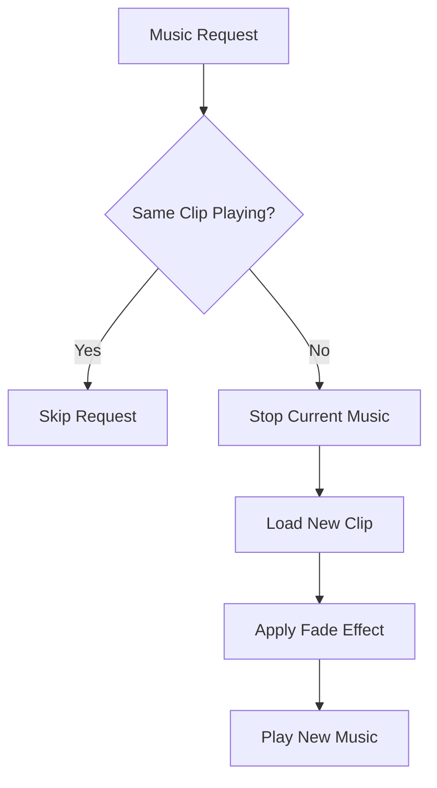

# AudioService Documentation

## Overview
The AudioService manages music, sound effects, and UI audio with intelligent clip management, volume control through Unity Audio Mixer, and fade effects.

## Core Responsibilities
- **Music Management**: Play/stop music with crossfade support and clip comparison
- **Sound Effect Playback**: Spatial and non-spatial sound effect management
- **Volume Control**: Master, music, SFX, and UI volume through Audio Mixer
- **Fade System**: Smooth fade in/out effects for music transitions
- **Settings Integration**: Automatic volume and enable/disable state management

## Key Features

### Intelligent Music System


### Audio Categories
- **Music**: Background music with loop support and fade effects
- **SFX**: Sound effects with spatial audio support
- **UI**: Interface sounds for buttons, notifications, etc.
- **Master**: Overall volume control

### Volume Management
- Linear to logarithmic volume conversion for Audio Mixer
- Real-time settings synchronization
- Individual category volume control

## Dependencies
- **IEventSystem**: Audio event subscription and publishing
- **AudioManager**: Unity Audio components (AudioSource, AudioMixer)
- **AudioDatabase_SO**: Audio clip asset management
- **AudioSettings_SO**: Volume and enable/disable settings

## Usage Example
```csharp
// Event-driven audio requests
eventSystem.Publish(new AudioEvents.PlayMusicEvent("MainMenu", fadeIn: true));
eventSystem.Publish(new AudioEvents.PlaySoundEvent("ButtonClick"));
```

## Integration Points
- Responds to AudioEvents from EventSystem
- Automatically applies settings changes
- Provides fade effects for smooth transitions
- Supports spatial audio for 3D sound positioning
