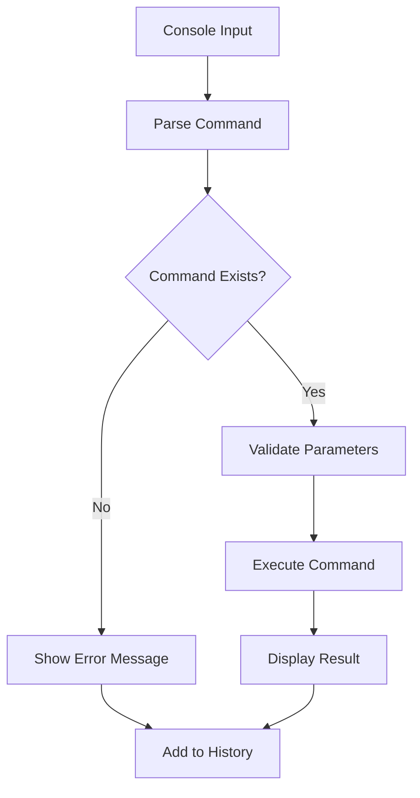

# ConsoleService Documentation

## Overview
The ConsoleService provides an in-game debug console with command registration, execution, and history management for developer tools and debugging.

## Core Responsibilities
- **Console UI Management**: Show/hide console interface with toggle support
- **Command System**: Register and execute console commands with parameter support
- **History Management**: Command history with navigation support
- **Tab Completion**: Smart command completion for registered commands
- **Debug Integration**: Integration with debug settings for console availability

## Key Features

### Console Command System


### Command Management
- Dynamic command registration system
- Parameter validation and type checking
- Command categorization and help system
- Extensible command framework

### Input Integration
- Console-specific input handling
- History navigation (up/down arrows)
- Tab completion for commands
- Toggle console visibility

## Dependencies
- **IEventSystem**: Console events and integration
- **IInputManager**: Console input context management
- **Settings System**: Debug console enable/disable state

## Usage Example
```csharp
consoleService.RegisterCommand("teleport", TeleportCommand, "Teleport player to coordinates");
bool isOpen = consoleService.IsConsoleOpen();
```

## Integration Points
- Integrates with debug settings for availability
- Uses InputManager for console-specific input context
- Provides developer tools for debugging and testing
- Extensible command system for custom debug commands
