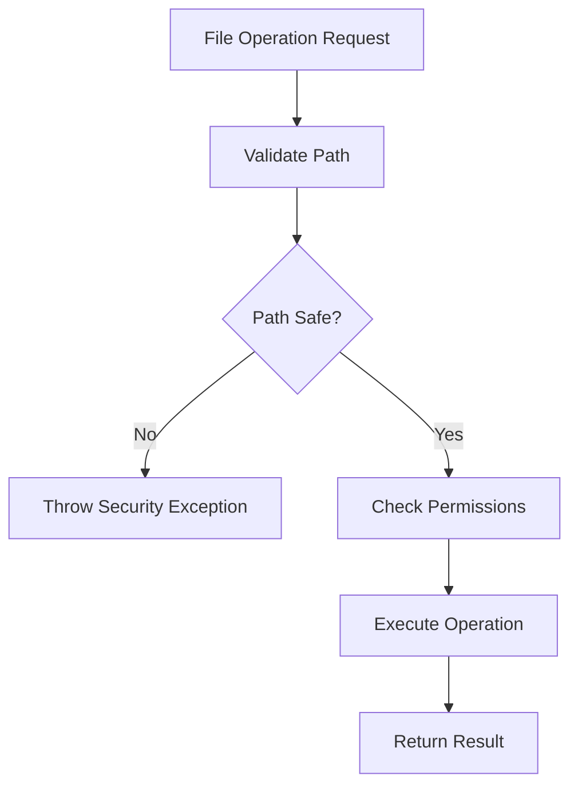

# FileService Documentation

## Overview
The FileService provides secure file I/O operations with path validation, directory management, and cross-platform compatibility for game data persistence.

## Core Responsibilities
- **Secure File Operations**: Read/write/delete files with path validation
- **Directory Management**: Create directories and manage file organization  
- **Path Security**: Prevent directory traversal attacks and validate file paths
- **Cross-Platform Support**: Handle platform-specific file path differences
- **Async Operations**: Non-blocking file I/O for better performance

## Key Features

### File Operation Security


### Supported Operations
- Async read/write file operations
- Directory creation and management
- File existence checking
- Secure path validation
- File deletion with safety checks

### Path Management
- Platform-specific path handling
- Directory traversal prevention
- Base directory enforcement
- File extension validation

## Dependencies
- **.NET File System**: System.IO operations for file handling
- **Unity Application**: Platform-specific path resolution

## Usage Example
```csharp
await fileService.WriteFileAsync("saves/game1.json", jsonData);
string data = await fileService.ReadFileAsync("saves/game1.json");
bool exists = fileService.FileExists("saves/game1.json");
```

## Integration Points
- Used by SaveSystem for game data persistence
- Provides secure file operations for configuration
- Handles cross-platform path differences
- Integrates with game data serialization systems
