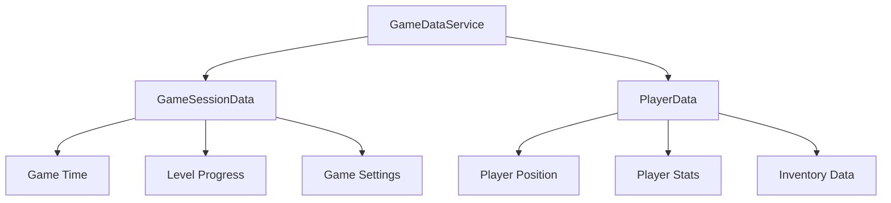

# GameDataService Documentation

## Overview
The GameDataService manages the current game session data and player data, providing controlled access to game state with automatic save system integration.

## Core Responsibilities
- **Game Session Management**: Current game session data including progress and settings
- **Player Data Management**: Player-specific data including position, stats, and progression
- **Save System Integration**: Automatic registration with save/load system
- **Event Publishing**: Notify other systems of data changes
- **Scene Integration**: Automatic main camera detection and management

## Key Features

### Data Management Hierarchy


### Save System Integration
- Automatic registration as saveable data source
- Handles pending player data for load operations
- Provides data serialization for persistence
- Event-driven save/load coordination

### Scene Management
- Automatic main camera detection
- Scene change event handling
- Camera reference management for player systems

## Dependencies
- **IEventSystem**: Data change event publishing
- **ISaveDataRegistry**: Save system registration and data persistence
- **Unity SceneManager**: Scene loading event handling

## Usage Example
```csharp
var gameSession = gameDataService.GetGameSessionData();
var playerData = gameDataService.GetPlayerData();
gameDataService.UpdatePlayerPosition(newPosition);
```

## Integration Points
- Automatically registers with save system on initialization
- Publishes GameSessionDataChangedEvent on data modifications
- Manages player spawn data for loading operations
- Provides main camera reference for gameplay systems
