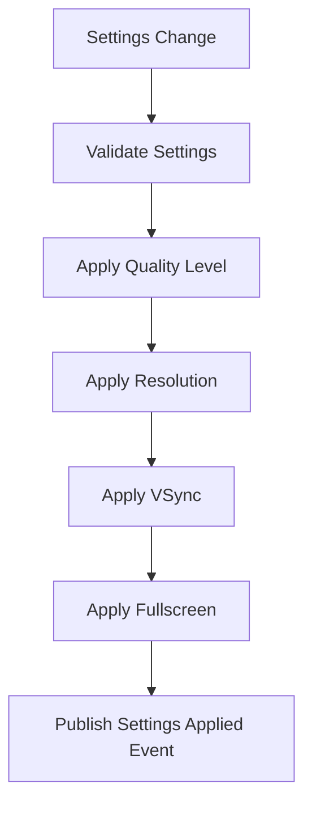

# GraphicsService Documentation

## Overview
The GraphicsService manages Unity graphics settings with real-time application, settings integration, and platform-appropriate configurations.

## Core Responsibilities
- **Quality Settings Management**: Apply Unity quality level changes in real-time
- **Resolution Control**: Manage screen resolution and fullscreen mode
- **VSync Management**: Control vertical synchronization settings
- **Settings Integration**: Apply graphics settings from ScriptableObject configuration
- **Platform Optimization**: Handle platform-specific graphics optimizations

## Key Features

### Settings Application Flow


### Graphics Categories
- **Quality Settings**: Unity's built-in quality levels with custom configurations
- **Display Settings**: Resolution, refresh rate, and fullscreen management
- **Performance Settings**: VSync, frame rate limiting, and optimization
- **Platform Settings**: Device-specific graphics optimizations

### Real-time Application
- Immediate graphics setting changes
- No restart required for most settings
- Smooth transitions between quality levels
- Performance impact monitoring

## Dependencies
- **IEventSystem**: Settings change event publishing
- **GraphicsSettings_SO**: Graphics configuration data
- **Unity Graphics System**: Quality settings and display management

## Usage Example
```csharp
graphicsService.SetQuality(2); // High quality
graphicsService.SetResolution(1920, 1080, true); // Fullscreen HD
graphicsService.SetVSync(true);
```

## Integration Points
- Responds to settings changes from OptionsPopup
- Integrates with ScriptableObject-based settings system
- Publishes events when graphics settings are applied
- Provides platform-optimized default configurations
