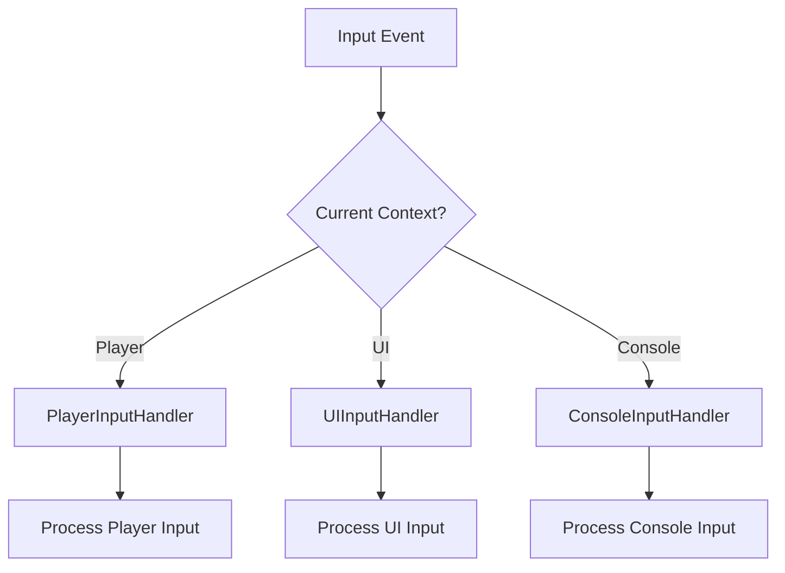

# InputManager Documentation

## Overview
The InputManager provides centralized input handling through Unity's Input System with context-aware input routing, handler management, and settings integration.

## Core Responsibilities
- **Input Context Management**: Route input based on current context (Player, UI, Console)
- **Handler Registration**: Manage multiple input handlers with priority-based processing
- **Unity Input System Integration**: Bridge between Unity Input Actions and game handlers
- **Settings Integration**: Apply mouse sensitivity and Y-axis inversion from settings

## Key Features

### Input Context System


### Handler Management
- Dynamic handler registration/deregistration
- Context-based handler activation
- Priority-based input processing

### Input Processing Flow
- Unity Input Actions → InputManager → Context-specific Handlers → Game Events
- Automatic mouse sensitivity and inversion application
- Delegate-based event handling for proper memory management

## Dependencies
- **IEventSystem**: Event publishing for input events
- **ConsoleInputHandler, UIInputHandler, PlayerInputHandler**: Specific input processors
- **InputSettings_SO**: Mouse sensitivity and inversion settings

## Usage Example
```csharp
inputManager.SetInputContext(InputContext.Player);
inputManager.RegisterHandler(customHandler);
inputManager.SetMouseSensitivity(2.0f);
```

## Integration Points
- Responds to input settings changes automatically
- Integrates with console service for command input
- Provides player movement/look input with configurable sensitivity
