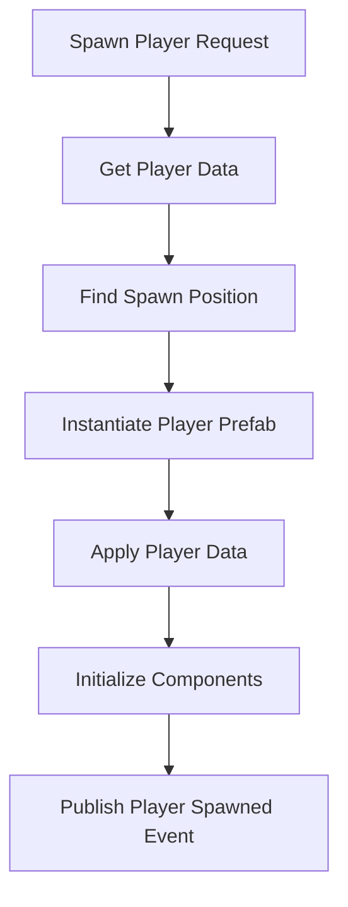

# InstantiationService Documentation

## Overview
The InstantiationService manages GameObject instantiation with prefab registry integration, player spawning, and object lifecycle management.

## Core Responsibilities
- **Prefab Instantiation**: Create GameObjects from registered prefab assets
- **Player Management**: Spawn and manage player character instances
- **Registry Integration**: Use PrefabRegistry for asset management
- **Spawn Coordination**: Handle spawn positions and configurations
- **Lifecycle Management**: Track and clean up instantiated objects

## Key Features

### Player Spawning System


### Prefab Management
- Integration with PrefabRegistry for asset loading
- Cached prefab references for performance
- Spawn position calculation and validation
- Component initialization and configuration

### Object Lifecycle
- Track instantiated objects for cleanup
- Automatic destruction when needed
- Memory management for instantiated assets
- Event publishing for spawn/destroy operations

## Dependencies
- **PrefabRegistry**: Prefab asset management and loading
- **IGameDataService**: Player data for spawn configuration
- **IEventSystem**: Spawn/destroy event publishing

## Usage Example
```csharp
GameObject player = await instantiationService.SpawnPlayerAsync();
await instantiationService.DestroyPlayerAsync();
GameObject obj = instantiationService.InstantiatePrefab("PrefabName");
```

## Integration Points
- Uses GameDataService for player spawn data
- Integrates with PrefabRegistry for asset management
- Publishes PlayerSpawnedEvent and PlayerDestroyedEvent
- Manages player reference for other game systems
