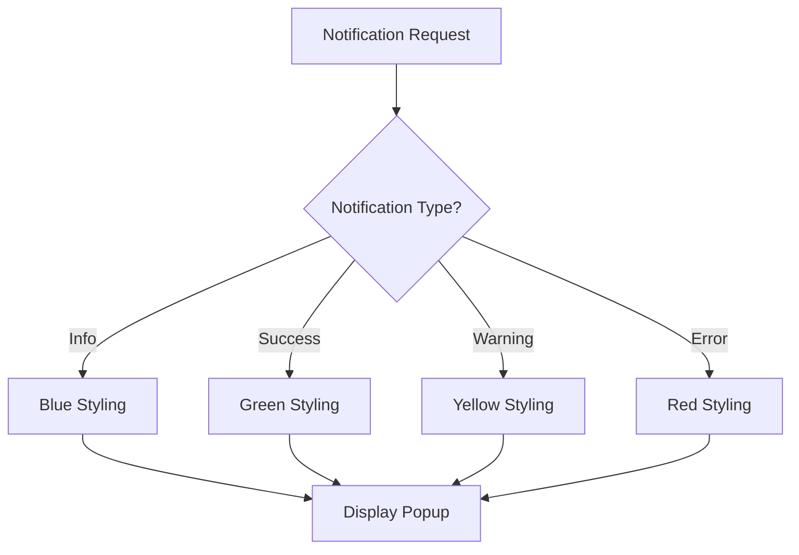

# NotificationService Documentation

## Overview
The NotificationService manages user notifications through popup displays, automatically responding to game events with contextual messages.

## Core Responsibilities
- **Notification Display**: Show timed notification popups with different types
- **Event-Driven Notifications**: Automatic notifications for save/load operations
- **Type-Based Styling**: Support for Info, Success, Warning, and Error notification types
- **Duration Management**: Configurable display duration for notifications

## Key Features

### Notification Types


### Automatic Event Handling
- Save operation completion notifications
- Save operation failure notifications
- Load operation status notifications
- Contextual success/error messaging

### Popup Management
- Non-blocking notification display
- Automatic dismissal after duration
- Integration with UIService popup system
- Styled based on notification type

## Dependencies
- **IEventSystem**: Event subscription for automatic notifications
- **IUIService**: Notification popup display management

## Usage Example
```csharp
// Manual notification
notificationService.ShowNotification("Game saved successfully!", NotificationType.Success, 3f);

// Automatic event-driven notifications occur automatically
```

## Integration Points
- Responds to SaveCompletedEvent and SaveFailedEvent
- Uses UIService for popup display management
- Provides user feedback for game operations
- Integrates with save/load system for operation status
