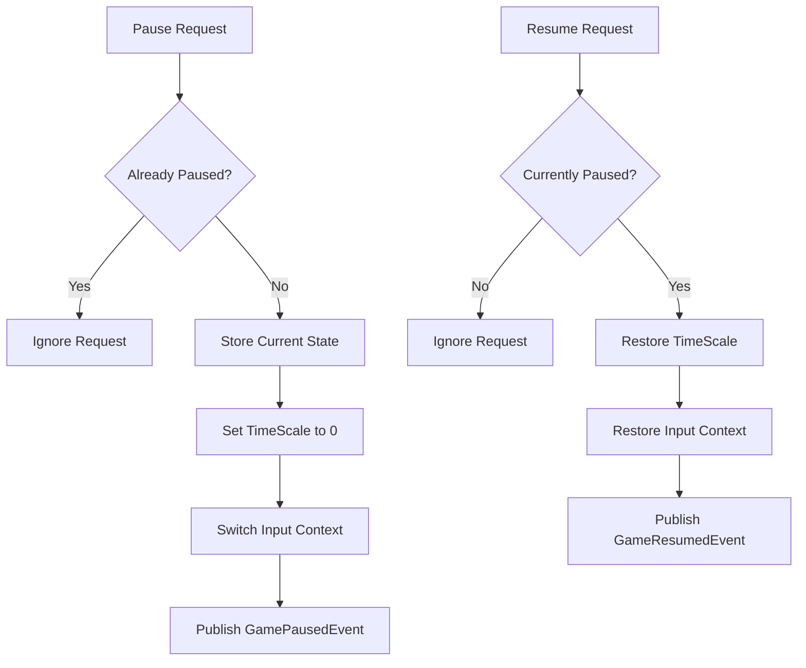

# PauseService Documentation

## Overview
The PauseService provides centralized game pause/resume functionality with time scale management, input context preservation, and event-driven state coordination.

## Core Responsibilities
- **Pause State Management**: Central pause/resume state tracking
- **Time Scale Control**: Unity Time.timeScale manipulation for pause effects
- **Input Context Preservation**: Save and restore input context during pause
- **Event Integration**: Publish pause/resume events and respond to requests

## Key Features

### Pause/Resume Flow


### State Management
- Pre-pause time scale preservation
- Input context restoration
- Automatic cleanup on shutdown

### Event Integration
- Responds to PauseRequestedEvent and ResumeRequestedEvent
- Publishes GamePausedEvent and GameResumedEvent
- Integrates with other services through EventSystem

## Dependencies
- **IEventSystem**: Event publishing and subscription
- **IInputManager**: Input context management during pause

## Usage Example
```csharp
// Event-driven pause/resume
eventSystem.Publish(new PauseRequestedEvent());
eventSystem.Publish(new ResumeRequestedEvent());

// Direct state checking
bool isPaused = pauseService.IsPaused;
```

## Integration Points
- Used by UIService for pause-aware update timing
- Integrates with InputManager for context switching
- Coordinates with states for pause menu management
- Affects TimeService time tracking behavior
