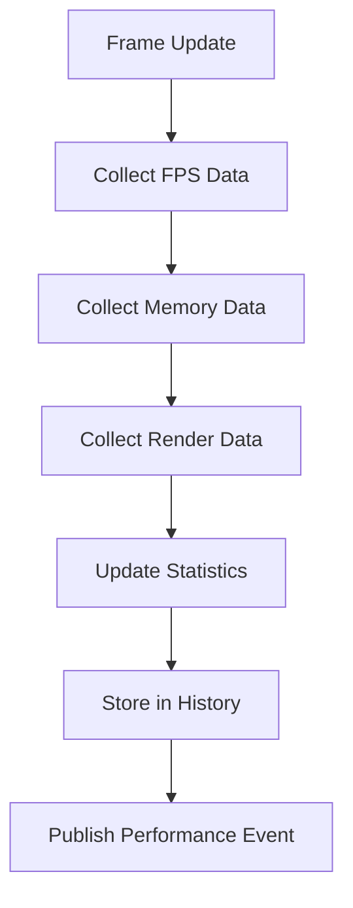

# ProfilingService Documentation

## Overview
The ProfilingService provides real-time performance monitoring with FPS tracking, memory monitoring, rendering statistics, and profiling session management.

## Core Responsibilities
- **Performance Monitoring**: Track FPS, memory usage, and rendering statistics
- **Data Collection**: Collect and store performance data over time
- **Session Management**: Manage profiling sessions with specific duration or frame counts
- **Event Publishing**: Publish performance data updates for UI and analysis
- **Historical Data**: Maintain performance history for trend analysis

## Key Features

### Performance Data Collection


### Monitoring Categories
- **FPS Statistics**: Current, average, minimum, maximum frame rates
- **Memory Tracking**: Used memory, GC allocations, memory pressure
- **Rendering Stats**: Draw calls, batches, triangles, vertices
- **Unity Profiler Integration**: Native Unity profiling data

### Session Management
- Frame-based profiling sessions
- Time-based profiling sessions
- Session progress tracking
- Automatic session completion

## Dependencies
- **IEventSystem**: Performance data event publishing
- **Unity Profiler**: Native performance data collection
- **System Memory APIs**: Memory usage tracking

## Usage Example
```csharp
// Start a profiling session
profilingService.StartSession("Performance Test", 1000); // 1000 frames

// Get current performance data
var snapshot = profilingService.GetCurrentSnapshot();
var fpsStats = profilingService.GetFPSStats();
```

## Integration Points
- Publishes PerformanceDataUpdatedEvent for UI updates
- Integrates with DebugPopup for real-time display
- Provides data for performance analysis tools
- Used by debug systems for monitoring game performance
