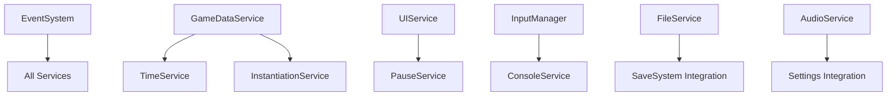

# Services Documentation

This directory contains documentation for all 13 game services that form the backbone of the Unity game framework.

## Service Overview

### Core Game Services
- **[UIService](UIService_Documentation.md)** - Unity UI Elements management with screens, popups, and frame updates
- **[InputManager](InputManager_Documentation.md)** - Context-aware input handling with Unity Input System integration
- **[AudioService](AudioService_Documentation.md)** - Music, SFX, and UI audio with mixer-based volume control
- **[GameDataService](GameDataService_Documentation.md)** - Game session and player data management with save integration

### System Services  
- **[PauseService](PauseService_Documentation.md)** - Centralized pause/resume with time scale and input context management
- **[TimeService](TimeService_Documentation.md)** - High-precision game time tracking with state awareness
- **[SceneService](SceneService_Documentation.md)** - Async scene loading with loading state coordination
- **[FileService](FileService_Documentation.md)** - Secure file I/O operations with cross-platform support

### Utility Services
- **[NotificationService](NotificationService_Documentation.md)** - User notification popups with event-driven automation
- **[ConsoleService](ConsoleService_Documentation.md)** - In-game debug console with extensible command system
- **[GraphicsService](GraphicsService_Documentation.md)** - Graphics settings management with real-time application
- **[InstantiationService](InstantiationService_Documentation.md)** - GameObject instantiation with prefab registry integration
- **[ProfilingService](ProfilingService_Documentation.md)** - Real-time performance monitoring and profiling session management

## Architecture Patterns

### Common Design Principles
All services follow consistent architectural patterns:

1. **Dependency Injection**: Constructor-based dependency injection for testability
2. **Event-Driven Communication**: Use EventSystem for decoupled service communication
3. **IGameService Interface**: Standard lifecycle with InitializeAsync, Shutdown, and IsInitialized
4. **Settings Integration**: ScriptableObject-based configuration where applicable
5. **Error Handling**: Robust error handling with graceful degradation

### Service Dependencies


### Integration Points
- Services communicate through **EventSystem** for loose coupling
- **Settings Services** use **ScriptableObjects** for configuration
- **UI Services** integrate with **Unity UI Elements**
- **Input Services** use **Unity Input System**
- **Performance Services** leverage **Unity Profiler**

## Service Lifecycle

All services follow the same initialization pattern:
1. Constructor injection of dependencies
2. `InitializeAsync()` for async setup and event subscription
3. Runtime operation through public API and event handling
4. `Shutdown()` for cleanup and event unsubscription

## Usage Patterns

### Event-Driven Operations
Most services respond to and publish events through the EventSystem:
```csharp
eventSystem.Publish(new SomeEvent());
eventSystem.Subscribe<SomeEvent>(OnSomeEvent);
```

### Settings Integration
Services that use settings integrate with ScriptableObject configuration:
```csharp
var settings = SettingsRegistry.Get<SomeSettings_SO>();
settings.ApplyChanges();
```

### Dependency Injection
Services receive dependencies through constructor injection:
```csharp
public SomeService(IEventSystem eventSystem, IOtherService otherService)
{
    _eventSystem = eventSystem;
    _otherService = otherService;
}
```

This service architecture provides a robust foundation for complex game systems while maintaining clean separation of concerns, testability, and maintainability.
