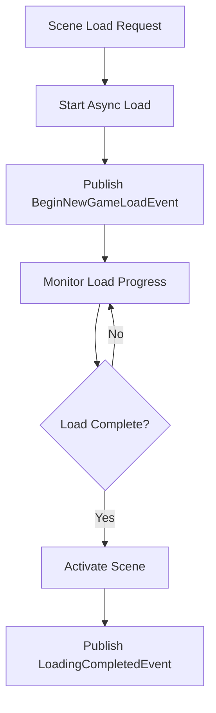

# SceneService Documentation

## Overview
The SceneService manages Unity scene loading operations with async support, loading state coordination, and integration with the game's loading system.

## Core Responsibilities
- **Async Scene Loading**: Load scenes asynchronously with progress tracking
- **Loading State Management**: Coordinate with LoadingState for UI updates
- **Scene Transition Control**: Manage scene activation and cleanup
- **Event Integration**: Publish scene loading events and progress updates

## Key Features

### Scene Loading Flow


### Loading Coordination
- Integration with LoadingState for UI updates
- Progress tracking and event publishing
- Scene activation control
- Error handling and recovery

### Scene Management
- Async scene loading with Unity's SceneManager
- Loading progress monitoring
- Scene activation timing control
- Memory management during transitions

## Dependencies
- **IEventSystem**: Loading event publishing and coordination
- **Unity SceneManager**: Scene loading and management operations

## Usage Example
```csharp
await sceneService.LoadSceneAsync("GameLevel1");
// Scene loading events are published automatically
```

## Integration Points
- Coordinates with LoadingState for loading screen display
- Publishes BeginNewGameLoadEvent and LoadingCompletedEvent
- Integrates with game flow for scene transitions
- Provides progress updates for loading UI
