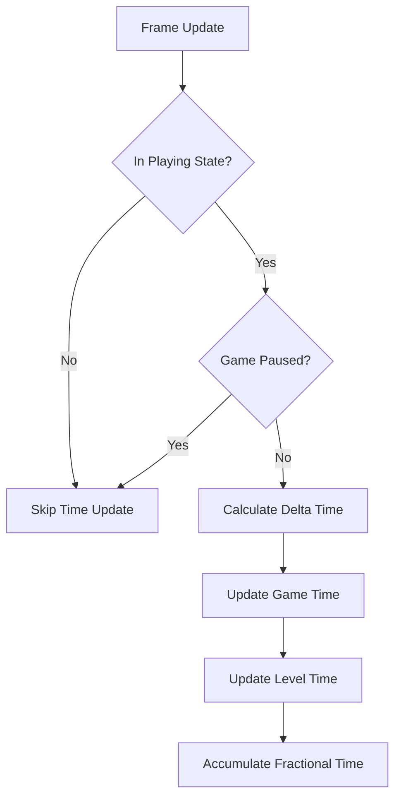

# TimeService Documentation

## Overview
The TimeService tracks game time and level time with double precision accuracy, integrating with game states and pause system for accurate time management.

## Core Responsibilities
- **Game Time Tracking**: Persistent game time stored in GameSessionData
- **Level Time Tracking**: Temporary level time reset per level
- **State-Aware Timing**: Only track time during Playing state and when unpaused
- **High Precision**: Double precision timing for accuracy over long play sessions
- **Event Integration**: Respond to game state and pause events

## Key Features

### Time Tracking Logic


### Precision Management
- Uses double precision (64-bit) for internal calculations
- Converts to long (64-bit integer) milliseconds for storage
- Accumulates fractional deltaTime to prevent drift
- Handles large time values accurately

### State Integration
- Tracks Playing state for game time updates
- Responds to pause/resume events
- Resets level time on scene transitions
- Integrates with GameDataService for persistent storage

## Dependencies
- **IEventSystem**: Game state and pause event handling
- **IGameDataService**: Game session data access for persistent time storage

## Usage Example
```csharp
long currentGameTime = timeService.GameTime; // milliseconds
bool isTracking = timeService.IsTrackingGameTime;
```

## Integration Points
- Updates GameSessionData game time automatically
- Responds to GameStateChangeEvent for state tracking
- Handles GamePausedEvent and GameResumedEvent
- Provides timing data for other game systems
