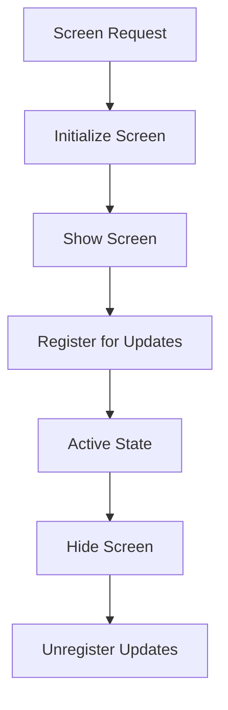

# UIService Documentation

## Overview
The UIService manages all Unity UI Elements-based screens and popups with centralized lifecycle management, frame-based updates, and cursor management.

## Core Responsibilities
- **Screen Management**: Show/hide screens and manage their lifecycle
- **Popup Stack Management**: Stack-based popup system with game-blocking detection  
- **Frame Updates**: Centralized update loop for dynamic UI components
- **Cursor Management**: Automatic cursor lock/unlock based on game state and input context
- **Event Integration**: Responds to loading, debug, and cursor events

## Key Features

### Screen Lifecycle


### Popup Stack Management
- Game-blocking vs non-blocking popup detection
- Stack-based popup navigation
- Automatic cleanup and state management

### Performance Optimization  
- Interval-based updates with dirty flagging
- Pause-aware update timing (scaled vs unscaled deltaTime)
- Efficient UI component caching

## Dependencies
- **IEventSystem**: Event publishing/subscription
- **IPauseService**: Pause state detection for updates
- **UIDocument**: Unity UI Document wrapper

## Usage Example
```csharp
await uiService.ShowScreenAsync<MainMenuScreen>();
await uiService.ShowPopupAsync<OptionsPopup>();
bool hasBlockingPopups = uiService.HasOpenPopups();
```

## Integration Points
- Automatically manages debug popup based on settings
- Integrates with PauseService for update timing
- Responds to cursor management events from input handlers
