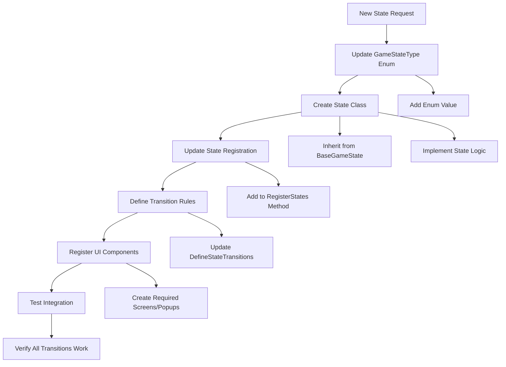
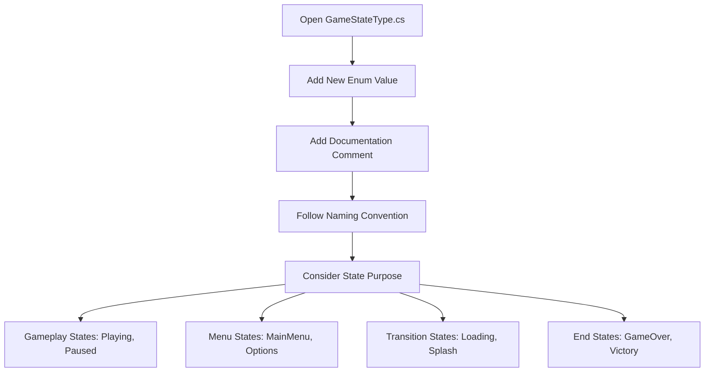
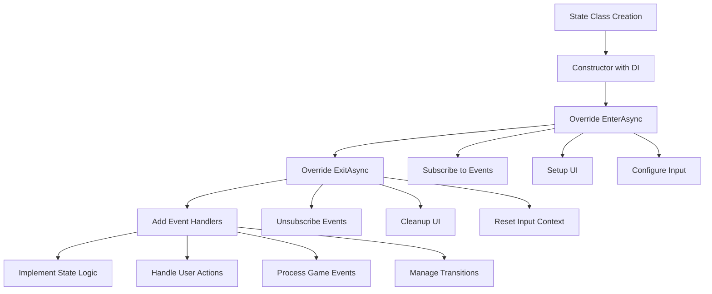
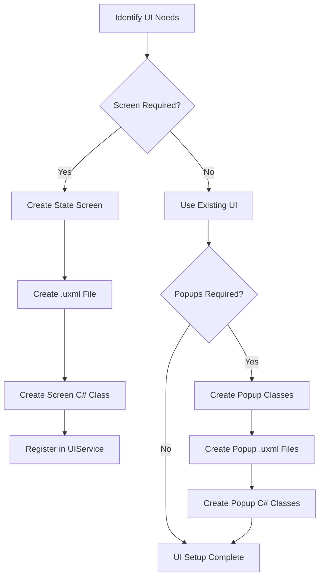
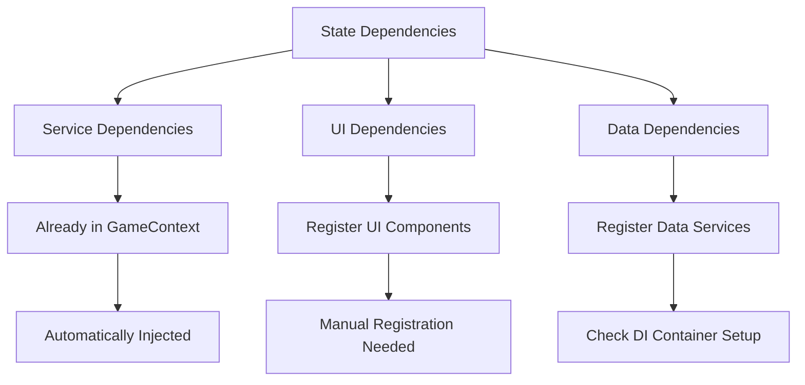
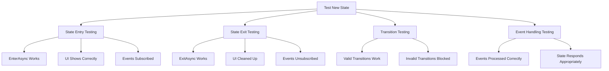
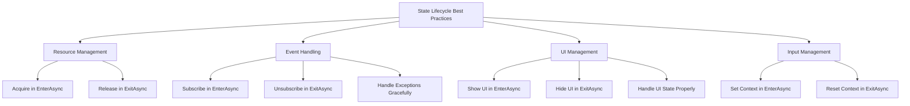
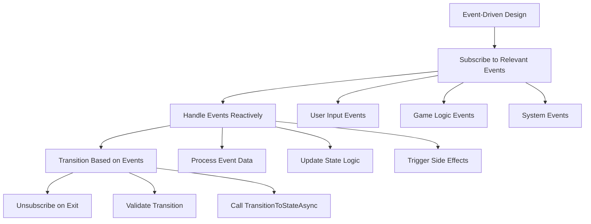
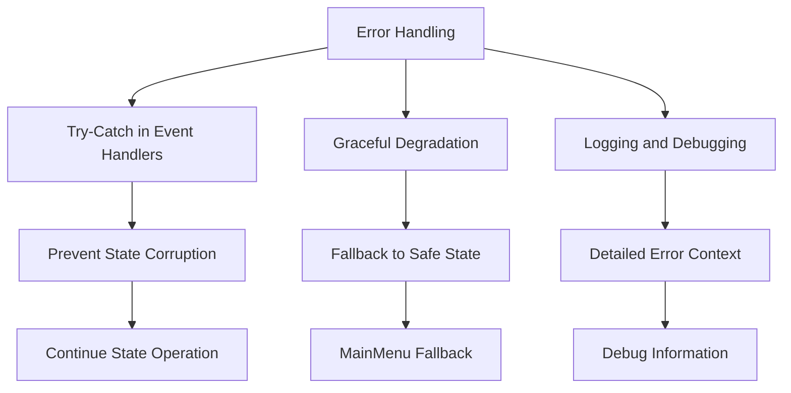

# Adding New States to the StateMachine

## Overview

This guide provides step-by-step instructions for adding new game states to the StateMachine system. The process involves multiple coordinated changes across enums, classes, registrations, and transition rules to ensure proper integration.

## Complete Integration Process

Adding a new state requires updates to several system components:



## Step 1: Update GameStateType Enum

First, add your new state to the `GameStateType` enum:

**File**: `Scripts/GameFramework/StateMachine/Enum/GameStateType.cs`



Example addition:
```csharp
public enum GameStateType
{
    // ... existing states ...
    Options,      // Settings and configuration screen
    Paused,       // Game paused overlay
    // ... other states ...
}
```

## Step 2: Create the State Class

Create your new state class inheriting from `BaseGameState`:

**Location**: `Scripts/GameFramework/StateMachine/GameStates/YourNewState.cs`

### State Class Structure



### Template Implementation

```csharp
using System.Threading.Tasks;
using GameFramework.Core;
using GameFramework.EventSystem.Events;
using GameFramework.Input;
using GameFramework.StateMachine.Enum;
using GameFramework.StateMachine.Interfaces;
using GameFramework.UI.Screens;
using GameFramework.UI.Popups;

namespace GameFramework.StateMachine.GameStates
{
    public class YourNewState : BaseGameState
    {
        public YourNewState(
            GameContext context,
            IGameStateMachine stateMachine)
            : base(GameStateType.YourNewStateType, context, stateMachine)
        {
        }

        public override async Task EnterAsync(GameContext context)
        {
            await base.EnterAsync(context);

            // Set appropriate input context
            InputManager.SetInputContext(InputContext.UI); // or InputContext.Player

            // Subscribe to relevant events
            EventSystem.Subscribe<SomeEvent>(OnSomeEvent);
            
            // Show state's UI
            await UIService.ShowScreenAsync<YourStateScreen>();
            
            // Play state-specific audio if needed
            EventSystem?.Publish(new AudioEvents.PlayMusicEvent("YourMusic"));
        }

        public override async Task ExitAsync()
        {
            // Unsubscribe from events
            EventSystem.Unsubscribe<SomeEvent>(OnSomeEvent);
            
            // Clean up UI
            await UIService.HideScreenAsync<YourStateScreen>();
            
            await base.ExitAsync();
        }

        private async void OnSomeEvent(SomeEvent evt)
        {
            // Handle event and potentially transition states
            await TransitionToStateAsync(GameStateType.SomeOtherState);
        }
    }
}
```

## Step 3: Register the State

Update the `RegisterStates` method in `GameStateMachine.cs`:

**File**: `Scripts/GameFramework/StateMachine/GameStateMachine.cs`

### State Registration Process

```mermaid
graph TD
    A[Update RegisterStates Method] --> B[Add DI Resolution Line]
    B --> C[State Created with Dependencies]
    C --> D[State Registered in Dictionary]
    D --> E[Available for Transitions]
    
    B --> B1[container.Resolve<YourNewState>()]
    C --> C1[Constructor Injection Occurs]
    D --> D1[_states Dictionary Updated]
    E --> E1[ChangeStateAsync Can Find State]
```

Add this line to the `RegisterStates()` method:

```csharp
private void RegisterStates()
{
    try
    {
        // ... existing registrations ...
        RegisterState(_container.Resolve<YourNewState>());
        // ... other registrations ...
    }
    catch (Exception e)
    {
        Debug.LogError($"[GameStateMachine] Error registering states: {e}");
        throw;
    }
}
```

## Step 4: Update AllGameStates Array

Add your state to the static array for Unity compatibility:

**File**: `Scripts/GameFramework/StateMachine/GameStateMachine.cs`

```csharp
private static readonly GameStateType[] AllGameStates = new GameStateType[]
{
    GameStateType.Bootstrap,
    GameStateType.Splash,
    // ... other states ...
    GameStateType.YourNewStateType,
    // ... remaining states ...
};
```

## Step 5: Define State Transitions

Update the `DefineStateTransitions` method to specify which states can transition to your new state:

### Transition Planning

```mermaid
graph TD
    A[Plan Transitions] --> B[Incoming Transitions]
    A --> C[Outgoing Transitions]
    
    B --> B1[Which states can enter this state?]
    C --> C1[Which states can this state go to?]
    
    B1 --> D[Add _validTransitions.Add((FromState, YourState))]
    C1 --> E[Add _validTransitions.Add((YourState, ToState))]
    
    D --> F[Consider Game Flow Logic]
    E --> F
    F --> G[Update DefineStateTransitions Method]
```

Add your transition rules:

```csharp
private void DefineStateTransitions()
{
    // ... existing transitions ...
    
    // Transitions TO your new state
    _validTransitions.Add((GameStateType.MainMenu, GameStateType.YourNewStateType));
    _validTransitions.Add((GameStateType.Playing, GameStateType.YourNewStateType));
    
    // Transitions FROM your new state
    _validTransitions.Add((GameStateType.YourNewStateType, GameStateType.MainMenu));
    _validTransitions.Add((GameStateType.YourNewStateType, GameStateType.Playing));
    
    // ... other transitions ...
}
```

## Step 6: Create Required UI Components

Create the necessary UI screens and popups for your state:

### UI Creation Flow



**Screen Example**:
- Create `UI/Screens/YourStateScreen.uxml`
- Create `Scripts/UI/Screens/YourStateScreen.cs`

**Popup Example** (if needed):
- Create `UI/Popups/YourStatePopup.uxml`
- Create `Scripts/UI/Popups/YourStatePopup.cs`

## Step 7: Handle Dependencies

Ensure your state's dependencies are registered in the DI container:

### Dependency Resolution



Check that any new services your state requires are properly registered in the DI container before the StateMachine initialization.

## Step 8: Testing and Validation

### Testing Checklist



**Validation Steps**:

1. **State Creation**: Verify the state can be resolved from DI container
2. **State Entry**: Test that `EnterAsync` completes without errors
3. **UI Integration**: Confirm UI elements appear and function correctly
4. **Event Handling**: Verify event subscriptions work as expected
5. **State Transitions**: Test all defined transitions work properly
6. **State Exit**: Ensure clean shutdown and resource cleanup
7. **Memory Management**: Check for event subscription leaks

## Common Patterns and Best Practices

### State Lifetime Management



### Event-Driven State Logic

Most states should react to events rather than polling for conditions:



### Error Handling Patterns

Implement robust error handling in your states:



## Troubleshooting Common Issues

### State Not Found
- Verify enum value is added to `GameStateType`
- Check state is registered in `RegisterStates()`
- Ensure state class constructor is accessible to DI container

### Invalid Transitions
- Add transition rules in `DefineStateTransitions()`
- Verify transition logic follows game flow requirements
- Check for circular transition dependencies

### UI Not Showing
- Confirm UI components exist and are properly registered
- Check `ShowScreenAsync()` calls in `EnterAsync()`
- Verify UI service dependencies are resolved

### Memory Leaks
- Ensure all event subscriptions have matching unsubscriptions
- Check UI cleanup in `ExitAsync()`
- Verify no static references are holding state instances

### Event Handler Exceptions
- Add try-catch blocks in event handlers
- Log detailed error information
- Implement fallback behavior for critical events

By following this comprehensive guide, you can successfully add new states to the StateMachine system while maintaining the architectural integrity and ensuring proper integration with all game systems.
