# StateMachine Documentation

## Overview

The StateMachine system provides robust state management for Unity games using a hierarchical finite state machine pattern with dependency injection. It manages game flow transitions, UI lifecycle, event coordination, and maintains clean separation between state logic and system services.

## Core Architecture

The StateMachine operates through three main components working together:

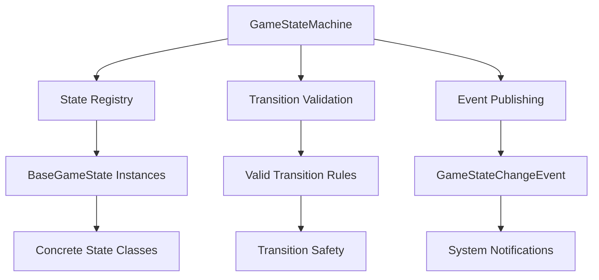

## State Lifecycle Management

Each game state follows a strict lifecycle pattern with dependency injection:

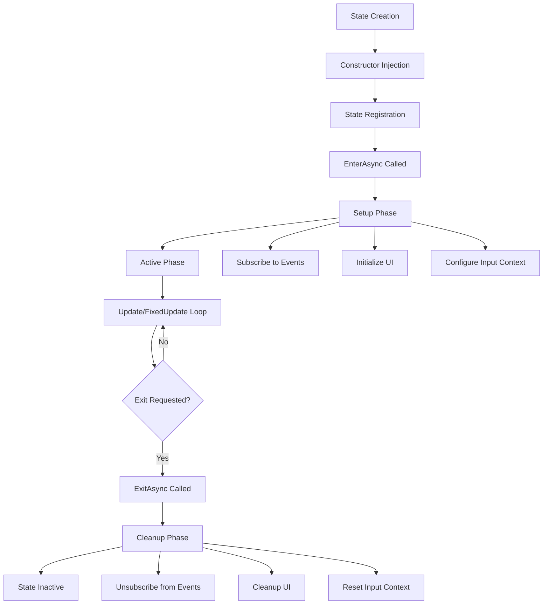

## State Transition System

The state machine enforces valid transitions through a predefined transition map:

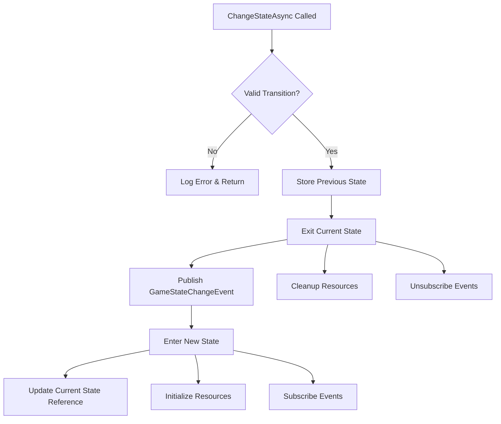

## Event-Driven State Communication

States communicate through the EventSystem, maintaining loose coupling:

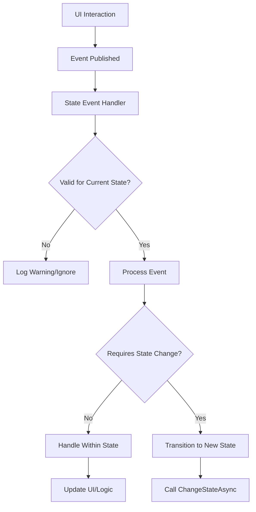

## Game State Hierarchy

The system defines a complete set of game states with clear purposes:

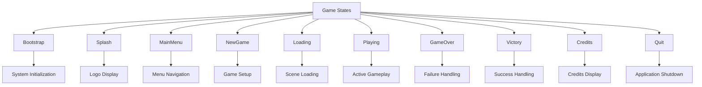

## Valid State Transitions

The system maintains strict transition rules for game flow integrity:

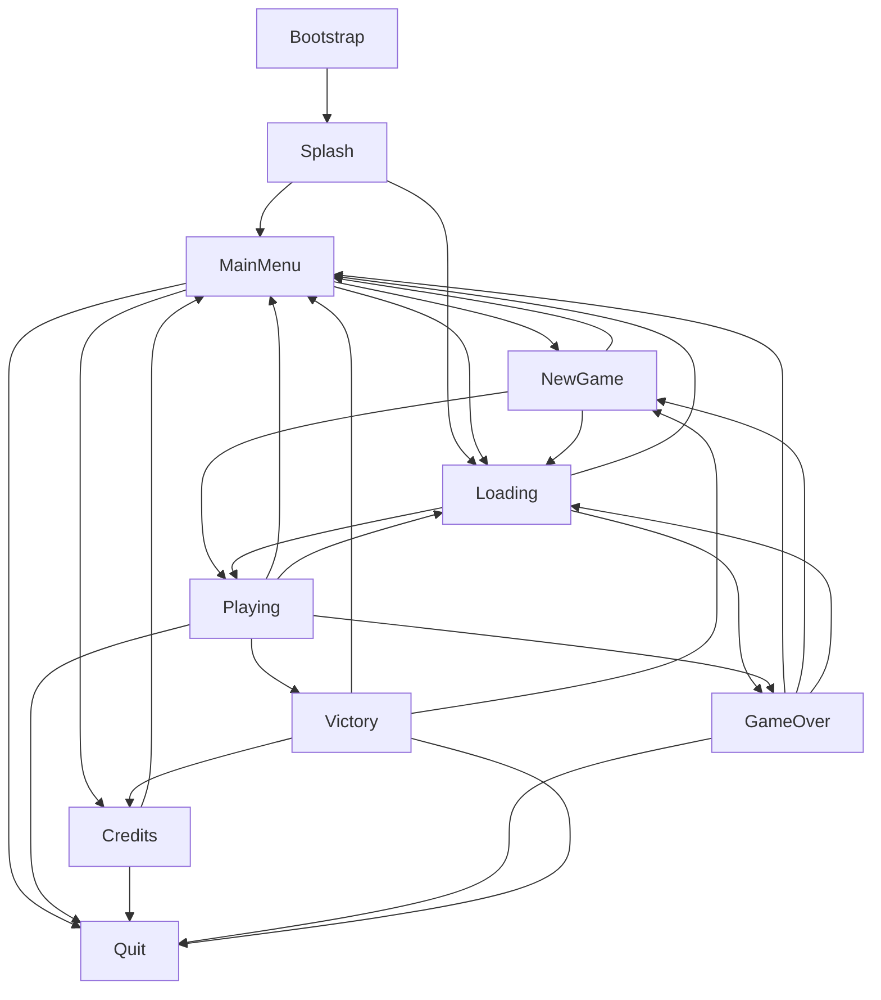

## Dependency Injection Pattern

States receive all dependencies through constructor injection:

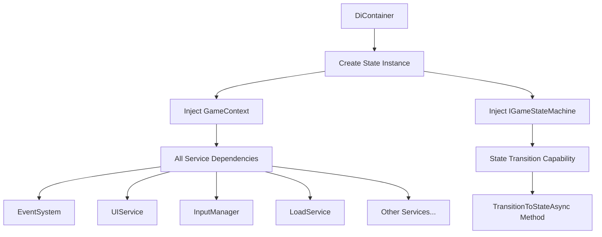

## State Registration Process

The GameStateMachine creates and registers all states during initialization:

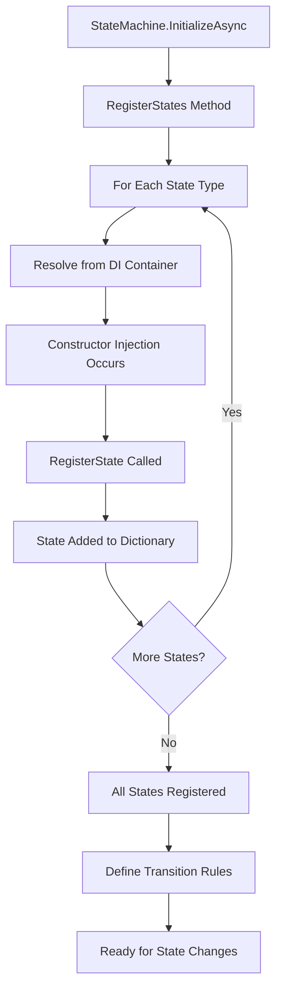

## Input Context Management

States manage input contexts based on their requirements:

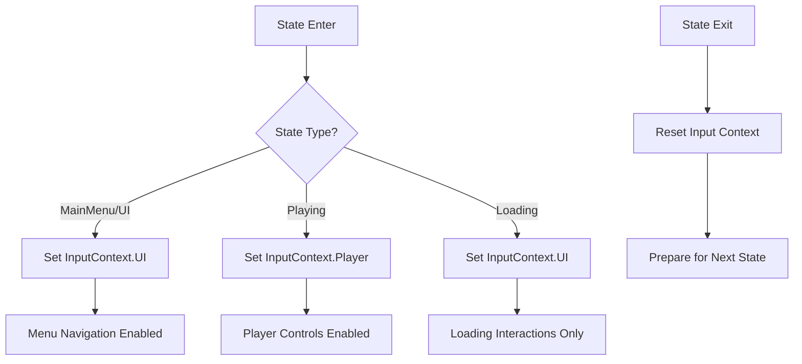

## UI Lifecycle Management

Each state is responsible for its UI elements throughout its lifecycle:

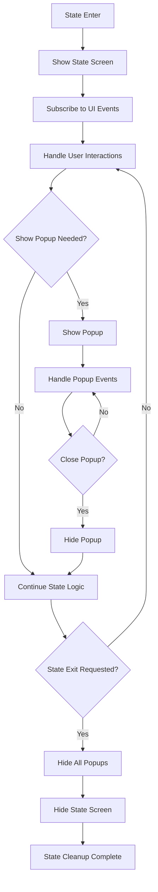

## Error Handling and Recovery

The state machine implements robust error handling:

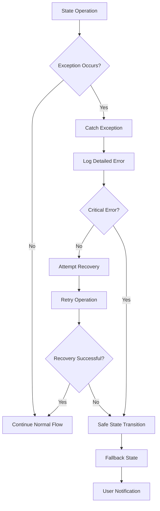

## Load Game Integration

BaseGameState provides universal load game functionality:

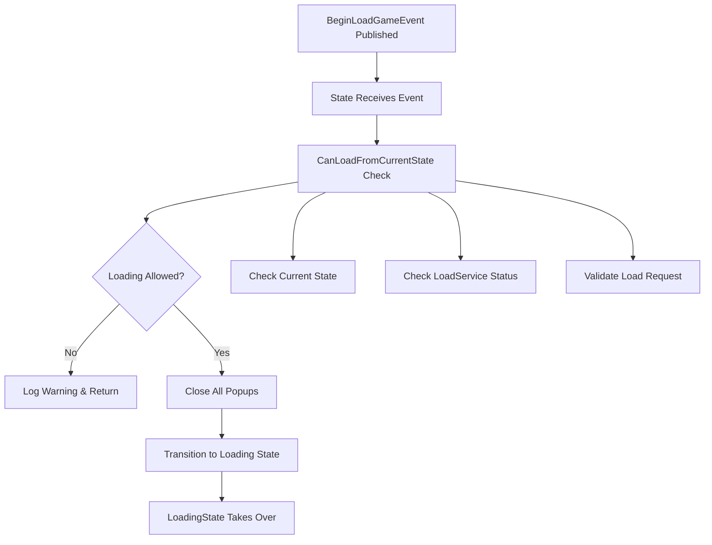

## Performance Considerations

### State Creation and Management
- States are created once during initialization and reused
- Constructor injection happens only once per state
- State transitions avoid object creation overhead
- Dictionary lookup for state retrieval: O(1) complexity

### Memory Management
- States maintain minimal memory footprint when inactive
- Event subscriptions are managed per state lifecycle
- UI elements are created/destroyed as needed
- No garbage collection pressure during normal operation

### Update Loop Integration
- Only active state receives Update/FixedUpdate calls
- Passive states remain dormant to save CPU cycles
- State machine overhead is minimal per frame

## Thread Safety Considerations

The current StateMachine implementation has specific thread safety characteristics:

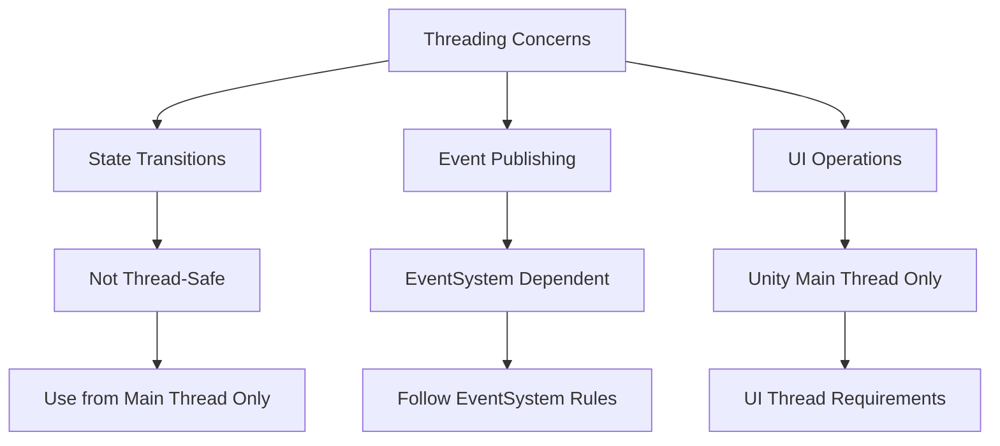

## Service Integration Pattern

The StateMachine integrates with the broader service architecture:

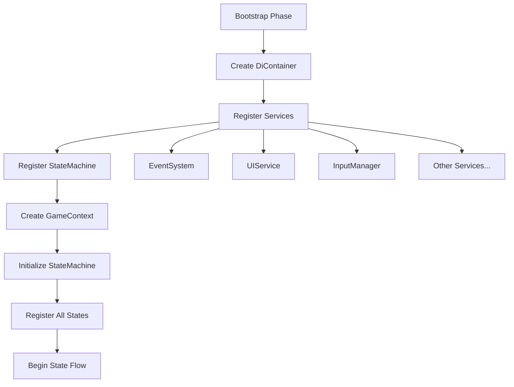

## Debugging and Monitoring

The system provides comprehensive logging and monitoring:

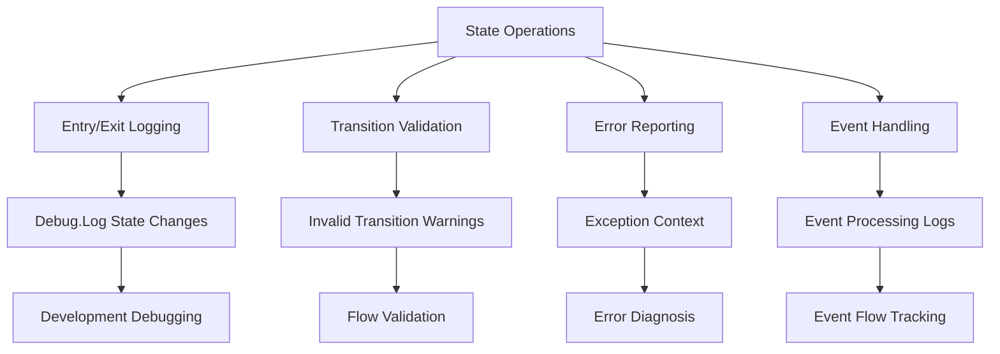

## Best Practices

### State Design Guidelines
1. **Single Responsibility**: Each state handles one game mode or screen
2. **Event-Driven**: Use events for communication, avoid direct state references
3. **Lifecycle Management**: Always pair subscriptions with unsubscriptions
4. **Input Context**: Set appropriate input context for each state
5. **UI Ownership**: States own their UI elements' lifecycle

### Transition Design
1. **Validate Transitions**: Only allow logical state flows
2. **Clean Exits**: Ensure proper cleanup before transitions
3. **Error Recovery**: Handle failed transitions gracefully
4. **Event Publishing**: Always publish state change events

### Performance Optimization
1. **Minimize State Logic**: Keep Update methods lightweight
2. **Efficient Event Handling**: Unsubscribe when not needed
3. **UI Efficiency**: Cache UI references when possible
4. **Memory Management**: Clean up resources in ExitAsync

## Common Usage Patterns

### Simple State Transition
States can transition directly using the injected state machine reference.

### Event-Driven State Changes
External systems publish events that states listen to and react accordingly.

### Conditional State Logic
States can implement complex conditional logic based on game data and user actions.

### UI-State Coordination
States coordinate with UI systems to show/hide screens and handle user interactions.

The StateMachine system provides a robust foundation for managing complex game flow while maintaining clean separation of concerns and testability through dependency injection.
