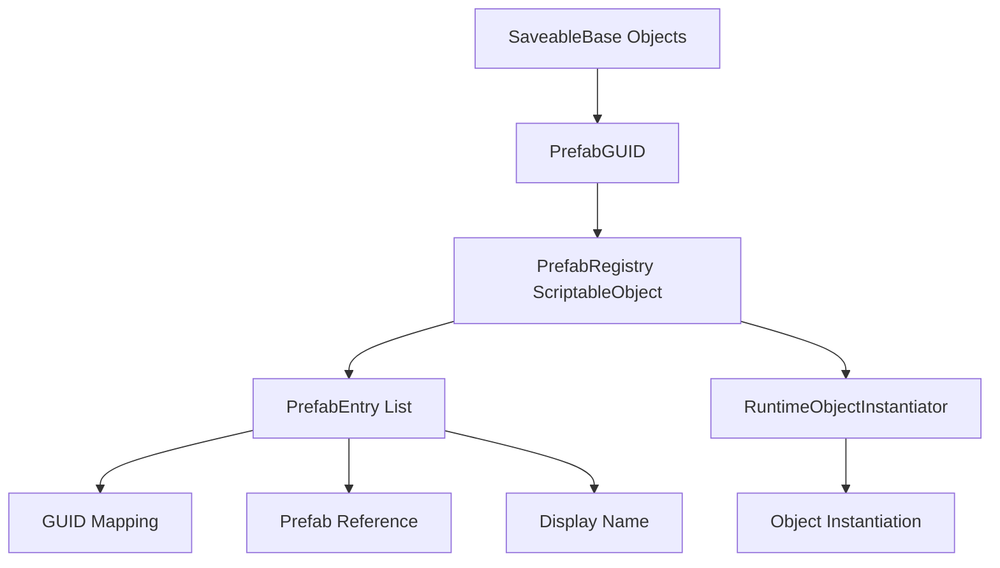
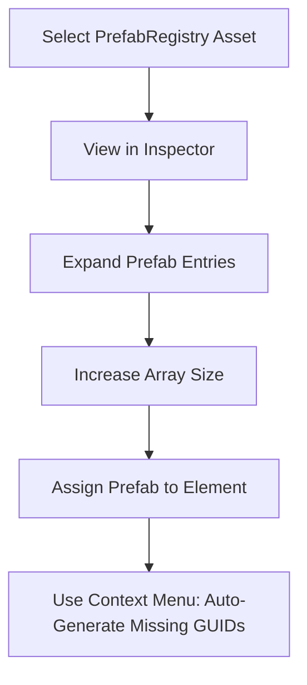
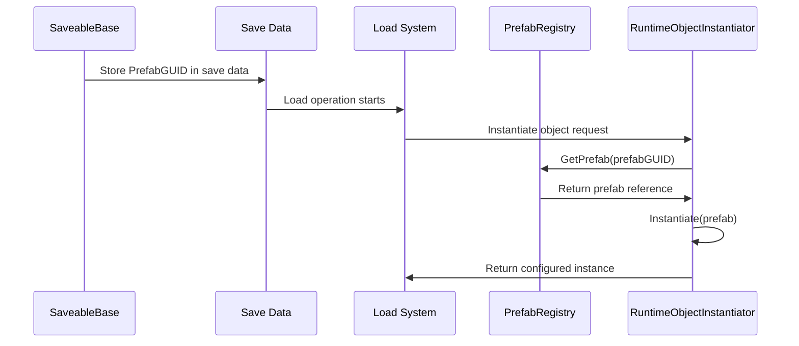
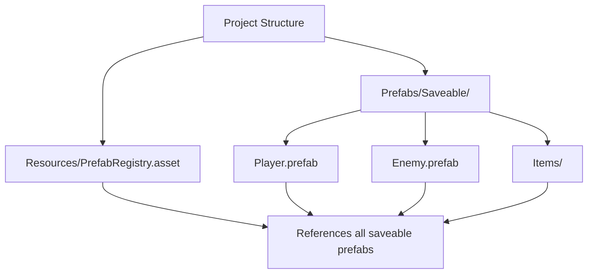

# PrefabRegistry Documentation

## Overview

The PrefabRegistry is a ScriptableObject that maintains a mapping between prefab GUIDs and prefab assets for the Save/Load system. It eliminates the need for Resources folder usage and provides stable references for runtime object instantiation.

## Architecture



### Core Components

- **PrefabRegistry**: ScriptableObject that stores prefab mappings
- **PrefabEntry**: Individual entry linking GUID to prefab asset
- **Lookup Tables**: In-memory dictionaries for fast GUID/prefab resolution
- **Editor Tools**: Context menu methods for maintenance

## Creating and Setting Up PrefabRegistry

### Step 1: Create the Registry Asset

1. In the Project window, right-click in a folder (typically `Resources/`)
2. Select `Create → Game Framework → Save System → Prefab Registry`
3. Name the asset (e.g., "PrefabRegistry")

### Step 2: Add Prefabs to Registry

#### Manual Addition via Inspector



1. Select your PrefabRegistry asset
2. In the Inspector, expand "Prefab Mappings"
3. Increase the size of "Prefab Entries"
4. Drag prefabs into the "Prefab" fields
5. Right-click the PrefabRegistry asset and select "Auto-Generate Missing GUIDs"

#### Programmatic Addition

```csharp
using UnityEngine;
using GameFramework.SaveSystem.Data;

public class PrefabRegistrySetup
{
    [ContextMenu("Register Prefab")]
    public void RegisterPrefab()
    {
        // Load your PrefabRegistry asset
        var registry = Resources.Load<PrefabRegistry>("PrefabRegistry");
        
        // Get a prefab reference
        GameObject prefab = // your prefab reference
        
        // Generate GUID from asset path
        string assetPath = UnityEditor.AssetDatabase.GetAssetPath(prefab);
        string guid = UnityEditor.AssetDatabase.AssetPathToGUID(assetPath);
        
        // Register the prefab
        bool success = registry.RegisterPrefab(guid, prefab);
        if (success)
        {
            Debug.Log($"Registered prefab: {prefab.name}");
        }
    }
}
```

## Built-in Editor Tools

The PrefabRegistry includes context menu methods for maintenance:

### Auto-Generate Missing GUIDs

**Right-click PrefabRegistry asset → "Auto-Generate Missing GUIDs"**

- Automatically generates GUIDs for prefabs that don't have them
- Uses Unity's AssetDatabase to get stable GUIDs
- Updates the PrefabName field for display
- Rebuilds internal lookup tables

**When to Use:**
- After manually adding prefabs to the registry
- When GUIDs are missing or corrupted
- During initial setup

### Validate GUIDs

**Right-click PrefabRegistry asset → "Validate GUIDs"**

- Checks all GUIDs against Unity's AssetDatabase
- Reports mismatches between stored GUIDs and actual asset GUIDs
- Identifies entries that may have been corrupted

**When to Use:**
- After moving or renaming prefab files
- When experiencing loading issues
- During project maintenance

## Registry Management Methods

### Core Lookup Methods

```csharp
// Get prefab by GUID
GameObject prefab = registry.GetPrefab("your-guid-here");

// Get GUID for a prefab
string guid = registry.GetGUID(yourPrefabReference);

// Check if GUID is registered
bool isRegistered = registry.IsRegistered("your-guid-here");

// Check if prefab is registered  
bool isRegistered = registry.IsRegistered(yourPrefabReference);
```

### Management Methods

```csharp
// Register a new prefab
bool success = registry.RegisterPrefab(guid, prefabReference);

// Unregister a prefab
bool success = registry.UnregisterPrefab(guid);

// Clean up invalid entries
int removedCount = registry.ValidateAndCleanup();

// Get all entries for inspection
PrefabEntry[] allEntries = registry.GetAllEntries();
```

## Integration with Save/Load System

### SaveableBase Integration

The PrefabRegistry works seamlessly with SaveableBase objects:

```csharp
[SaveableType(typeof(MyObjectRuntimeSaveData))]
public class MyObject : SaveableBase
{
    // SaveableBase automatically determines PrefabGUID
    // which gets stored in save data for later instantiation
}
```

### Runtime Object Instantiation Flow



### Save Data Integration

```csharp
// During saving
protected override RuntimeObjectSaveData CreateSpecificRuntimeSaveData()
{
    return new MyObjectRuntimeSaveData(UniqueID, PrefabGUID)
    {
        // PrefabGUID is automatically set by SaveableBase
        // and will be used for instantiation during loading
    };
}

// During loading (handled by RuntimeObjectInstantiator)
GameObject prefab = _prefabRegistry.GetPrefab(saveData.prefabGUID);
if (prefab != null)
{
    GameObject instance = Instantiate(prefab);
    // Configure instance with save data
}
```

## Data Structure

### PrefabEntry Structure

```csharp
[System.Serializable]
public class PrefabEntry
{
    public string GUID;           // Unity asset GUID
    public GameObject Prefab;     // Direct prefab reference
    public string PrefabName;     // Display name (auto-updated)
}
```

### Registry Properties

```csharp
// Public properties for inspection
public int TotalPrefabs { get; }              // Count of registered prefabs
public string[] RegisteredGUIDs { get; }      // Array of all GUIDs
```

## Best Practices

### Project Organization



### Workflow Recommendations

1. **Single Registry**: Use one PrefabRegistry per project
2. **Resources Folder**: Place registry in Resources folder for easy loading
3. **Version Control**: Include PrefabRegistry.asset in version control
4. **Regular Validation**: Run validation after major project changes
5. **GUID Regeneration**: Use "Auto-Generate Missing GUIDs" after adding prefabs

### Team Workflow


## Troubleshooting

### Common Issues and Solutions

#### "Prefab not found for GUID"
**Cause**: Registry contains a GUID that doesn't match any prefab
**Solutions**:
- Run "Validate GUIDs" to identify mismatches
- Use "Auto-Generate Missing GUIDs" to refresh GUIDs
- Remove invalid entries manually

#### "GUID mismatch detected"
**Cause**: Prefab was moved or duplicated, changing its GUID
**Solutions**:
- Re-generate GUIDs using the context menu
- Verify prefab references in the registry
- Check if prefabs were accidentally duplicated

#### "Duplicate GUID found"
**Cause**: Multiple entries have the same GUID
**Solutions**:
- Use ValidateAndCleanup() to remove duplicates
- Manually review registry entries
- Re-generate GUIDs to ensure uniqueness

### Debugging Methods

```csharp
// Debug registry state
public void DebugRegistry()
{
    var registry = Resources.Load<PrefabRegistry>("PrefabRegistry");
    
    Debug.Log($"Total prefabs: {registry.TotalPrefabs}");
    
    foreach (var entry in registry.GetAllEntries())
    {
        Debug.Log($"Prefab: {entry.PrefabName}, GUID: {entry.GUID}");
    }
    
    // Check for issues
    int cleanedUp = registry.ValidateAndCleanup();
    Debug.Log($"Cleaned up {cleanedUp} invalid entries");
}
```

## Performance Considerations

### Optimization Features

- **Lazy Loading**: Lookup tables built on first access or when needed
- **Dictionary Lookups**: O(1) performance for prefab resolution
- **Automatic Cleanup**: Removes invalid entries during validation
- **Memory Efficient**: Only stores essential mapping data

### Memory Usage

- **Runtime**: Small memory footprint with dictionary lookups
- **Editor**: Additional validation and cleanup overhead
- **Loading**: Temporary object creation during instantiation

## Integration Examples

### Custom Prefab Management

```csharp
using UnityEngine;
using GameFramework.SaveSystem.Data;

public class CustomPrefabManager : MonoBehaviour
{
    [SerializeField] private PrefabRegistry _registry;
    
    public GameObject CreatePrefabInstance(string prefabGUID)
    {
        GameObject prefab = _registry.GetPrefab(prefabGUID);
        if (prefab != null)
        {
            return Instantiate(prefab);
        }
        
        Debug.LogError($"Prefab not found for GUID: {prefabGUID}");
        return null;
    }
    
    public void RegisterNewPrefab(GameObject prefab)
    {
        if (_registry.IsRegistered(prefab))
        {
            Debug.Log($"Prefab {prefab.name} already registered");
            return;
        }
        
        #if UNITY_EDITOR
        string assetPath = UnityEditor.AssetDatabase.GetAssetPath(prefab);
        string guid = UnityEditor.AssetDatabase.AssetPathToGUID(assetPath);
        
        bool success = _registry.RegisterPrefab(guid, prefab);
        if (success)
        {
            Debug.Log($"Successfully registered prefab: {prefab.name}");
        }
        #endif
    }
}
```

### Validation Integration

```csharp
public class RegistryValidator : MonoBehaviour
{
    [ContextMenu("Validate All Saveable Prefabs")]
    public void ValidateAllSaveablePrefabs()
    {
        var registry = Resources.Load<PrefabRegistry>("PrefabRegistry");
        if (registry == null)
        {
            Debug.LogError("PrefabRegistry not found in Resources folder");
            return;
        }
        
        int validCount = 0;
        int invalidCount = 0;
        
        foreach (var entry in registry.GetAllEntries())
        {
            if (entry.Prefab != null)
            {
                var saveable = entry.Prefab.GetComponent<SaveableBase>();
                if (saveable != null)
                {
                    validCount++;
                }
                else
                {
                    Debug.LogWarning($"Prefab {entry.PrefabName} has no SaveableBase component");
                    invalidCount++;
                }
            }
            else
            {
                Debug.LogWarning($"Missing prefab reference for GUID: {entry.GUID}");
                invalidCount++;
            }
        }
        
        Debug.Log($"Validation complete: {validCount} valid, {invalidCount} invalid");
    }
}
```

## Conclusion

The PrefabRegistry provides a robust foundation for prefab management in the Save/Load system. Its simple ScriptableObject structure combined with efficient lookup mechanisms ensures reliable object instantiation while maintaining excellent performance.

**Key Benefits:**
- **Simple Setup**: ScriptableObject-based configuration
- **Stable References**: GUID-based prefab mapping survives project changes  
- **Editor Integration**: Built-in validation and maintenance tools
- **Performance**: Fast dictionary-based lookups
- **Reliability**: Automatic cleanup of invalid entries

Use the PrefabRegistry to eliminate Resources folder dependencies and ensure your Save/Load system can reliably instantiate saved objects.