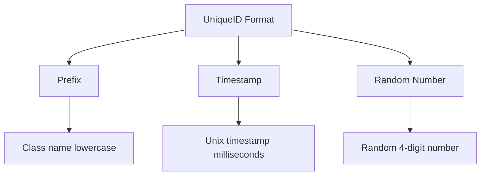
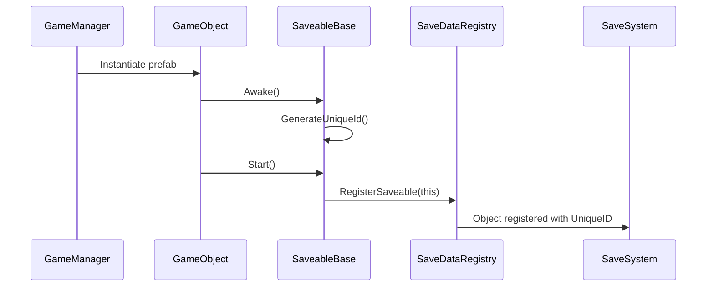

# UniqueID Generation System

## Overview

The UniqueID Generation system provides automatic generation of unique identifiers for SaveableBase objects during runtime instantiation. Unlike traditional editor-time generation, this system creates IDs when objects are instantiated during gameplay, ensuring proper runtime identification without interfering with prefab assets.

## How It Works

### Runtime Generation

The system generates UniqueIDs automatically during the `Awake()` lifecycle of SaveableBase objects:

```mermaid
flowchart TD
    A[GameObject Created] --> B[SaveableBase.Awake()]
    B --> C{IsRuntimeInstance?}
    C -->|Yes| D{UniqueID Empty?}
    C -->|No| E[Skip Generation]
    D -->|Yes| F[GenerateUniqueId()]
    D -->|No| E
    F --> G[UniqueIDGenerator.GenerateUniqueID()]
    G --> H[ID Generated: prefix_timestamp_random]
```

### When IDs Are Generated

UniqueIDs are automatically created when:
- **Runtime Instantiation**: Objects instantiated during gameplay (via Instantiate())
- **Scene Loading**: Scene objects when entering play mode
- **Runtime Object Creation**: Any SaveableBase object created during application runtime

### When IDs Are NOT Generated

The system avoids generating IDs for:
- **Prefab Assets**: Objects that exist only as prefab files
- **Editor Mode**: Objects created during edit mode (non-playing)
- **Existing IDs**: Objects that already have a UniqueID assigned

## ID Format and Structure

### Format Specification

UniqueIDs follow the pattern: `{prefix}_{timestamp}_{random}`

**Example**: `clickablecube_1734567890123_4567`

### Components



- **Prefix**: Lowercase class name (customizable via `GetUniqueIdPrefix()`)
- **Timestamp**: Unix timestamp in milliseconds for temporal uniqueness
- **Random**: 4-digit random number (1000-9999) for collision avoidance

## Implementation Details

### SaveableBase Integration

```csharp
protected virtual void Awake()
{
    // Generate ID only for runtime instances with empty IDs
    if (string.IsNullOrEmpty(_uniqueID) && IsRuntimeInstance())
    {
        GenerateUniqueId();
    }
}

protected virtual void GenerateUniqueId()
{
    string prefix = GetUniqueIdPrefix();
    UniqueID = UniqueIDGenerator.GenerateUniqueID(prefix);
}

protected virtual string GetUniqueIdPrefix()
{
    return GetType().Name.ToLower(); // e.g., "clickablecube"
}
```

### Runtime Instance Detection

```csharp
private bool IsRuntimeInstance()
{
#if UNITY_EDITOR
    if (!Application.isPlaying)
        return false; // Don't generate in edit mode
    
    return gameObject.scene.IsValid() && !string.IsNullOrEmpty(gameObject.scene.name);
#else
    return Application.isPlaying; // In builds, Awake means runtime
#endif
}
```

### UniqueIDGenerator Utility

```csharp
public static string GenerateUniqueID(string prefix = "obj")
{
    var timestamp = DateTimeOffset.Now.ToUnixTimeMilliseconds();
    var random = UnityEngine.Random.Range(1000, 9999);
    return $"{prefix}_{timestamp}_{random}";
}

public static bool IsValidUniqueID(string uniqueId)
{
    var parts = uniqueId.Split('_');
    return parts.Length == 3 && 
           !string.IsNullOrEmpty(parts[0]) && 
           long.TryParse(parts[1], out _) && 
           int.TryParse(parts[2], out _);
}
```

## Customization Options

### Custom ID Prefixes

Override `GetUniqueIdPrefix()` to customize the prefix:

```csharp
[SaveableType(typeof(WeaponRuntimeSaveData))]
public class WeaponSaveable : SaveableBase
{
    protected override string GetUniqueIdPrefix()
    {
        return "weapon"; // Results in: weapon_1734567890123_4567
    }
}
```

### Manual ID Assignment

For specific scenarios, you can manually set IDs:

```csharp
// During loading operations
saveableObject.SetUniqueID(loadedData.uniqueID);

// For special objects with predetermined IDs
saveableObject.SetUniqueID("player_main_character");
```

## Editor Tools

### Debug ID Generation

For testing purposes, a debug method is available:

```csharp
#if UNITY_EDITOR
[System.ComponentModel.EditorBrowsable(System.ComponentModel.EditorBrowsableState.Never)]
public void EditorGenerateUniqueID()
{
    if (!Application.isPlaying)
    {
        GenerateUniqueId();
        Debug.LogWarning($"Editor-generated UniqueID: {_uniqueID}. This should only be used for testing!");
    }
}
#endif
```

**Note**: This method is hidden from normal editor browsing and should only be used for debugging.

## Practical Usage Examples

### Standard Runtime Object

```csharp
[SaveableType(typeof(EnemyRuntimeSaveData))]
public class Enemy : SaveableBase
{
    // UniqueID automatically generated during Awake()
    // Format: enemy_1734567890123_4567
    
    protected override string GetUniqueIdPrefix() => "enemy";
}
```

### Instantiated Objects

```csharp
public class EnemySpawner : MonoBehaviour
{
    [SerializeField] private GameObject _enemyPrefab;
    
    public void SpawnEnemy()
    {
        // UniqueID automatically generated for the new instance
        GameObject enemy = Instantiate(_enemyPrefab);
        
        // The Enemy SaveableBase component will have a unique ID
        var enemySaveable = enemy.GetComponent<Enemy>();
        Debug.Log($"Spawned enemy with ID: {enemySaveable.UniqueID}");
    }
}
```

### Scene Objects

```csharp
// Objects placed in scenes will get IDs when entering play mode
public class LevelManager : MonoBehaviour
{
    private void Start()
    {
        // All SaveableBase objects in scene now have UniqueIDs
        var allSaveables = FindObjectsOfType<SaveableBase>();
        foreach (var saveable in allSaveables)
        {
            Debug.Log($"Scene object {saveable.name} has ID: {saveable.UniqueID}");
        }
    }
}
```

## Integration with Save/Load System

### Automatic Integration

The UniqueID system integrates seamlessly with the Save/Load system:



### Save Data Creation

```csharp
protected override RuntimeObjectSaveData CreateSpecificRuntimeSaveData()
{
    return new MyObjectRuntimeSaveData(UniqueID, PrefabGUID)
    {
        // UniqueID automatically available for save data
    };
}
```

### Loading Operations

```csharp
protected override void LoadSpecificRuntimeSaveData(RuntimeObjectSaveData saveData)
{
    // UniqueID is automatically restored during loading
    // No manual ID management required
}
```

## Benefits and Advantages

### For Developers
- **Zero Configuration**: Works automatically without setup
- **Runtime Safety**: No interference with prefab assets
- **Collision Avoidance**: Timestamp + random ensures uniqueness
- **Customizable**: Override prefix generation for specific needs

### For Runtime Performance
- **Lightweight**: Fast generation using simple operations
- **Memory Efficient**: No caching or complex data structures
- **Deterministic**: Predictable behavior across all platforms

### For Save/Load System
- **Automatic Integration**: SaveableBase objects automatically get proper IDs
- **Reliable Identification**: Unique IDs ensure correct object loading
- **No Manual Work**: Developers don't need to manage IDs manually

## Troubleshooting

### Common Issues

#### "UniqueID is empty after instantiation"
**Cause**: Object may not be a valid runtime instance
**Solutions**:
- Ensure object is instantiated during play mode
- Check if `IsRuntimeInstance()` returns true
- Verify object is in a valid scene

#### "Multiple objects with same ID"
**Cause**: Very rare timestamp collision or manual ID assignment
**Solutions**:
- Check for manual `SetUniqueID()` calls with duplicate values
- Verify system clock is functioning properly
- Report if this occurs without manual intervention

#### "ID format validation fails"
**Cause**: Manual ID assignment with incorrect format
**Solutions**:
- Use `UniqueIDGenerator.IsValidUniqueID()` to validate custom IDs
- Follow the `prefix_timestamp_random` format
- Use the built-in generation methods when possible

### Debugging Tools

```csharp
// Validate ID format
bool isValid = UniqueIDGenerator.IsValidUniqueID(myObject.UniqueID);

// Check if object would generate ID at runtime
bool wouldGenerate = string.IsNullOrEmpty(myObject.UniqueID) && 
                    IsRuntimeInstanceCheck(myObject);

// Force ID generation for testing (editor only)
#if UNITY_EDITOR
if (!Application.isPlaying)
{
    myObject.EditorGenerateUniqueID();
}
#endif
```

## Best Practices

### ID Management
1. **Let the System Handle It**: Don't manually assign IDs unless necessary
2. **Custom Prefixes**: Use meaningful prefixes for different object types
3. **Validation**: Always validate manually assigned IDs
4. **Documentation**: Document any manual ID assignments and reasons

### Performance
1. **No Caching Needed**: IDs are generated once and stored
2. **Lightweight Operations**: Generation is very fast, no performance concerns
3. **Runtime Only**: No editor-time overhead or processing

### Integration
1. **Trust the Process**: The system integrates automatically with SaveableBase
2. **Debug When Needed**: Use debug tools for troubleshooting only
3. **Consistent Patterns**: Use the same approach across your entire project

## Conclusion

The UniqueID Generation system provides automatic, reliable unique identification for SaveableBase objects during runtime. By generating IDs only when needed and using a collision-resistant format, it ensures proper object identification without interfering with prefab assets or editor workflows.

**Key Benefits:**
- ✅ Automatic runtime generation
- ✅ No editor-time interference  
- ✅ Collision-resistant format
- ✅ Seamless Save/Load integration
- ✅ Customizable prefixes
- ✅ Zero configuration required

The system requires no setup or configuration and integrates transparently with the Save/Load system, making it an essential component for reliable game state persistence.