# UI System Documentation

## Overview

The UI System provides a sophisticated Unity UI Elements-based architecture for managing game interfaces. It implements a clean separation between UI components and game logic through event-driven communication, centralized lifecycle management, and performance-optimized rendering.

## Core Architecture

The UI System operates through a hierarchical component structure with clear responsibilities:

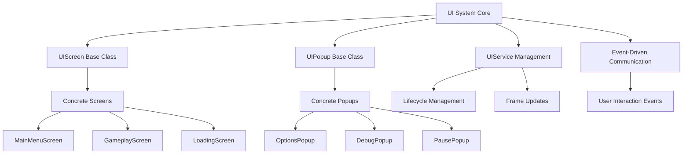

## Component Hierarchy

The system uses a two-tier inheritance model for UI components:

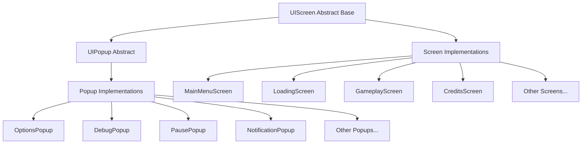

## Screen Lifecycle Management

Each UI component follows a strict lifecycle pattern managed by the UIService:

```mermaid
graph TD
    A[Screen Creation] --> B[Constructor Called]
    B --> C[Element Caching]
    C --> D[Event Registration]
    D --> E[Initial Hide State]
    E --> F[Ready for Show]
    
    F --> G[Show() Called]
    G --> H[DisplayStyle.Flex Set]
    H --> I[IsVisible = true]
    I --> J[OnShow() Hook]
    J --> K[Active State]
    
    K --> L[Hide() Called]
    L --> M[DisplayStyle.None Set]
    M --> N[IsVisible = false]
    N --> O[OnHide() Hook]
    O --> P[Inactive State]
    
    P --> Q{Cleanup Needed?}
    Q -->|Yes| R[Cleanup() Called]
    Q -->|No| F
    R --> S[Event Unsubscription]
    S --> T[Update Deregistration]
    T --> U[Component Destroyed]
```

## Event-Driven Communication Pattern

UI components communicate with the game through events, maintaining loose coupling:

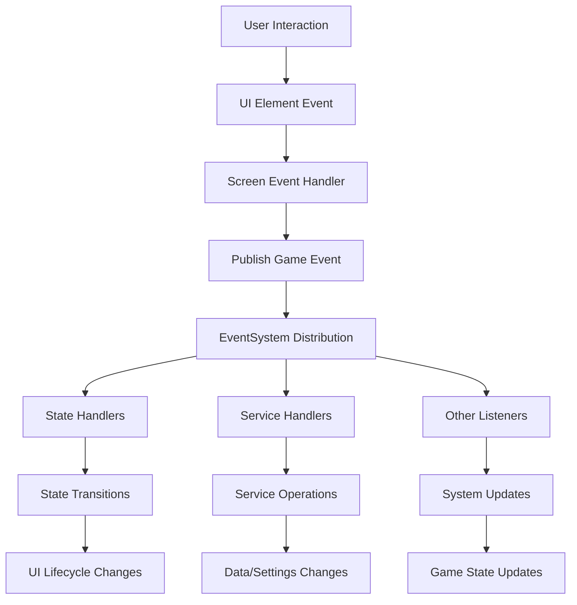

## Frame Update System

The system provides efficient frame-based updates for dynamic UI components:

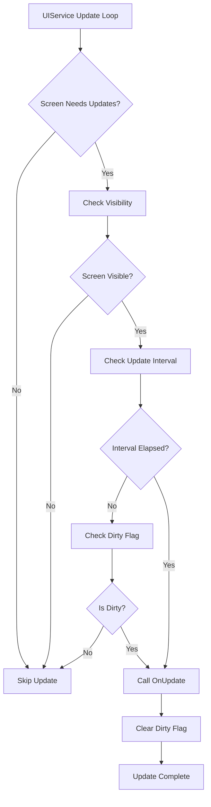

## Popup Management System

Popups use a stack-based management approach with game-blocking detection:

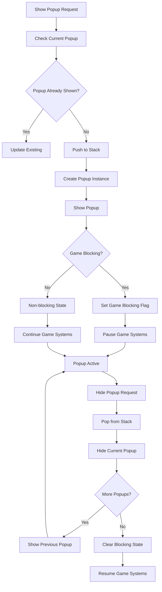

## Settings Integration Pattern

UI components integrate with the settings system through ScriptableObjects:

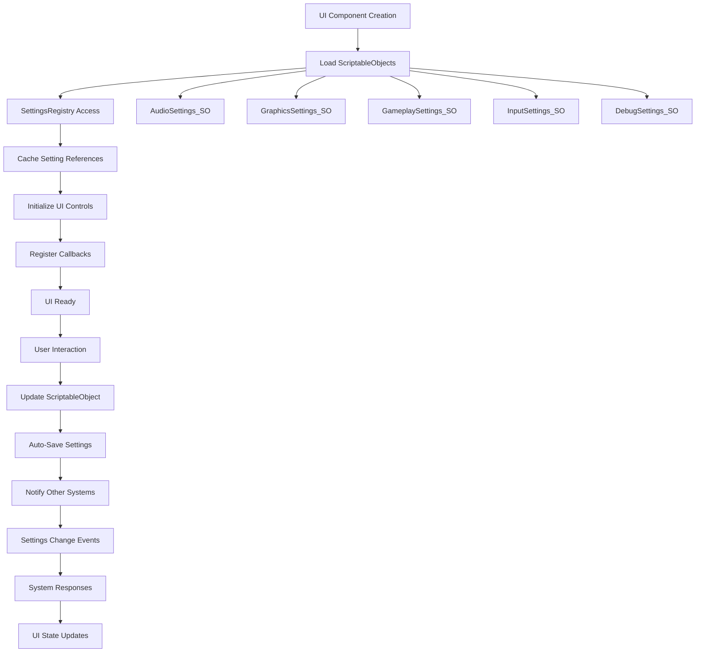

## Performance Optimization Strategies

The system implements multiple optimization techniques:

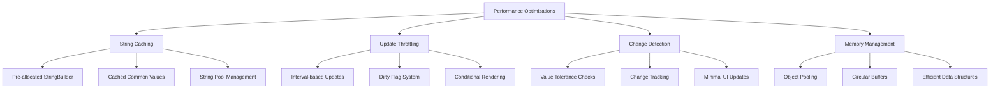

## Debug System Architecture

The DebugPopup demonstrates advanced UI optimization techniques:

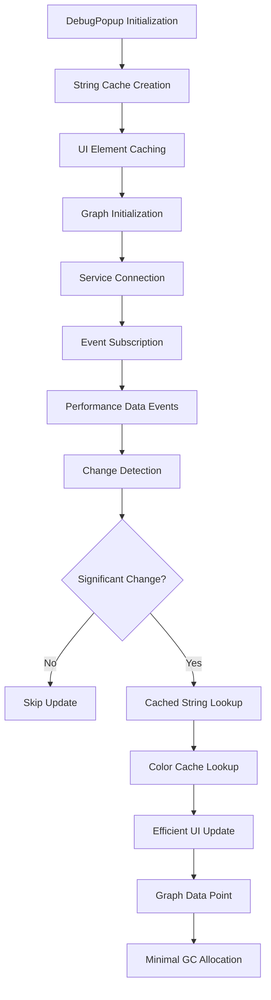

## Graph Rendering System

The GraphElement provides efficient real-time data visualization:

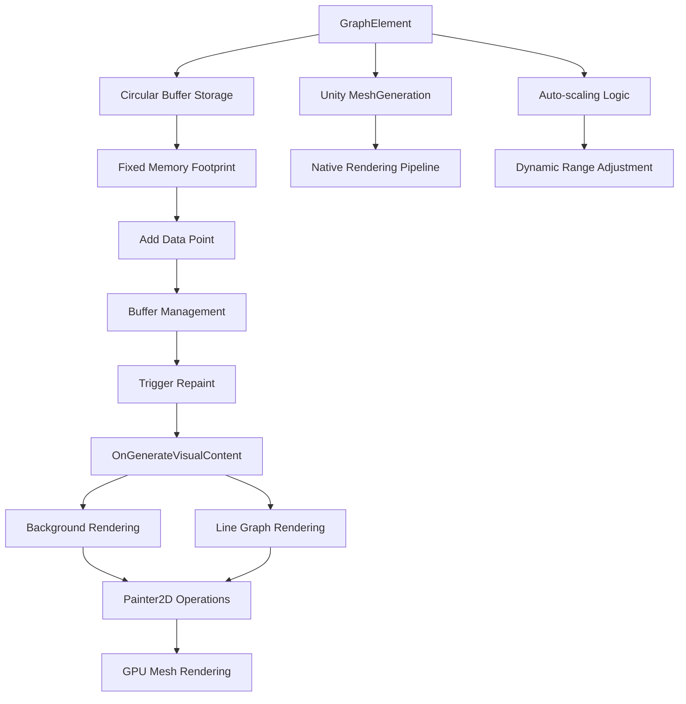

## Service Integration Flow

UI components integrate with game services through dependency injection:

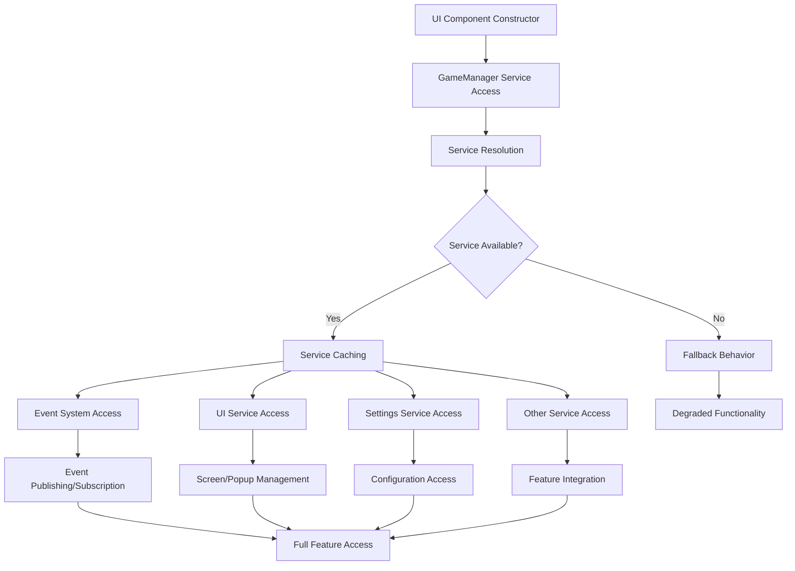

## Input Handling Architecture

UI components handle input through Unity's UI Elements event system:

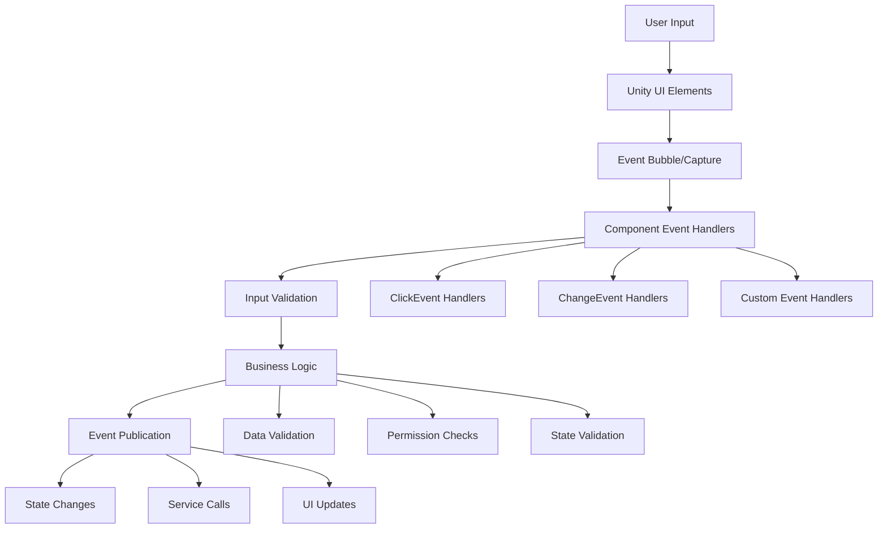

## Error Handling and Recovery

The system implements robust error handling across all components:

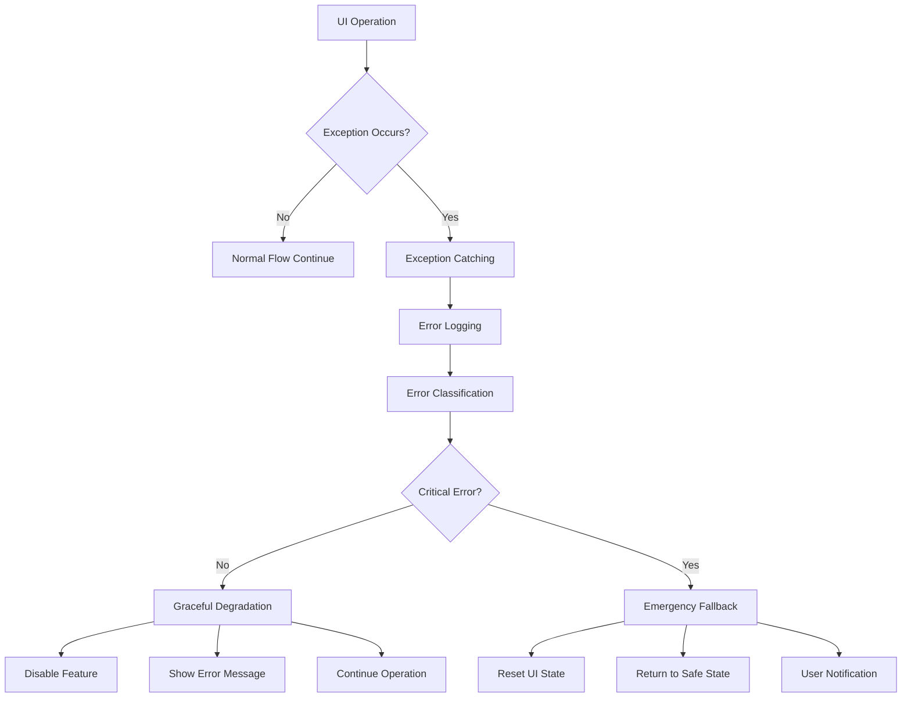

## Memory Management Strategy

The UI system employs several memory management techniques:

```mermaid
graph TD
    A[Memory Management] --> B[Object Lifecycle]
    A --> C[String Management]
    A --> D[Event Management]
    A --> E[Resource Cleanup]
    
    B --> B1[Constructor Injection]
    B --> B2[Proper Disposal]
    B --> B3[Reference Management]
    
    C --> C1[String Caching]
    C --> C2[StringBuilder Reuse]
    C --> C3[Constant Pooling]
    
    D --> D1[Subscription Tracking]
    D --> D2[Automatic Unsubscription]
    D --> D3[Memory Leak Prevention]
    
    E --> E1[Cleanup() Methods]
    E --> E2[Resource Deregistration]
    E --> E3[Cache Clearing]
```

## Threading Considerations

UI operations are designed for Unity's main thread with specific threading patterns:

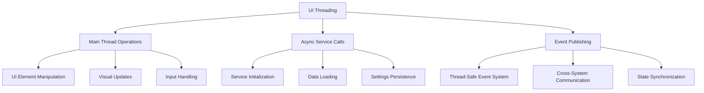

## Testing and Debugging Support

The system provides comprehensive testing and debugging capabilities:

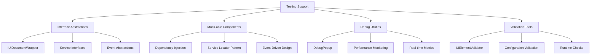

## Best Practices

### Component Design Guidelines
1. **Single Responsibility**: Each screen/popup handles one specific UI concern
2. **Event-Driven Communication**: Use events for all external communication
3. **Lifecycle Management**: Always pair subscriptions with unsubscriptions
4. **Performance Awareness**: Use frame updates only when necessary
5. **Error Resilience**: Implement graceful degradation for service failures

### Performance Optimization
1. **String Caching**: Pre-allocate and cache commonly used strings
2. **Update Throttling**: Use intervals and dirty flags for expensive operations
3. **Memory Efficiency**: Employ circular buffers and object pooling
4. **Change Detection**: Only update UI when values actually change
5. **Resource Management**: Clean up resources in Cleanup() methods

### Integration Patterns
1. **Service Integration**: Use dependency injection and service locator patterns
2. **Settings Integration**: Connect to ScriptableObject-based settings
3. **State Coordination**: Let states manage UI lifecycle, not screens themselves
4. **Error Handling**: Implement fallback behavior for missing services
5. **Testing Support**: Design for testability with interface abstractions

## Common Usage Patterns

### Screen Implementation
Screens are pure UI components that report user interactions without managing their own lifecycle.

### Popup Implementation
Popups can be game-blocking or non-blocking, with stack-based management for complex interactions.

### Settings Integration
UI components automatically sync with ScriptableObject settings through the SettingsRegistry system.

### Performance Monitoring
The DebugPopup demonstrates advanced optimization techniques for real-time data display.

### Custom Graph Rendering
The GraphElement shows how to implement efficient custom UI elements using Unity's mesh generation system.

The UI System provides a robust foundation for complex game interfaces while maintaining performance, testability, and maintainability through careful architectural design and optimization strategies.
