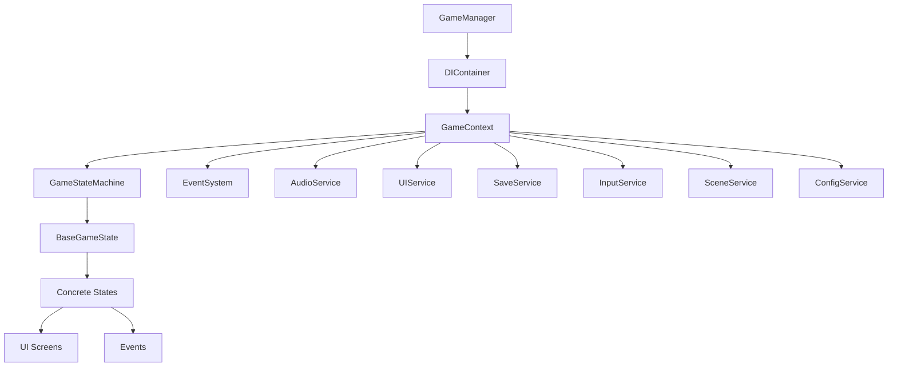
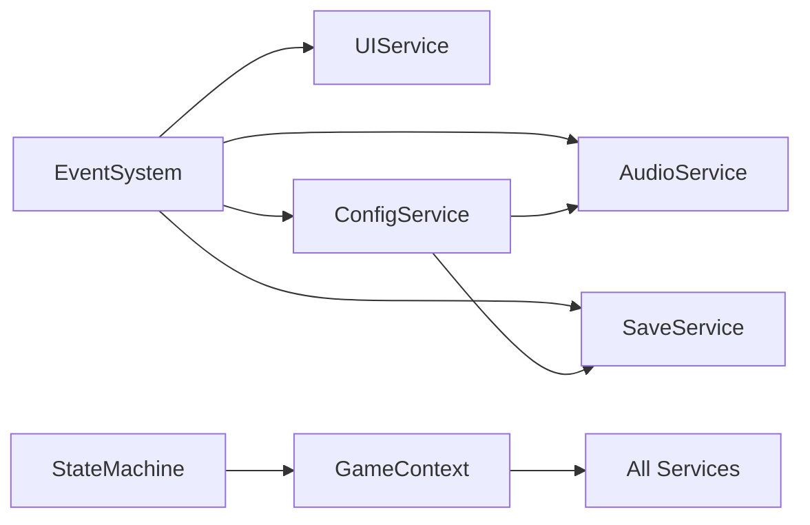

## 3. Architecture-Guide.md

```markdown
# Architecture Guide

Deep dive into the Unity Game Framework architecture, design patterns, and principles.

## 🏗️ Overview

The framework is built on modern software architecture principles with a focus on:
- **Dependency Injection** for loose coupling
- **Event-Driven Architecture** for decoupled communication
- **State Machine Pattern** for game flow management
- **Service-Oriented Architecture** for modularity

## 📐 High-Level Architecture



## 🔧 Core Components

### 1. Dependency Injection Container

**Purpose**: Manages service lifecycle and dependencies

```csharp
// Registration Phase (GameManager.Awake)
container.RegisterSingleton<IEventSystem, EventSystem>();
container.RegisterSingleton<IAudioService, AudioService>();

// Resolution Phase (Automatic via Constructor Injection)
public class AudioService : IAudioService
{
    public AudioService(IEventSystem eventSystem) // ← Automatic injection
    {
        _eventSystem = eventSystem;
    }
}
```

**Key Features**:
- Automatic constructor injection
- Singleton and transient lifetimes
- Circular dependency detection
- Type safety with interfaces

### 2. Event System

**Purpose**: Decoupled communication between systems

```csharp
// Publisher (any service/state)
_eventSystem.Publish(new PlayerLevelUpEvent { NewLevel = 5 });

// Subscriber (any service/state)
_eventSystem.Subscribe<PlayerLevelUpEvent>(OnPlayerLevelUp);

private void OnPlayerLevelUp(PlayerLevelUpEvent evt)
{
    PlayLevelUpAnimation(evt.NewLevel);
}
```

**Benefits**:
- Type-safe event handling
- No direct dependencies between publishers/subscribers
- Easy to add new event types
- Automatic memory management

### 3. State Machine

**Purpose**: Manages game flow and screen transitions

```csharp
// State Definition
public class MainMenuState : BaseGameState
{
    public MainMenuState(IGameStateMachine stateMachine, /*...*/) 
        : base(GameStateType.MainMenu, stateMachine, /*...*/) { }
        
    public override async Task EnterAsync(GameContext context)
    {
        // Show UI, setup input handlers, etc.
    }
}

// Transition (from any state)
await TransitionToStateAsync(GameStateType.Playing);
```

**Features**:
- Async state transitions
- Validation prevents invalid transitions
- State history for back navigation
- Clean enter/exit lifecycle

## 🎯 Design Patterns Used

### 1. Dependency Injection Pattern

**Implementation**: Constructor Injection
```csharp
// ✅ Good - Dependencies explicitly declared
public class PlayerService : IPlayerService
{
    private readonly IAudioService _audioService;
    private readonly IEventSystem _eventSystem;
    
    public PlayerService(IAudioService audioService, IEventSystem eventSystem)
    {
        _audioService = audioService;
        _eventSystem = eventSystem;
    }
}

// ❌ Avoid - Service Locator (harder to test)
public class PlayerService : IPlayerService  
{
    public void DoSomething()
    {
        var audioService = ServiceLocator.Get<IAudioService>(); // Avoid this
    }
}
```

### 2. State Pattern

**Implementation**: Game State Machine
```csharp
// State Interface
public abstract class BaseGameState
{
    public abstract Task EnterAsync(GameContext context);
    public abstract Task ExitAsync();
    public abstract void Update();
}

// Concrete State
public class PlayingState : BaseGameState
{
    // State-specific logic
}
```

### 3. Observer Pattern

**Implementation**: Event System
```csharp
// Publisher doesn't know about subscribers
_eventSystem.Publish(new GameOverEvent());

// Multiple subscribers can respond
_uiService.Subscribe<GameOverEvent>(ShowGameOverScreen);
_audioService.Subscribe<GameOverEvent>(PlayGameOverMusic);
_saveService.Subscribe<GameOverEvent>(SaveHighScore);
```

### 4. Service Locator (Limited Use)

**Implementation**: GameManager.GetService<T>()
```csharp
// Use sparingly - prefer constructor injection
var audioService = GameManager.GetService<IAudioService>();

// Better: Inject in constructor when possible
public MyClass(IAudioService audioService) { }
```

## 🔄 Data Flow

### 1. Startup Flow

```
1. GameManager.Awake()
2. RegisterServices() → DIContainer
3. Initialize GameContext with all services
4. Initialize GameStateMachine
5. Transition to Bootstrap State
6. Bootstrap initializes all services
7. Transition to Splash State
8. Game ready for user interaction
```

### 2. State Transition Flow

```
1. Event Published (e.g., NewGameRequestedEvent)
2. Current State receives event
3. State calls StateMachine.ChangeStateAsync()
4. StateMachine validates transition
5. Current State.ExitAsync()
6. New State.EnterAsync()
7. UI updates automatically
```

### 3. Service Communication Flow

```
User Input → InputService → Event → Game State → Service Call → UI Update
                              ↓
                        Other Services Subscribe → Side Effects
```

## 🧩 Service Interactions

### Core Service Dependencies



### Service Responsibilities

| Service | Responsibility | Dependencies |
|---------|---------------|--------------|
| `EventSystem` | Message passing | None (leaf service) |
| `AudioService` | Sound/music playback | `IEventSystem`, `IConfigService` |
| `UIService` | Screen/popup management | `IEventSystem` |
| `SaveService` | Game persistence | `IEventSystem`, `IConfigService` |
| `ConfigService` | Settings management | `IEventSystem` |
| `InputService` | Input handling | `IEventSystem` |
| `SceneService` | Scene loading | `IEventSystem` |

## 🎮 Game State Lifecycle

### State Lifecycle Methods

```csharp
public abstract class BaseGameState
{
    // Called when entering state
    public virtual async Task EnterAsync(GameContext context)
    {
        // 1. Store context
        // 2. Subscribe to events
        // 3. Show UI
        // 4. Initialize state-specific systems
        // 5. Publish state change event
    }
    
    // Called every frame while active
    public virtual void Update()
    {
        // Handle frame-based logic
        // Check input
        // Update animations
    }
    
    // Called when leaving state
    public virtual async Task ExitAsync()
    {
        // 1. Unsubscribe from events
        // 2. Hide UI
        // 3. Cleanup resources
        // 4. Save state if needed
    }
}
```

### State Transition Rules

```csharp
// Defined in GameStateMachine.DefineStateTransitions()
_validTransitions.Add((GameStateType.MainMenu, GameStateType.NewGame)); // ✅ Valid
_validTransitions.Add((GameStateType.Playing, GameStateType.Bootstrap)); // ❌ Invalid (not defined)
```

## 💾 Memory Management

### Service Lifetimes

- **Singleton Services**: Live for entire application lifetime
- **Transient States**: Created on-demand, cached by state machine
- **Event Subscriptions**: Cleaned up in state ExitAsync()

### Best Practices

```csharp
// ✅ Always unsubscribe in ExitAsync
public override async Task ExitAsync()
{
    EventSystem.Unsubscribe<GameOverEvent>(OnGameOver);
    await base.ExitAsync();
}

// ✅ Use using statements for resources
using var stream = File.OpenRead(savePath);

// ✅ Clear collections when appropriate
_temporaryData.Clear();
```

## 🔒 Thread Safety

### Async Patterns

```csharp
// ✅ Proper async/await usage
public async Task SaveGameAsync()
{
    await File.WriteAllTextAsync(path, data);
    EventSystem.Publish(new GameSavedEvent());
}

// ✅ ConfigureAwait(false) for non-Unity contexts
public async Task LoadConfigAsync()
{
    var data = await File.ReadAllTextAsync(path).ConfigureAwait(false);
    // Process data...
}
```

### Unity Main Thread

- **UI Operations**: Always on main thread (handled automatically)
- **File I/O**: Can be async (framework handles this)
- **Event Publishing**: Always on main thread

## 🧪 Testing Strategy

### Unit Testing Services

```csharp
[Test]
public void AudioService_PlaySound_CallsCorrectClip()
{
    // Arrange
    var mockEventSystem = new Mock<IEventSystem>();
    var mockConfigService = new Mock<IConfigService>();
    var audioService = new AudioService(mockEventSystem.Object, mockConfigService.Object);
    
    // Act
    audioService.PlaySound("test");
    
    // Assert
    // Verify behavior
}
```

### Integration Testing States

```csharp
[Test]
public async Task MainMenuState_NewGamePressed_TransitionsToNewGameState()
{
    // Setup all mocked services
    // Create MainMenuState with mocks
    // Simulate new game button press
    // Verify state transition occurred
}
```

## 🚀 Performance Considerations

### Optimization Points

1. **Event System**: Minimal allocation, fast dispatch
2. **State Machine**: Cached state instances
3. **UI Service**: Efficient screen show/hide
4. **Save Service**: Async I/O doesn't block game thread

### Profiling Tips

- Monitor DI container resolution calls (should be minimal after startup)
- Check event subscription counts (unsubscribe properly)
- Profile state transition times
- Monitor UI element creation/destruction

## 🔧 Extension Points

The framework is designed to be extended:

1. **New Services**: Implement `IGameService`, register in DI container
2. **New States**: Inherit from `BaseGameState`, add to state machine
3. **New Events**: Create event classes, publish/subscribe as needed
4. **New UI**: Create `UIScreen`/`UIPopup` subclasses

---

**Next**: [Extension Guide](Extension-Guide.md) for adding custom features
```