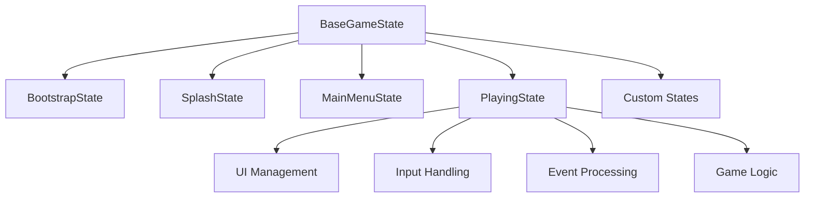

## 7. Game-States-Guide.md

```markdown
# Game States Guide

Complete guide to working with the game state system in the Unity Game Framework.

## 📋 Table of Contents

- [Understanding Game States](#understanding-game-states)
- [State Lifecycle](#state-lifecycle)
- [Creating Custom States](#creating-custom-states)
- [State Transitions](#state-transitions)
- [State Data Management](#state-data-management)
- [Advanced Patterns](#advanced-patterns)
- [Debugging States](#debugging-states)

## 🎯 Understanding Game States

Game states represent different modes or screens in your game. Each state encapsulates all the logic, UI, and behavior for a specific game mode.

### Built-in States

The framework provides these states out of the box:

| State | Purpose | Typical Duration |
|-------|---------|------------------|
| `Bootstrap` | Initial setup and service initialization | 1-2 seconds |
| `Splash` | Company logos, branding | 3-5 seconds |
| `MainMenu` | Main navigation hub | User-controlled |
| `Loading` | Asset loading, scene transitions | Variable |
| `NewGame` | Character creation, game setup | User-controlled |
| `Playing` | Active gameplay | Primary state |
| `Paused` | Game temporarily suspended | User-controlled |
| `Options` | Settings and configuration | User-controlled |
| `Credits` | Credits roll, acknowledgments | Skippable |
| `GameOver` | Failure state, restart options | User-controlled |
| `Victory` | Success state, celebration | User-controlled |
| `Quit` | Application shutdown | Brief |

### State Architecture



## 🔄 State Lifecycle

Every game state follows a predictable lifecycle:

### 1. Construction Phase

```csharp
public class MyCustomState : BaseGameState
{
    // Constructor injection happens here
    public MyCustomState(
        IGameStateMachine stateMachine,
        IEventSystem eventSystem,
        IAudioService audioService,
        IUIService uiService,
        IInputService inputService,
        ICustomService customService) // Your dependencies
        : base(GameStateType.MyCustom, stateMachine, eventSystem, audioService, uiService, inputService)
    {
        // Store additional dependencies
        _customService = customService;
        
        // Initialize state-specific data
        _stateData = new MyStateData();
        
        // DO NOT access Context here - it's not available yet
    }
}
```

### 2. Enter Phase

```csharp
public override async Task EnterAsync(GameContext context)
{
    await base.EnterAsync(context); // Always call base first
    
    Debug.Log($"Entering {StateType} state");
    
    // 1. Store context reference (done by base)
    // 2. Set IsActive = true (done by base)
    // 3. Publish state change event (done by base)
    
    // 4. Your custom enter logic:
    
    // Show UI
    await UIService.ShowScreenAsync<MyCustomScreen>();
    
    // Start audio
    AudioService.PlayMusic("my_custom_theme");
    
    // Subscribe to events
    EventSystem.Subscribe<MyCustomEvent>(OnMyCustomEvent);
    EventSystem.Subscribe<ExitRequestEvent>(OnExitRequest);
    
    // Initialize state systems
    await InitializeStateSystemsAsync();
    
    // Setup input handlers
    SetupInputHandlers();
    
    // Start background processes
    StartBackgroundTasks();
    
    // Update UI with initial data
    RefreshUI();
    
    Debug.Log($"{StateType} state fully initialized");
}
```

### 3. Update Phase

```csharp
public override void Update()
{
    // Handle frame-based logic
    
    // Input processing
    HandleInput();
    
    // State-specific updates
    UpdateStateLogic();
    
    // UI updates if needed
    if (_needsUIRefresh)
    {
        RefreshUI();
        _needsUIRefresh = false;
    }
}

public override void FixedUpdate()
{
    // Physics-based updates (if needed)
    UpdatePhysics();
}

public override void HandleInput()
{
    // Process input events
    if (InputService.GetKeyDown("Escape"))
    {
        RequestExit();
    }
    
    if (InputService.GetKeyDown("Pause"))
    {
        RequestPause();
    }
}
```

### 4. Exit Phase

```csharp
public override async Task ExitAsync()
{
    Debug.Log($"Exiting {StateType} state");
    
    // 1. Your custom cleanup logic:
    
    // Stop background processes
    StopBackgroundTasks();
    
    // Unsubscribe from events
    EventSystem.Unsubscribe<MyCustomEvent>(OnMyCustomEvent);
    EventSystem.Unsubscribe<ExitRequestEvent>(OnExitRequest);
    
    // Save state data if needed
    await SaveStateDataAsync();
    
    // Hide UI
    await UIService.HideScreenAsync<MyCustomScreen>();
    
    // Cleanup resources
    CleanupResources();
    
    // Stop audio
    AudioService.StopMusic();
    
    // 2. Call base cleanup
    await base.ExitAsync(); // Always call base last
    
    // 3. Base sets IsActive = false
    
    Debug.log($"{StateType} state cleanup complete");
}
```

## 🛠️ Creating Custom States

### Step 1: Define State Type

```csharp
// Add to GameStateType enum
public enum GameStateType
{
    // ... existing states
    
    // Your custom states
    Shop,
    Inventory,
    DialoguE,
    Combat,
    Map,
    Crafting
}
```

### Step 2: Implement State Class

```csharp
/// <summary>
/// Shop state for buying and selling items
/// Demonstrates advanced state patterns and service integration
/// </summary>
public class ShopState : BaseGameState
{
    // Additional injected services
    private readonly IShopService _shopService;
    private readonly IInventoryService _inventoryService;
    private readonly ICurrencyService _currencyService;
    private readonly IPlayerService _playerService;
    
    // State-specific data
    private ShopData _currentShop;
    private List<ShopItem> _availableItems;
    private bool _isTransactionInProgress;
    
    // Background tasks
    private CancellationTokenSource _backgroundTaskToken;
    
    public ShopState(
        IGameStateMachine stateMachine,
        IEventSystem eventSystem,
        IAudioService audioService,
        IUIService uiService,
        IInputService inputService,
        IShopService shopService,
        IInventoryService inventoryService,
        ICurrencyService currencyService,
        IPlayerService playerService)
        : base(GameStateType.Shop, stateMachine, eventSystem, audioService, uiService, inputService)
    {
        _shopService = shopService ?? throw new ArgumentNullException(nameof(shopService));
        _inventoryService = inventoryService ?? throw new ArgumentNullException(nameof(inventoryService));
        _currencyService = currencyService ?? throw new ArgumentNullException(nameof(currencyService));
        _playerService = playerService ?? throw new ArgumentNullException(nameof(playerService));
    }
    
    public override async Task EnterAsync(GameContext context)
    {
        await base.EnterAsync(context);
        
        // Get shop data from context or service
        _currentShop = GetCurrentShopData();
        
        // Show shop UI
        await UIService.ShowScreenAsync<ShopScreen>();
        
        // Play shop music
        AudioService.PlayMusic(_currentShop.MusicTheme);
        AudioService.PlaySound("shop_enter");
        
        // Subscribe to shop events
        EventSystem.Subscribe<ItemPurchaseRequestEvent>(OnItemPurchaseRequest);
        EventSystem.Subscribe<ItemSellRequestEvent>(OnItemSellRequest);
        EventSystem.Subscribe<ShopExitRequestEvent>(OnShopExitRequest);
        EventSystem.Subscribe<CurrencyChangedEvent>(OnCurrencyChanged);
        
        // Load available items
        await LoadShopInventoryAsync();
        
        // Setup periodic updates
        _backgroundTaskToken = new CancellationTokenSource();
        StartPeriodicUpdates(_backgroundTaskToken.Token);
        
        // Initialize UI
        await RefreshShopUIAsync();
        
        // Show welcome message
        ShowShopWelcomeMessage();
    }
    
    public override void Update()
    {
        if (_isTransactionInProgress)
            return;
            
        // Handle shop-specific input
        if (InputService.GetKeyDown("Escape"))
        {
            RequestExitShop();
        }
        
        // Handle quick purchase shortcuts
        for (int i = 1; i <= 9; i++)
        {
            if (InputService.GetKeyDown($"Alpha{i}"))
            {
                QuickPurchaseItem(i - 1);
            }
        }
        
        // Handle tab switching
        if (InputService.GetKeyDown("Tab"))
        {
            SwitchShopTab();
        }
    }
    
    public override async Task ExitAsync()
    {
        // Stop background tasks
        _backgroundTaskToken?.Cancel();
        
        // Unsubscribe from events
        EventSystem.Unsubscribe<ItemPurchaseRequestEvent>(OnItemPurchaseRequest);
        EventSystem.Unsubscribe<ItemSellRequestEvent>(OnItemSellRequest);
        EventSystem.Unsubscribe<ShopExitRequestEvent>(OnShopExitRequest);
        EventSystem.Unsubscribe<CurrencyChangedEvent>(OnCurrencyChanged);
        
        // Save shop state
        await SaveShopStateAsync();
        
        // Hide UI
        await UIService.HideScreenAsync<ShopScreen>();
        
        // Play exit sound
        AudioService.PlaySound("shop_exit");
        
        // Cleanup
        _currentShop = null;
        _availableItems?.Clear();
        
        await base.ExitAsync();
    }
    
    // Event handlers
    private async void OnItemPurchaseRequest(ItemPurchaseRequestEvent evt)
    {
        if (_isTransactionInProgress) return;
        
        _isTransactionInProgress = true;
        
        try
        {
            await ProcessPurchaseAsync(evt.ItemId, evt.Quantity);
        }
        finally
        {
            _isTransactionInProgress = false;
        }
    }
    
    private async void OnItemSellRequest(ItemSellRequestEvent evt)
    {
        if (_isTransactionInProgress) return;
        
        _isTransactionInProgress = true;
        
        try
        {
            await ProcessSaleAsync(evt.ItemId, evt.Quantity);
        }
        finally
        {
            _isTransactionInProgress = false;
        }
    }
    
    private async void OnShopExitRequest(ShopExitRequestEvent evt)
    {
        await TransitionToStateAsync(GameStateType.Playing);
    }
    
    private void OnCurrencyChanged(CurrencyChangedEvent evt)
    {
        // Update UI to reflect new currency amount
        var shopScreen = UIService.GetScreen<ShopScreen>();
        shopScreen?.UpdateCurrency(evt.NewAmount);
    }
    
    // State-specific methods
    private async Task ProcessPurchaseAsync(string itemId, int quantity)
    {
        var item = _availableItems.FirstOrDefault(i => i.Id == itemId);
        if (item == null) return;
        
        var totalCost = item.Price * quantity;
        
        if (!_currencyService.HasCurrency(totalCost))
        {
            ShowInsufficientFundsMessage();
            AudioService.PlaySound("purchase_failed");
            return;
        }
        
        if (!_inventoryService.CanAddItem(itemId, quantity))
        {
            ShowInventoryFullMessage();
            AudioService.PlaySound("purchase_failed");
            return;
        }
        
        // Process transaction
        _currencyService.SpendCurrency(totalCost);
        _inventoryService.AddItem(itemId, quantity);
        
        // Update shop inventory
        item.Stock -= quantity;
        if (item.Stock <= 0)
        {
            _availableItems.Remove(item);
        }
        
        // Audio and UI feedback
        AudioService.PlaySound("purchase_success");
        ShowPurchaseSuccessMessage(item.Name, quantity, totalCost);
        
        // Refresh UI
        await RefreshShopUIAsync();
        
        // Publish event
        EventSystem.Publish(new ItemPurchasedEvent
        {
            ItemId = itemId,
            Quantity = quantity,
            TotalCost = totalCost,
            ShopId = _currentShop.Id
        });
    }
    
    private async Task LoadShopInventoryAsync()
    {
        _availableItems = await _shopService.GetAvailableItemsAsync(_currentShop.Id);
        
        // Apply any daily/weekly rotations
        ApplyShopRotation();
        
        // Apply player level restrictions
        FilterItemsByPlayerLevel();
    }
    
    private async void StartPeriodicUpdates(CancellationToken cancellationToken)
    {
        while (!cancellationToken.IsCancellationRequested)
        {
            try
            {
                await Task.Delay(5000, cancellationToken); // Update every 5 seconds
                
                // Check for shop rotations, special offers, etc.
                await CheckForShopUpdatesAsync();
            }
            catch (TaskCanceledException)
            {
                break; // Expected when cancelling
            }
        }
    }
    
    private ShopData GetCurrentShopData()
    {
        // Get shop data from context, service, or scene
        return _shopService.GetCurrentShop() ?? _shopService.GetDefaultShop();
    }
}
```

### Step 3: Register Custom State

```csharp
// In GameManager.RegisterGameStates()
_container.RegisterTransient<ShopState, ShopState>();

// In GameStateMachine.RegisterStates()
RegisterState(_container.Resolve<ShopState>());

// In GameStateMachine.AllGameStates array
private static readonly GameStateType[] AllGameStates = new GameStateType[]
{
    // ... existing states
    GameStateType.Shop
};

// In GameStateMachine.DefineStateTransitions()
// Define valid transitions to/from your state
_validTransitions.Add((GameStateType.Playing, GameStateType.Shop));
_validTransitions.Add((GameStateType.Shop, GameStateType.Playing));
_validTransitions.Add((GameStateType.Shop, GameStateType.Inventory));
```

## 🔄 State Transitions

### Transition Rules

The state machine enforces transition rules to prevent invalid state changes:

```csharp
// Valid transitions must be explicitly defined
_validTransitions.Add((GameStateType.MainMenu, GameStateType.NewGame));
_validTransitions.Add((GameStateType.Playing, GameStateType.Paused));

// Invalid transitions will be rejected
// GameStateType.Playing -> GameStateType.Bootstrap // ❌ Not defined
// GameStateType.GameOver -> GameStateType.Playing // ❌ Not defined (must go through MainMenu)
```

### Transition Patterns

#### 1. Simple Transition

```csharp
// Direct state change
await TransitionToStateAsync(GameStateType.MainMenu);
```

#### 2. Conditional Transition

```csharp
public override void Update()
{
    if (InputService.GetKeyDown("Pause") && CanPause())
    {
        await TransitionToStateAsync(GameStateType.Paused);
    }
}

private bool CanPause()
{
    // Custom pause logic
    return !_isInCutscene && !_isInDialog && _playerService.IsAlive;
}
```

#### 3. Delayed Transition

```csharp
public override async Task EnterAsync(GameContext context)
{
    await base.EnterAsync(context);
    
    // Auto-transition after timeout
    _ = AutoTransitionAsync();
}

private async Task AutoTransitionAsync()
{
    await Task.Delay(3000); // Wait 3 seconds
    
    if (IsActive) // Only transition if still in this state
    {
        await TransitionToStateAsync(GameStateType.MainMenu);
    }
}
```

#### 4. Event-Driven Transition

```csharp
private void OnGameOverEvent(GameOverEvent evt)
{
    // Transition based on game events
    if (evt.Reason == GameOverReason.PlayerDeath)
    {
        await TransitionToStateAsync(GameStateType.GameOver);
    }
    else if (evt.Reason == GameOverReason.Victory)
    {
        await TransitionToStateAsync(GameStateType.Victory);
    }
}
```

### Transition Validation

```csharp
// Check if transition is valid before attempting
if (StateMachine.CanTransitionTo(GameStateType.NewState))
{
    await TransitionToStateAsync(GameStateType.NewState);
}
else
{
    Debug.LogWarning($"Cannot transition from {StateMachine.CurrentStateType} to NewState");
    // Handle invalid transition gracefully
}
```