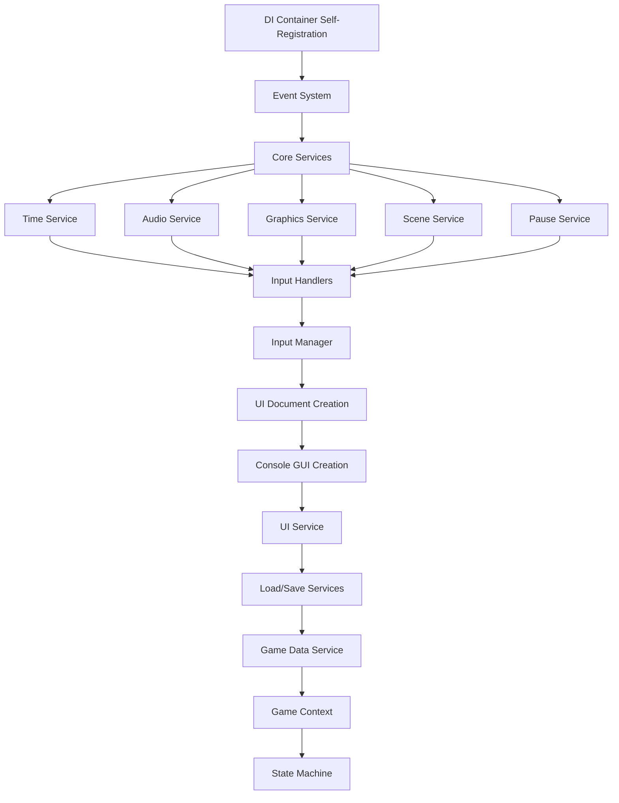

# GameManager Documentation

## Overview

The **GameManager** is the central bootstrapping class that initializes and coordinates the entire game framework using dependency injection. It acts as the main entry point for all game systems, managing their lifecycle from initialization through shutdown.

## Architecture

The GameManager follows a **dependency injection** pattern combined with the **singleton pattern** to provide:

- ✅ **Centralized service management**
- ✅ **Proper dependency resolution**
- ✅ **Deterministic initialization order**
- ✅ **Clean separation of concerns**
- ✅ **Frame-based update coordination**

---

## Initialization Sequence

The GameManager follows a strict initialization sequence to ensure all dependencies are available when needed:

### 1. **Singleton Setup** (`Awake()`)
```
GameManager Instance Creation
├── DontDestroyOnLoad Configuration
├── Duplicate Instance Prevention
└── Async Initialization Trigger
```

### 2. **Framework Bootstrap** (`InitializeFrameworkAsync()`)
```
Dependency Injection Container Creation
├── Service Registration Phase
│   ├── RegisterCoreServices()
│   ├── RegisterGameSystems()  
│   └── RegisterGameStates()
├── Service Initialization Phase
│   └── InitializeServicesAsync()
├── State Machine Setup
│   └── IGameStateMachine.InitializeAsync()
├── Update System Collection
│   └── CollectUpdatableSystems()
└── Framework Ready Signal
```

### 3. **Service Registration Order**

Services are registered in **dependency order** to ensure proper resolution:



### 4. **Service Initialization Order**

After registration, services are initialized in dependency order:

1. **Event System** - Core event infrastructure
2. **Settings Registry** - Configuration management
3. **Audio Service** - Sound and music systems
4. **Graphics Service** - Display and rendering settings
5. **Time Service** - Game timing and pause management
6. **Input Manager** - User input handling
7. **Scene Service** - Scene loading and management
8. **Pause Service** - Game pause functionality
9. **Load Service** - Game loading operations
10. **Save Service** - Game save operations
11. **UI Service** - User interface management *(initialized last)*

### 5. **State Machine Initialization**

The game state machine is created and initialized with all available game states registered as transient services.

### 6. **Update System Collection**

All services implementing update interfaces are collected:
- **IUpdatable** - Frame-based updates
- **IFixedUpdatable** - Physics-based updates
- **ILateUpdatable** - Post-update operations

---

## Frame Update Coordination

The GameManager coordinates frame updates across all systems:

### Update Loop Flow
```
Unity Update() → GameManager.Update() → All IUpdatable Systems
Unity FixedUpdate() → GameManager.FixedUpdate() → All IFixedUpdatable Systems  
Unity LateUpdate() → GameManager.LateUpdate() → All ILateUpdatable Systems
```

### Update Order
Systems are updated in **registration order**, ensuring predictable execution sequence.

---

## Configuration

The GameManager requires several prefabs and configuration objects to be assigned in the Inspector:

### Required Prefabs
- **UI Document Prefab** - Main UI system
- **Console GUI Prefab** - Debug console (if enabled)
- **Audio Manager Prefab** - Audio system manager

### Configuration Assets
- **Audio Settings** - Sound and music configuration
- **Graphics Settings** - Display and rendering options
- **Gameplay Settings** - Core game parameters
- **Input Settings** - Control scheme configuration
- **Debug Settings** - Development and debugging options

---

## Public API

### Service Access
```csharp
// Synchronous service access (check IsReady first)
var audioService = GameManager.GetService<IAudioService>();

// Asynchronous service access (waits for initialization)
var audioService = await GameManager.GetServiceAsync<IAudioService>();
```

### Framework Status
```csharp
// Check if framework is ready
bool isReady = GameManager.Instance != null && GameManager.Instance.IsInitialized;
```


## Next Steps

- [**Adding New Services**](adding-new-services.md) - How to integrate custom services
- [**Adding New Game States**](adding-new-game-states.md) - How to create custom game states