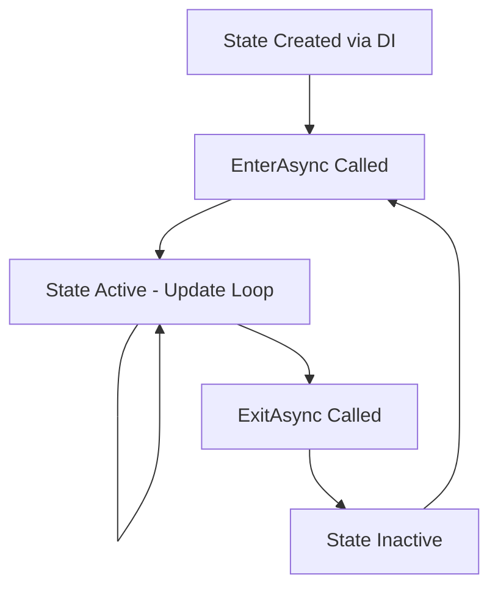

# GameStateMachine

The **GameStateMachine** is the central orchestrator of your Unity game's flow, managing state transitions with proper event publishing and dependency injection. It ensures clean separation of concerns while providing robust state management capabilities for complex game systems.

## Overview

The GameStateMachine acts as the primary controller for your game's high-level states (Bootstrap, MainMenu, Playing, GameOver, etc.), coordinating transitions between them and ensuring all dependent systems receive proper notifications. Built on dependency injection principles, it integrates seamlessly with the broader game framework.

The GameStateMachine is not intended to be used to directly control in-game logic.  I'd recommend implementing a custom statemachine to handle in-game logic.

### Key Responsibilities

- **State Lifecycle Management**: Handles entering, updating, and exiting game states
- **Transition Validation**: Prevents invalid state changes through predefined transition rules
- **Event Broadcasting**: Publishes state change events for dependent systems
- **Frame Updates**: Coordinates Update/FixedUpdate calls to active states
- **History Tracking**: Maintains state transition history for debugging and analytics

## Architecture

The GameStateMachine follows several important design patterns:

### Dependency Injection Pattern
All dependencies are provided through constructor injection rather than service locators, ensuring testable and maintainable code.

### State Pattern Implementation
Each game state inherits from `BaseGameState` and implements its own logic for entering, updating, and exiting, providing clear separation of concerns.

### Factory Pattern Integration
States are created using the DI container, allowing for proper dependency injection into state constructors while maintaining lazy instantiation.

## Core Features

### 🔄 **Robust State Transitions**
The system enforces predefined transition rules, preventing invalid state changes that could break game flow. All transitions are explicitly defined during initialization.

### 📡 **Event-Driven Communication**
Critical for framework integration - the StateMachine publishes `GameStateChangeEvent` whenever states transition, ensuring systems like TimeService receive proper notifications.

### 🔧 **Dependency Injection Ready**
Fully integrated with the framework's DI container, allowing states to receive all required dependencies through constructor injection.

### ⚡ **Performance Optimized**
States are cached after first creation and frame updates are efficiently distributed to only the active state.

## State Lifecycle



Each state follows a predictable lifecycle:

1. **Creation**: State instantiated via DI container with all dependencies
2. **Enter**: `EnterAsync()` called with GameContext, state becomes active
3. **Update Loop**: `Update()` and `FixedUpdate()` called each frame while active
4. **Exit**: `ExitAsync()` called when transitioning away
5. **Cached**: State remains in memory for future reuse

## Integration Points

### TimeService Integration
The StateMachine's event publishing is **crucial** for TimeService functionality:

```csharp
// This event ensures TimeService receives state change notifications
_eventSystem.Publish(new GameStateChangeEvent 
{ 
    PreviousState = previousStateType,
    NewState = newStateType, 
    Context = _context 
});
```

### Framework Services
States have access to all framework services through the injected `GameContext`:

- **AudioService**: Music and sound management
- **UIService**: Screen and interface control
- **SceneService**: Scene loading and management
- **InputManager**: Player input handling
- **SaveService**: Game data persistence
- **EventSystem**: Cross-system communication

## Usage Examples

### Basic State Transition
```csharp
// Transition from MainMenu to Playing state
await stateMachine.ChangeStateAsync(GameStateType.Playing);
```

### Checking Valid Transitions
```csharp
// Verify if transition is allowed before attempting
if (stateMachine.CanTransitionTo(GameStateType.GameOver))
{
    await stateMachine.ChangeStateAsync(GameStateType.GameOver);
}
```

### Current State Information
```csharp
// Get current state information
var currentType = stateMachine.CurrentStateType;
var currentState = stateMachine.CurrentState;
var isReady = stateMachine.IsInitialized;
```

## State Transition Rules

The StateMachine enforces specific transition rules to maintain game flow integrity:

### Bootstrap Flow
- **Bootstrap** → Splash (initialization complete)

### Menu Navigation
- **Splash** → MainMenu, Loading
- **MainMenu** → NewGame, Loading, Credits, Quit

### Gameplay Flow
- **NewGame** → Loading, Playing, MainMenu
- **Loading** → Playing, MainMenu, GameOver
- **Playing** → GameOver, Victory, MainMenu, Loading, Quit

### End States
- **GameOver** → MainMenu, NewGame, Loading, Quit
- **Victory** → MainMenu, Credits, NewGame, Quit
- **Credits** → MainMenu, Quit

## Performance Considerations

### State Caching
States are created once and cached for reuse, avoiding repeated instantiation costs:

```csharp
// States cached in dictionary for efficient reuse
private readonly Dictionary<GameStateType, BaseGameState> _states = new();
```

### Efficient Updates
Only the active state receives update calls, minimizing per-frame overhead:

```csharp
public void Update() => CurrentState?.Update();
public void FixedUpdate() => CurrentState?.FixedUpdate();
```

### Memory Management
State history is maintained in a stack structure, providing efficient access to previous states without excessive memory usage.

## Debugging Support

### State History
Access previous states for debugging game flow issues:

```csharp
// History maintained automatically during transitions  
private readonly Stack<GameStateType> _stateHistory = new();
```

### Comprehensive Logging
All state transitions are logged with detailed information for debugging and analytics.

### Unity Inspector Integration
Current state information is exposed for runtime inspection and debugging.

## Best Practices

### State Design
- Keep states focused on single responsibilities
- Use dependency injection for all state dependencies
- Implement proper cleanup in `ExitAsync()` methods
- Avoid direct state-to-state communication - use events instead

### Transition Management
- Consider checking `CanTransitionTo()` before attempting transitions
- Use meaningful state names that reflect game flow
- Document custom transition logic clearly
- Test edge cases in transition sequences

### Performance
- Minimize work in `Update()` methods - prefer event-driven approaches
- Use async/await properly in `EnterAsync()` and `ExitAsync()`
- Cache frequently accessed services from GameContext
- Profile state transitions in complex games
