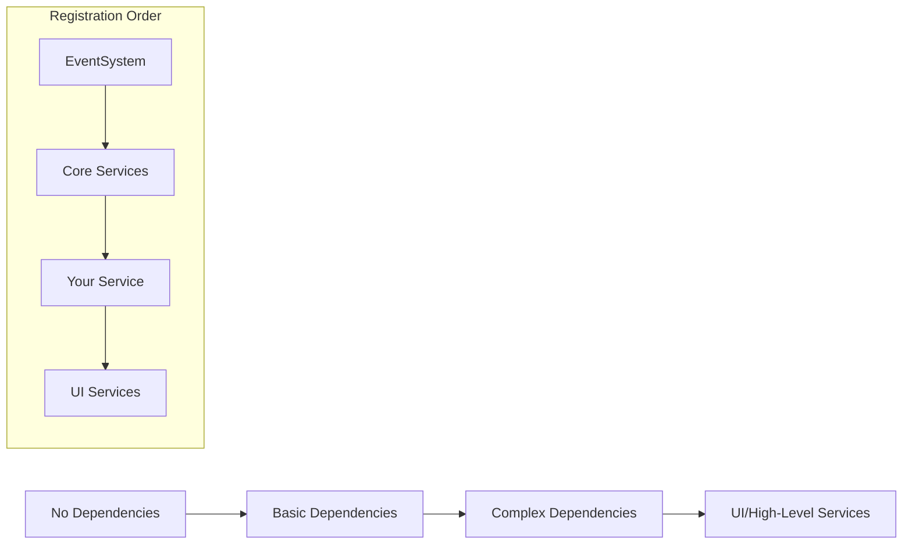

# Adding New Services

## Overview

This guide explains how to create and integrate new services into the game framework. Services are managed through dependency injection and follow specific patterns for initialization, updates, and lifecycle management.

Services provide modular functionality such as audio, input handling, UI management, and more. By following this guide, you can add custom services that seamlessly integrate with the existing architecture.

Services do not implement Monobehaviour and are not attached to GameObjects. Instead, they are instantiated and managed by the GameManager.

---

## Service Architecture

### Core Principles
- **Interface-based design** - All services implement interfaces
- **Dependency injection** - Services receive dependencies via constructor
- **Initialization order** - Services initialize in dependency order
- **Update coordination** - Framework manages all update calls
- **Lifecycle management** - Proper startup and shutdown sequences

---

## Step-by-Step Guide

### 1. Create the Service Interface

First, define a clean interface in the `GameFramework.Services.Interfaces` namespace that inherits from GameDataService:

```csharp
using System.Threading.Tasks;

namespace GameFramework.Services.Interfaces
{
    /// <summary>
    /// Service for managing custom game feature
    /// </summary>
    public interface IMyCustomService : IGameService
    {
        // IGameService interface
        bool IsInitialized { get; }
        Task InitializeAsync();
        void Shutdown();
        
        // Service-specific functionality
        void DoSomething();
        string GetSomeData();
    }
}
```

### 2. Implement the Service

Create the service implementation with proper dependency injection:

```csharp
using System;
using System.Threading.Tasks;
using GameFramework.Services.Interfaces;
using GameFramework.EventSystem.Interfaces;
using UnityEngine;

namespace GameFramework.Services
{
    /// <summary>
    /// Implementation of custom service with dependency injection
    /// </summary>
    public class MyCustomService : IMyCustomService
    {
        public bool IsInitialized { get; private set; }
        
        // Injected dependencies
        private readonly IEventSystem _eventSystem;
        private readonly IAudioService _audioService;
        private readonly IUIService _uiService;
        
        /// <summary>
        /// Constructor injection - dependencies provided by DI container
        /// </summary>
        public MyCustomService(
            IEventSystem eventSystem,
            IAudioService audioService,
            IUIService uiService)
        {
            _eventSystem = eventSystem ?? throw new ArgumentNullException(nameof(eventSystem));
            _audioService = audioService ?? throw new ArgumentNullException(nameof(audioService));
            _uiService = uiService ?? throw new ArgumentNullException(nameof(uiService));
        }
        
        public async Task InitializeAsync()
        {
            if (IsInitialized) return;
            
            Debug.Log("[MyCustomService] Initializing...");
            
            // Initialize service-specific systems
            await SetupCustomSystems();
            
            // Subscribe to events
            _eventSystem.Subscribe<SomeEvent>(OnSomeEvent);
            
            IsInitialized = true;
            Debug.Log("[MyCustomService] Initialization complete");
        }
        
        public void Shutdown()
        {
            if (!IsInitialized) return;
            
            Debug.Log("[MyCustomService] Shutting down...");
            
            // Unsubscribe from events
            _eventSystem.Unsubscribe<SomeEvent>(OnSomeEvent);
            
            // Cleanup resources
            CleanupCustomSystems();
            
            IsInitialized = false;
        }
        
        public void DoSomething()
        {
            if (!IsInitialized)
            {
                Debug.LogWarning("[MyCustomService] Service not initialized!");
                return;
            }
            
            // Service functionality here
            _audioService.PlaySound("customSound");
        }
        
        public string GetSomeData()
        {
            return IsInitialized ? "Custom Data" : "Not Ready";
        }
        
        private async Task SetupCustomSystems()
        {
            // Initialize service-specific systems
            await Task.Delay(100); // Simulate async initialization
        }
        
        private void CleanupCustomSystems()
        {
            // Cleanup service-specific resources
        }
        
        private void OnSomeEvent(SomeEvent eventData)
        {
            // Handle event
        }
    }
}
```

### 3. Add Update Support (Optional)

If your service needs frame updates, implement the appropriate update interface:

```csharp
using GameFramework.StateMachine.Interfaces;

public class MyCustomService : IMyCustomService, IUpdatable, IFixedUpdatable
{
    // ... existing code ...
    
    public void Update()
    {
        if (!IsInitialized) return;
        
        // Frame-based update logic
        UpdateCustomSystems();
    }
    
    public void FixedUpdate()
    {
        if (!IsInitialized) return;
        
        // Physics-based update logic
        UpdatePhysicsSystems();
    }
    
    private void UpdateCustomSystems() { /* Update logic */ }
    private void UpdatePhysicsSystems() { /* Physics logic */ }
}
```

### 4. Register the Service

Add your service to the GameManager's `RegisterCoreServices()` method:

```csharp
private void RegisterCoreServices()
{
    Debug.Log("[GameManager] Registering core services...");
    
    // ... existing registrations ...
    
    // Register your custom service
    // Place it in the correct dependency order!
    _container.RegisterSingleton<IMyCustomService, MyCustomService>();
    
    // ... rest of registrations ...
    
    Debug.Log("[GameManager] Core services registration complete");
}
```

### 5. Initialize the Service

Add initialization to `InitializeServicesAsync()` in dependency order:

```csharp
private async Task InitializeServicesAsync()
{
    Debug.Log("[GameManager] Initializing services...");
    
    // Initialize in dependency order
    var eventSystem = _container.Resolve<IEventSystem>();
    await eventSystem.InitializeAsync();
    
    // ... other service initializations ...
    
    // Initialize your service after its dependencies
    var myCustomService = _container.Resolve<IMyCustomService>();
    await myCustomService.InitializeAsync();
    
    // Services that depend on your service come after...
    
    Debug.Log("[GameManager] All services initialized!");
}
```

### 6. Add to Update Collection (If Updatable)

If your service implements update interfaces, add it to `CollectUpdatableSystems()`:

```csharp
private void CollectUpdatableSystems()
{
    Debug.Log("[GameManager] Collecting updatable systems...");
    
    // ... existing systems ...
    
    // Add your custom service to updates
    var myCustomService = _container.Resolve<IMyCustomService>();
    if (myCustomService is IUpdatable updatable)
        _updatables.Add(updatable);
        
    if (myCustomService is IFixedUpdatable fixedUpdatable)
        _fixedUpdatables.Add(fixedUpdatable);
        
    if (myCustomService is ILateUpdatable lateUpdatable)
        _lateUpdatables.Add(lateUpdatable);
    
    Debug.Log($"[GameManager] Collected {_updatables.Count} updatable systems...");
}
```

### 7. Add Shutdown Handling

Add shutdown logic to `OnApplicationQuit()`:

```csharp
private void OnApplicationQuit()
{
    Debug.Log("[GameManager] Shutting down game framework...");
    
    // ... existing shutdown code ...
    
    // Shutdown your service
    if (_container?.IsRegistered<IMyCustomService>() == true)
    {
        var myCustomService = _container.Resolve<IMyCustomService>();
        myCustomService?.Shutdown();
    }
    
    // ... rest of shutdown ...
}
```

---

## Dependency Management

### Understanding Dependencies

Services must be registered and initialized in **dependency order**:



### Dependency Guidelines

1. **EventSystem** - Usually required by all services
2. **Core Services** - Audio, Graphics, Time, etc.
3. **Your Service** - Place based on what it needs
4. **UI Services** - Typically depend on everything else

### Common Dependency Patterns

```csharp
// Minimal dependencies
public MyService(IEventSystem eventSystem) { }

// Common dependencies  
public MyService(
    IEventSystem eventSystem,
    IAudioService audioService,
    ITimeService timeService) { }

// Heavy dependencies (register later)
public MyService(
    IEventSystem eventSystem,
    IAudioService audioService,
    IUIService uiService,
    IGameDataService gameDataService) { }
```

---

## Configuration Support

### Adding Configuration Objects

If your service needs configuration, create a ScriptableObject:

```csharp
[CreateAssetMenu(menuName = "Game/Settings/My Custom Settings")]
public class MyCustomSettings_SO : ConfigCategoryBase
{
    [Header("Custom Settings")]
    public float customValue = 1.0f;
    public bool enableFeature = true;
    public string[] customStrings;
}
```

### Using Configuration in Service

```csharp
public class MyCustomService : IMyCustomService
{
    private MyCustomSettings_SO _settings;
    
    public async Task InitializeAsync()
    {
        // Get configuration from registry
        _settings = SettingsRegistry.GetSettings<MyCustomSettings_SO>();
        
        if (_settings != null)
        {
            // Use configuration values
            SetupWithConfig(_settings);
        }
    }
    
    private void SetupWithConfig(MyCustomSettings_SO settings)
    {
        // Apply configuration
    }
}
```

---

## Best Practices

### ✅ Do's

- **Use interfaces** for all service contracts
- **Constructor injection** for dependencies
- **Null checks** for all injected dependencies
- **Proper error handling** in async methods
- **Clear logging** for initialization and shutdown
- **Event-driven communication** between services
- **Graceful degradation** when dependencies unavailable

### ❌ Don'ts

- **Service locator pattern** - Use injection instead
- **Static dependencies** - Everything through DI
- **Circular dependencies** - Review your architecture
- **Blocking operations** in Update() methods
- **Heavy work** in constructors
- **Missing null checks** on injected services

### Common Patterns

```csharp
// Async initialization with error handling
public async Task InitializeAsync()
{
    try
    {
        if (IsInitialized) return;
        
        await DoAsyncWork();
        IsInitialized = true;
        
        Debug.Log("[Service] Initialized successfully");
    }
    catch (Exception e)
    {
        Debug.LogError($"[Service] Initialization failed: {e}");
        throw;
    }
}

// Safe service calls
public void DoSomething()
{
    if (!IsInitialized)
    {
        Debug.LogWarning("[Service] Not initialized!");
        return;
    }
    
    // Safe to proceed
}

// Event handling
private void OnSomeEvent(SomeEvent eventData)
{
    if (!IsInitialized) return;
    
    // Handle event safely
}
```

---

## Testing Your Service

### Verification Checklist

- [ ] Service implements interface correctly
- [ ] Constructor injection works without errors
- [ ] InitializeAsync() completes successfully
- [ ] Service appears in DI container
- [ ] Dependencies resolve properly
- [ ] Update methods called (if implemented)
- [ ] Shutdown cleans up properly
- [ ] No null reference exceptions
- [ ] Configuration loads correctly (if used)


---

## Next Steps

- [**Adding New Game States**](adding-new-game-states.md) - Create custom game states
- [**Event System Usage**](event-system.md) - Inter-service communication
- [**Configuration Management**](configuration-system.md) - Settings and config