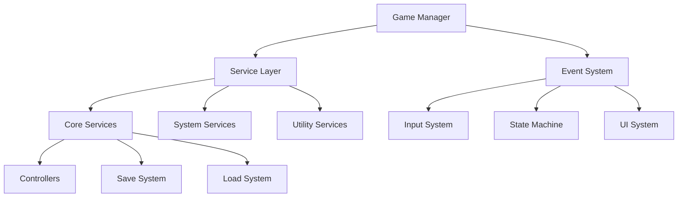

# Unity Game Framework (UCTools BaseProject)

## Overview

A comprehensive, production-ready Unity game framework featuring modular architecture, dependency injection, event-driven communication, and sophisticated player control systems. This framework provides a solid foundation for developing complex Unity games with clean code architecture, maintainable systems, and high performance.

## 🎯 Key Features

- **🏗️ Modular Architecture** - Component-based design with clear separation of concerns
- **💉 Dependency Injection** - Advanced DI container with automatic constructor injection
- **📡 Event-Driven Communication** - Type-safe EventSystem for decoupled component interaction
- **🎮 Multiple Controller Types** - FPS, Third-Person, Isometric, and RTS player controls
- **💾 Advanced Save System** - Robust save/load with automatic validation and data migration
- **🖥️ Modern UI System** - Unity UIToolkit-based interface with performance optimization
- **🔄 State Machine** - Flexible game state management with transition validation

## 🏛️ Architecture Overview



The framework follows a layered architecture with clear dependencies:
- **Core Layer**: GameManager, DIContainer, EventSystem
- **Service Layer**: All game services with defined interfaces
- **Component Layer**: Player controllers, UI components, interactables
- **System Layer**: State management, input handling, save/load operations

## 📚 Documentation

### Core Systems
- [**Game Manager**](Assets/Documentation/Core/GameManager_Documentation.md) - Central service coordinator and lifecycle manager
- [**DI Container**](Assets/Documentation/Core/DIContainer_Documentation.md) - Dependency injection with automatic constructor injection
- [**Event System**](Assets/Documentation/EventSystem/EventSystem_Documentation.md) - Type-safe publish-subscribe communication

### State Management
- [**State Machine**](Assets/Documentation/StateMachine/StateMachine_Documentation.md) - Game state management with transition validation
- [**Adding New States Guide**](Assets/Documentation/StateMachine/AddingNewStates_Guide.md) - Step-by-step guide for extending states

### Input & Controls
- [**Input System**](Assets/Documentation/Input/InputSystem_Documentation.md) - Context-aware input handling with Unity Input System
- [**Controllers**](Assets/Documentation/Controllers/Controllers_Documentation.md) - FPS, Third-Person, Isometric, and RTS player controllers

### User Interface
- [**UI System**](Assets/Documentation/UI/UISystem_Documentation.md) - Unity UI Elements-based interface system
- [**Interactables**](Assets/Documentation/Components/Interactables_Documentation.md) - Object interaction system with controller adaptation

### Data Persistence
- [**Save System**](Assets/Documentation/SaveSystem/SaveSystem_Documentation.md) - Robust save/load with validation
- [**Load System**](Assets/Documentation/LoadSystem/LoadSystem_Documentation.md) - Async loading with progress tracking
- [**ISaveable Implementation**](Assets/Documentation/SaveSystem/ISaveable_Implementation_Guide.md) - Guide for making objects saveable
- [**Game Session Data**](Assets/Documentation/SaveSystem/GameSessionData_Documentation.md) - Game state and session management

### Services
- [**Services Overview**](Assets/Documentation/Services/README.md) - Complete service architecture overview

#### Core Game Services
- [**UI Service**](Assets/Documentation/Services/UIService_Documentation.md) - Screen and popup management with centralized updates
- [**Audio Service**](Assets/Documentation/Services/AudioService_Documentation.md) - Music, SFX, and UI audio with mixer integration
- [**Game Data Service**](Assets/Documentation/Services/GameDataService_Documentation.md) - Game session and player data management

#### System Services
- [**Input Manager**](Assets/Documentation/Services/InputManager_Documentation.md) - Context-aware input routing and handling
- [**Pause Service**](Assets/Documentation/Services/PauseService_Documentation.md) - Game pause/resume with state preservation
- [**Time Service**](Assets/Documentation/Services/TimeService_Documentation.md) - High-precision game time tracking
- [**Scene Service**](Assets/Documentation/Services/SceneService_Documentation.md) - Async scene loading with coordination

#### Utility Services
- [**File Service**](Assets/Documentation/Services/FileService_Documentation.md) - Secure cross-platform file I/O operations
- [**Graphics Service**](Assets/Documentation/Services/GraphicsService_Documentation.md) - Graphics settings with real-time application
- [**Notification Service**](Assets/Documentation/Services/NotificationService_Documentation.md) - User notification popups with event integration
- [**Console Service**](Assets/Documentation/Services/ConsoleService_Documentation.md) - In-game debug console with extensible commands
- [**Instantiation Service**](Assets/Documentation/Services/InstantiationService_Documentation.md) - GameObject instantiation with prefab registry
- [**Profiling Service**](Assets/Documentation/Services/ProfilingService_Documentation.md) - Real-time performance monitoring

### Development Tools
- [**Prefab Registry Tools**](Assets/Documentation/Tools/PrefabRegistryTools_Documentation.md) - Asset management and prefab organization
- [**Saveable Validation Tool**](Assets/Documentation/Tools/SaveableValidationTool_Documentation.md) - Automatic save system validation
- [**Unique ID Auto-Generation**](Assets/Documentation/Tools/UniqueID_AutoGeneration_Documentation.md) - Automatic ID generation for saveable objects

## 🚀 Getting Started

### Prerequisites
- Unity 2022.3 LTS or newer
- Unity Input System package
- Cinemachine 3.1+ package
- TextMeshPro package

### Quick Setup
1. **Clone or import the project** into Unity
2. **Open the Bootstrap scene** (`Assets/Scenes/Bootloader.unity`)
3. **Press Play** - the framework will auto-initialize all systems
4. **Explore the example scenes** to see different controller types in action


## 🏗️ Architecture Principles

### Design Patterns Used
- **Dependency Injection** - Constructor injection for testable, decoupled code
- **Service Locator** - GameManager provides centralized service access
- **Event-Driven Architecture** - EventSystem for loose coupling between components
- **State Pattern** - StateMachine for game flow management
- **Composition over Inheritance** - Component-based controllers and UI systems

## 🎮 Controller Types

The framework supports four distinct player controller types, each optimized for different game genres:

| Controller | Use Case | Features |
|------------|----------|----------|
| **First Person** | FPS games, immersive exploration | Direct view control, cursor lock, precise aiming |
| **Third Person** | Action RPGs, adventure games | Orbital camera, character visibility, dynamic angles |
| **Isometric** | RPGs, puzzle games, strategy | Fixed camera angle, top-down perspective, grid support |
| **RTS** | Strategy games, city builders | Free camera movement, mouse interaction, overview control |

## 🔧 Extensibility

The framework is designed for easy extension:

- **Add New Services** - Implement `IGameService` and register with DI container
- **Create Custom Controllers** - Inherit from `BasePlayerController` or implement interfaces
- **Build Interactive Objects** - Inherit from `BaseInteractable` or implement `IInteractable`
- **Extend Save System** - Implement `ISaveable` interface for any object
- **Add New States** - Follow the comprehensive state addition guide

## 📦 Project Structure

```
Assets/
├── Documentation/           # All system documentation
│   ├── Core/               # Core system docs (GameManager, DIContainer)
│   ├── StateMachine/       # State management documentation
│   ├── EventSystem/        # Event system documentation
│   ├── UI/                 # UI system documentation
│   ├── Controllers/        # Player controller documentation
│   ├── Components/         # Component documentation (Interactables)
│   ├── Services/           # All service documentation
│   ├── Input/              # Input system documentation
│   ├── SaveSystem/         # Save system documentation
│   ├── LoadSystem/         # Load system documentation
│   └── Tools/              # Development tool documentation
├── Scripts/
│   └── GameFramework/      # All framework code
├── Scenes/                 # Example scenes and bootloader
├── Prefabs/                # Framework prefabs and examples
└── UI/                     # UI Elements assets and styles
```
---

**Built with ❤️ for my own education and the Unity community**
